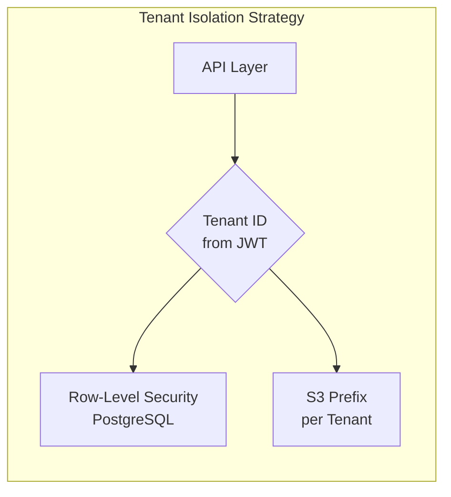
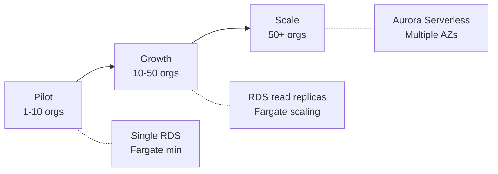

# System Architecture

**Document Version:** 1.0
**Last Updated:** 24 January 2025
**Status:** Complete
**Author:** Oluwasegun Olumbe

---

> **MILESTONE 0 — DISCOVERY PHASE**
>
> This document is a deliverable of Milestone 0, a paid discovery phase intended to define the technical, architectural, and compliance foundations of AI-Reclaim™ **prior to any production build**.
>
> This document does not constitute a commitment to build. Detailed scope, timelines, and commercials for development phases will be defined following successful completion and acceptance of Milestone 0.
>
> All intellectual property vests exclusively in A to Z IT Recycling Ltd.

---

## Executive Summary

This document defines the technical architecture for AI-Reclaim™, a compliance-first SaaS platform for IT asset disposition (ITAD) management. The architecture addresses three critical requirements for our target market of NHS trusts, banks, local authorities, and enterprises:

1. **Regulatory compliance** — Immutable audit trails, secure chain of custody, and certified destruction documentation
2. **Data sovereignty** — All data processing and storage within UK jurisdiction (AWS eu-west-2)
3. **Scalability** — Pilot deployment that scales to national adoption without re-architecture

The proposed solution is a multi-tenant web application hosted on AWS, using PostgreSQL with Row-Level Security for tenant isolation, AWS Rekognition for AI-powered asset identification, and S3 for secure document storage.

**Key architectural decisions:**
- AWS eu-west-2 (London) as sole deployment region
- Multi-tenant architecture with database-level isolation
- Managed services (Cognito, RDS, S3) to reduce operational complexity
- Web-only MVP with responsive design for tablet use

---

## 1. Introduction

### 1.1 Purpose

This document provides the high-level system architecture for AI-Reclaim™. It is intended to:
- Communicate the technical approach to stakeholders
- Guide Phase 1 development decisions
- Serve as a reference for security and compliance review
- Document assumptions requiring validation

### 1.2 Scope

This architecture covers:
- Application components and their interactions
- Data storage and isolation strategy
- Security and compliance controls
- Scalability approach from pilot to national scale

Out of scope for this document:
- Detailed API specifications (see `03-api-integration/`)
- Database schema design (see `02-data-model/`)
- Security policies and procedures (see `04-compliance-security/`)

### 1.3 Audience

| Audience | Relevant Sections |
|----------|-------------------|
| Business stakeholders | Executive Summary, Section 1 |
| Development team | Sections 2-6 |
| Security/compliance | Sections 4, 7, 8 |
| Operations | Sections 6, 7 |

### 1.4 Platform Overview

AI-Reclaim™ is a multi-tenant SaaS platform hosted on AWS (UK region) providing IT asset disposition tracking, AI-enabled identification, and compliance reporting for regulated organisations.

The platform enables organisations to maintain a complete digital chain of custody for IT assets from collection through to certified destruction or recycling, while generating the audit trails and ESG reports required by regulators.

### 1.1 Architecture Principles

The architecture is guided by the following principles:

1. **Compliance-first design** — Every component is designed with audit logging, data residency, and regulatory requirements as primary concerns, not afterthoughts.

2. **Multi-tenant isolation** — Client organisations share infrastructure while data is strictly isolated at the database and storage layers to prevent cross-tenant access.

3. **UK data sovereignty** — All data processing and storage occurs exclusively within AWS eu-west-2 (London) to meet UK data protection requirements for NHS, financial services, and public sector clients.

4. **Managed services preference** — Where possible, AWS managed services are used to reduce operational overhead, improve security posture, and accelerate time-to-market.

5. **Horizontal scalability** — The architecture supports growth from pilot (1-10 organisations) to national scale (50+ organisations) without fundamental redesign.

---

## 2. High-Level Architecture

### 2.1 Architecture Diagram

```mermaid
graph TB
    subgraph "Client Layer"
        WEB[Web Application<br/>React/Next.js]
    end

    subgraph "AWS UK Region (eu-west-2)"
        subgraph "Edge & Security"
            CF[CloudFront CDN]
            WAF[AWS WAF]
        end

        subgraph "Application Layer"
            ALB[Application Load Balancer]
            AUTH[Auth Service<br/>Cognito]
        end

        subgraph "ECS Fargate Cluster"
            subgraph "Containers (Docker Hardened Images)"
                API[api-service<br/>Node.js (Docker Hardened Images)]
                ASSET[asset-service<br/>Node.js (Docker Hardened Images)]
                AUDIT[audit-service<br/>Node.js (Docker Hardened Images)]
                CERT[certificate-service<br/>Node.js (Docker Hardened Images)]
                ESG[esg-service<br/>Node.js (Docker Hardened Images)]
                AIID[ai-identification<br/>Python (Docker Hardened Images)]
            end
        end

        subgraph "AI/ML Layer"
            REKOGNITION[AWS Rekognition<br/>Image Analysis]
        end

        subgraph "Data Layer"
            ECR[ECR Registry<br/>Private, eu-west-2]
            RDS[(PostgreSQL<br/>RDS Multi-AZ)]
            REDIS[(ElastiCache<br/>Redis)]
            S3[S3 Bucket<br/>Asset Images]
            S3AUDIT[S3 Bucket<br/>Audit Logs]
        end
    end

    WEB --> CF
    CF --> WAF
    WAF --> ALB
    ALB --> API
    API --> AUTH
    API --> ASSET
    API --> AUDIT
    API --> CERT
    API --> ESG
    ASSET --> AIID
    AIID --> REKOGNITION
    AIID --> S3
    ASSET --> RDS
    AUDIT --> RDS
    AUDIT --> S3AUDIT
    CERT --> RDS
    ESG --> RDS
    API --> REDIS
    ECR -.->|pulls| API
```

### 2.2 Architecture Narrative

The architecture follows a layered approach where each layer has distinct responsibilities:

**Client Layer**: A single-page web application built with React/Next.js provides the user interface for all user types (client organisation staff, recycling operators, auditors, and administrators). The application is served as static assets from S3 via CloudFront, enabling global edge caching while keeping origin data in the UK.

**Edge & Security Layer**: All inbound traffic passes through CloudFront and AWS WAF before reaching the application. WAF provides protection against common web exploits (SQL injection, XSS), bot traffic, and DDoS attacks. This layer acts as the first line of defence for the platform.

**Application Layer**: The Application Load Balancer (ALB) receives all inbound requests from WAF and routes them to the appropriate backend services. AWS Cognito provides managed authentication, handling user identities, JWT token issuance, and MFA for compliance requirements. The ALB performs health checks and distributes traffic across container instances.

**Container Platform (ECS Fargate)**: All application services run as containerised microservices on AWS ECS Fargate, using **Docker Hardened Images (DHI)** as base images. DHI provides near-zero CVE posture, SLSA Level 3 provenance, and FIPS/STIG-compliant variants for NHS and government clients. Container images are stored in a private ECR registry within eu-west-2.

**Business Services Layer**: Five domain-specific containerised services handle core platform functionality:
- **api-service** — Request routing, rate limiting, JWT validation
- **asset-service** — Asset lifecycle management from registration through disposition
- **audit-service** — Immutable audit log entries for all significant actions
- **certificate-service** — Destruction and recycling certificate generation
- **esg-service** — Environmental impact calculations and reporting

**AI/ML Layer**: The AI Identification Service enables users to identify IT assets by uploading photographs or scanning barcodes/serial numbers. Image analysis is performed by AWS Rekognition, with results matched against a device database. This accelerates asset registration and reduces data entry errors.

**Data Layer**: PostgreSQL (RDS) serves as the primary transactional database, chosen for its ACID compliance, Row-Level Security support, and mature audit capabilities. Redis (ElastiCache) provides caching for session data and frequently-accessed queries. S3 buckets store asset images and archived audit logs with appropriate retention policies.

---

## 3. Component Specifications

| Component | Purpose | AWS Service | Justification |
|-----------|---------|-------------|---------------|
| Web Application | User interface for all user types | S3 + CloudFront | Static hosting reduces attack surface; CDN improves performance |
| Container Registry | Private image storage | ECR (eu-west-2) | UK data residency; integrated scanning; immutable tags |
| api-service | API routing, rate limiting, request orchestration | ECS Fargate (Node.js DHI) | Serverless containers; Docker Hardened base for compliance |
| Auth Service | Authentication, JWT tokens, MFA | Cognito | Managed auth with built-in MFA, federation support, compliance certifications |
| asset-service | Asset lifecycle management | ECS Fargate (Node.js DHI) | Stateless containers; independent scaling |
| audit-service | Immutable audit log creation | ECS Fargate (Node.js DHI) | Dedicated service ensures audit writes are never blocked |
| certificate-service | Certificate generation, PDF | ECS Fargate (Node.js DHI) | PDF generation with Lambda burst capacity |
| esg-service | Environmental impact calculations | ECS Fargate (Node.js DHI) | Complex calculations benefit from dedicated compute |
| ai-identification | Image recognition + barcode lookup | ECS Fargate (Python DHI) | Rekognition integration; scale-to-zero capable |
| Primary Database | Transactional data, tenant isolation | RDS PostgreSQL | ACID compliance, RLS for tenant isolation, JSON support |
| Cache | Session data, frequent queries | ElastiCache Redis | Sub-millisecond latency; reduces database load |
| Object Storage | Asset images, PDFs, audit archives | S3 | Unlimited scale; lifecycle policies for retention management |

---

## 4. Multi-Tenant Architecture

### 4.1 Tenant Isolation Diagram



### 4.2 Isolation Strategy

Multi-tenancy is a core architectural decision that enables infrastructure sharing while maintaining strict data isolation between client organisations. The isolation strategy operates at multiple levels:

**Authentication Level**: When a user authenticates via Cognito, their JWT token includes an `organisation_id` claim. This claim is extracted and validated on every API request, ensuring users can only access data belonging to their organisation.

**Database Level**: PostgreSQL Row-Level Security (RLS) policies automatically filter all queries by `organisation_id`. Even if application code contains a bug that omits tenant filtering, the database layer enforces isolation. This defence-in-depth approach is critical for regulated environments.

**Storage Level**: S3 objects are stored with a tenant-specific prefix structure (`s3://bucket/{organisation_id}/...`). IAM policies and bucket policies restrict access to tenant-specific prefixes based on the authenticated user's organisation.

**Cache Level**: Redis keys are namespaced per tenant (`{organisation_id}:cache_key`), preventing cache pollution between organisations.

This multi-layered approach ensures that a failure at any single layer does not result in cross-tenant data exposure.

---

## 5. Design Assumptions

This section documents assumptions made during architecture definition. Assumptions are categorised by confidence level and validation status.

### 5.1 Confirmed Assumptions

These assumptions are based on explicit requirements or stakeholder decisions:

| ID | Assumption | Source | Notes |
|----|------------|--------|-------|
| A1 | Platform will be web-only for MVP | Stakeholder decision | Native mobile apps deferred to future phase |
| A2 | AWS is the cloud provider | Stakeholder decision | Selected over Azure/GCP |
| A3 | All data must reside in UK | Compliance requirement | NHS, financial services, public sector mandate |
| A4 | Multi-tenant architecture | Stakeholder decision | Isolation via RLS |

### 5.2 Technical Assumptions

These assumptions are based on technical analysis and require validation:

| ID | Assumption | Confidence | Validation Approach | Risk if Invalid |
|----|------------|------------|---------------------|-----------------|
| T1 | AWS Cognito meets authentication requirements including MFA and potential SSO | High | Review Cognito capabilities against NHS/enterprise SSO requirements | May need custom auth implementation |
| T2 | PostgreSQL RLS provides sufficient tenant isolation | High | Security review during Phase 1 | May need schema-per-tenant approach |
| T3 | PostgreSQL handles audit write volume | Medium | Load testing with projected volumes | May need separate audit database or time-series DB |
| T4 | AWS Rekognition recognises IT equipment (laptops, servers, monitors) | Low | **Requires PoC** with sample IT asset images | May need custom ML model training |
| T5 | Synchronous AI identification completes within 5 seconds | Medium | Performance testing during Phase 1 | May need async pattern with webhooks/polling |
| T6 | ECS Fargate provides adequate compute flexibility | High | Standard AWS pattern | Unlikely to be invalid |

### 5.3 Business Assumptions

These assumptions relate to user requirements and workflows:

| ID | Assumption | Confidence | Validation Approach | Risk if Invalid |
|----|------------|------------|---------------------|-----------------|
| B1 | Recycling operators can use same portal as clients (with different permissions) | **Unknown** | User research / stakeholder interview | May need separate operator portal |
| B2 | Responsive web design is acceptable for warehouse/field use | Medium | User testing with target devices | May need PWA with offline capability |
| B3 | 99.9% availability SLA meets customer expectations | High | Confirm in sales process | Higher SLA requires multi-region architecture |
| B4 | English-only interface is acceptable for MVP | High | Confirm with stakeholders | Internationalisation adds complexity |

### 5.4 Assumptions Requiring Immediate Validation

The following assumptions are high-risk and should be validated before Phase 1 development begins:

| Priority | ID | Assumption | Recommended Action |
|----------|----|-----------|--------------------|
| 🔴 Critical | T4 | Rekognition recognises IT equipment | Run PoC with 50+ sample images of typical IT assets |
| 🟠 High | B1 | Operators use same portal | Interview 2-3 recycling operators about their workflow |
| 🟡 Medium | T3 | PostgreSQL audit performance | Estimate audit event volume; compare to PostgreSQL benchmarks |

---

## 6. Scalability Considerations

### 6.1 Growth Path

The architecture is designed to scale through three phases without fundamental redesign:



### 6.2 Phase Specifications

**Pilot Phase (1-10 Organisations)**

The pilot phase establishes the foundation for growth. Infrastructure is sized for minimal viable capacity with auto-scaling headroom.

| Resource | Sizing |
|----------|--------|
| API Compute | ECS Fargate 0.5 vCPU / 1GB, 1-4 tasks |
| Database | RDS db.t3.medium, Single-AZ |
| Cache | ElastiCache cache.t3.micro |
| Storage | S3 Standard |

**Growth Phase (10-50 Organisations)**

As user base grows, the focus shifts to resilience and read performance. Database read replicas offload reporting queries from the primary instance.

| Resource | Sizing | Changes from Pilot |
|----------|--------|-------------------|
| API Compute | Fargate 2-10 tasks | Increased min capacity |
| Database | RDS Multi-AZ + Read Replica | Add failover and read scaling |
| Cache | ElastiCache cluster mode | Add cache redundancy |

**Scale Phase (50+ Organisations)**

At national scale, Aurora Serverless provides automatic scaling based on demand, and services may be split into independently deployable microservices.

| Resource | Sizing | Changes from Growth |
|----------|--------|-------------------|
| Database | Aurora Serverless v2 | Auto-scaling, higher IOPS |
| Compute | Fargate with service mesh | Independent service scaling |
| Observability | Enhanced CloudWatch, X-Ray | Distributed tracing |

### 6.3 Performance Targets

| Metric | Target | Measurement Method |
|--------|--------|-------------------|
| API Response Time (p95) | <500ms | CloudWatch Metrics |
| AI Identification Time | <5s | CloudWatch Metrics |
| Platform Availability | 99.9% | CloudWatch Synthetics |
| Audit Log Write Latency | <100ms | CloudWatch Metrics |
| Database Query Time (p95) | <100ms | RDS Performance Insights |

---

## 7. Security Architecture

Security is addressed in detail in `04-compliance-security/README.md`. This section summarises the key architectural security controls:

### 7.1 Network Security

- **VPC isolation**: All backend services run in private subnets with no direct internet access
- **Security groups**: Least-privilege network access between components
- **NAT Gateway**: Controlled outbound internet access for services requiring external APIs

### 7.2 Data Security

- **Encryption in transit**: TLS 1.3 enforced on all connections
- **Encryption at rest**: AWS KMS-managed keys for RDS, S3, and ElastiCache
- **Key rotation**: Automatic annual key rotation via KMS

### 7.3 Application Security

- **WAF rules**: OWASP Top 10 protection, rate limiting, bot detection
- **Input validation**: All API inputs validated against schemas
- **Output encoding**: Prevent XSS via content security policies

### 7.4 Access Control

- **IAM roles**: Service-specific roles with least-privilege policies
- **Cognito MFA**: Multi-factor authentication required for privileged users
- **Audit logging**: All access and changes logged to CloudTrail and application audit log

---

## 8. UK Data Residency

Compliance with UK data protection requirements is a non-negotiable architectural constraint. The following measures ensure all data remains within UK jurisdiction:

| Requirement | Implementation | Verification |
|-------------|----------------|--------------|
| All data stored in UK | AWS eu-west-2 (London) region exclusively | AWS Config rules |
| No cross-region replication | Replication disabled by IAM policy | IAM policy audit |
| Backups in UK | RDS automated backups in eu-west-2 | Backup configuration audit |
| Processing in UK | All compute resources in eu-west-2 | Resource tagging audit |
| CDN edge locations | CloudFront geo-restriction (optional) | Distribution configuration |

### 8.1 Compliance Certifications

AWS eu-west-2 maintains certifications relevant to target customers:
- ISO 27001, 27017, 27018
- SOC 1, 2, 3
- Cyber Essentials Plus
- NHS Data Security and Protection Toolkit (via AWS compliance programme)

---

## 9. Decision Log

| ID | Decision | Rationale | Alternatives Considered |
|----|----------|-----------|------------------------|
| D1 | AWS as cloud provider | UK region availability, NHS compliance, managed services | Azure (strong NHS presence), GCP |
| D2 | PostgreSQL as primary database | RLS for multi-tenancy, ACID for audit, team familiarity | MongoDB (flexible schema), DynamoDB (serverless) |
| D3 | Multi-tenant shared infrastructure | Shared infrastructure with isolation via RLS | Single-tenant (simpler isolation) |
| D4 | Web-only MVP | Faster time-to-market; responsive design covers tablets | Native mobile apps (better offline support) |
| D5 | Mermaid for diagrams | Version-controllable, renders in GitHub/IDEs | Draw.io (richer visuals), Lucidchart (collaboration) |
| D6 | Docker Hardened Images (DHI) | Near-zero CVE posture; FIPS/STIG compliance for NHS/Gov | Standard Docker images (higher CVE risk) |
| D7 | Microservices on ECS Fargate | Independent scaling; fault isolation; serverless ops | Monolith (simpler), EKS (more complex) |

---

## 10. Open Questions

The following questions require resolution before or during Phase 1:

1. **Operator portal scope**: Do recycling operators require a separate portal with different workflows, or can role-based access within the same portal suffice?

2. **AI model training**: Will AWS Rekognition recognise IT assets (laptops, servers, monitors) out-of-the-box, or will custom model training be required?

3. **Offline capability**: Do field staff require offline data entry capability, and if so, what sync strategy should be used?

4. **Integration requirements**: What existing systems (ERP, ticketing, logistics) do target customers need to integrate with?

5. **Certificate legal requirements**: What specific content and format is required for destruction certificates to be legally valid in UK jurisdictions?
