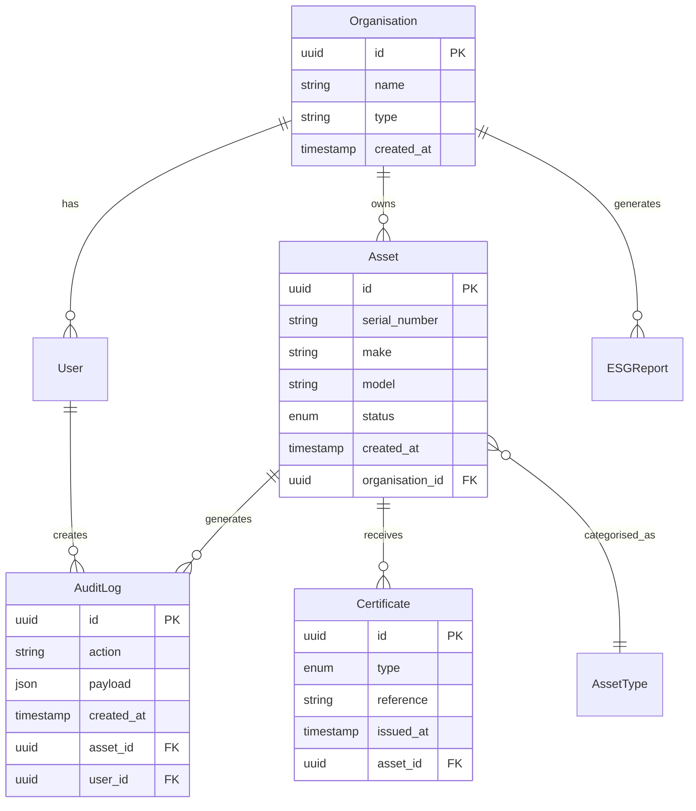

# Core Data Model

**Document Version:** 1.0
**Last Updated:** 13 January 2025
**Status:** Draft for Review

---

> **MILESTONE 0 — DISCOVERY PHASE**
>
> This document is a deliverable of Milestone 0, a paid discovery phase intended to define the technical, architectural, and compliance foundations of AI-Reclaim™ **prior to any production build**.
>
> This document does not constitute a commitment to build. Detailed scope, timelines, and commercials for development phases will be defined following successful completion and acceptance of Milestone 0.
>
> All intellectual property vests exclusively in A to Z IT Recycling Ltd.

---

## Primary Entities

| Entity | Description |
|--------|-------------|
| Asset | IT equipment being tracked through disposal lifecycle |
| Organisation | Client organisation (NHS trust, bank, etc.) |
| User | System users with roles |
| AuditLog | Immutable audit trail entries |
| Certificate | Destruction/recycling certificates |
| ESGReport | Environmental impact reports |

## Entity Relationship Diagram

## Entity Details

### Asset
(Detailed field descriptions)

### Organisation
(Detailed field descriptions)

### AuditLog
(Detailed field descriptions)
