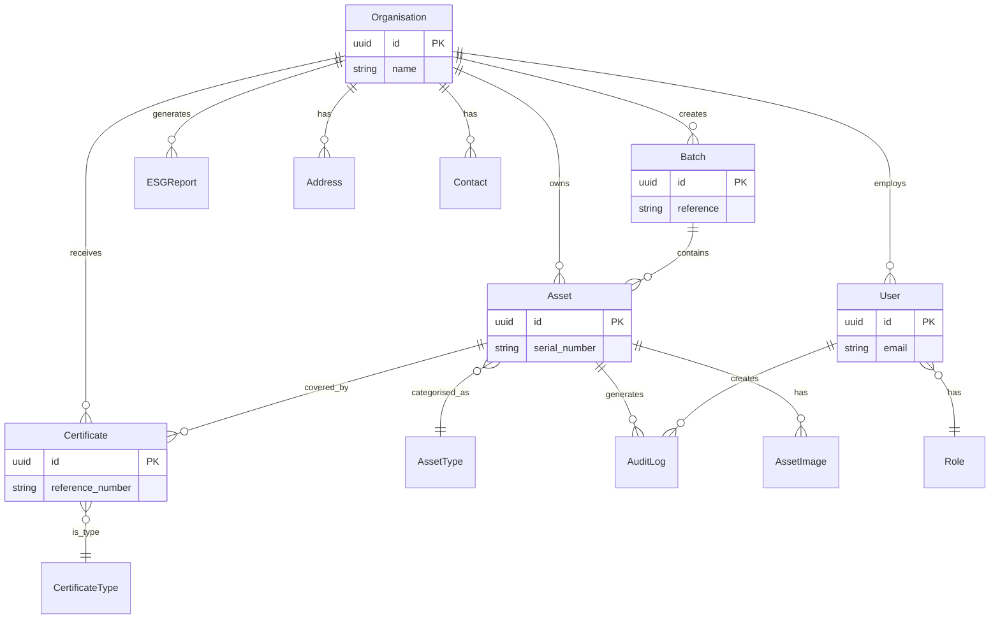
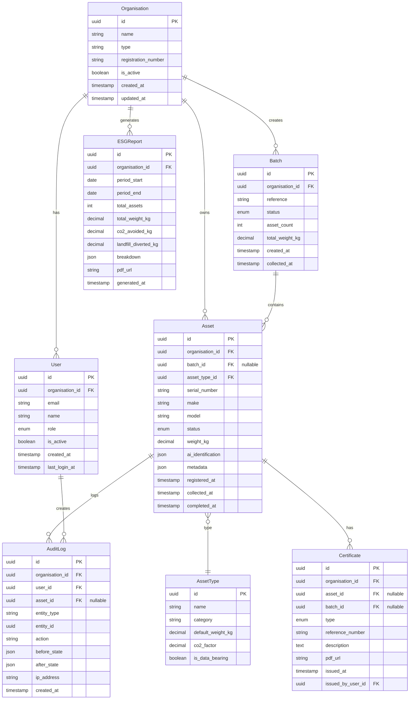
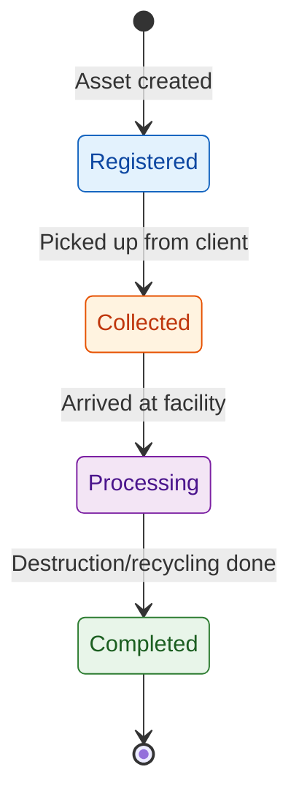

# Core Data Model

**Document Version:** 1.0
**Last Updated:** 24 January 2025
**Status:** Draft for Review
**Author:** Oluwasegun Olumbe

---

> **MILESTONE 0 — DISCOVERY PHASE**
>
> This document is a deliverable of Milestone 0, a paid discovery phase intended to define the technical, architectural, and compliance foundations of AI-Reclaim™ **prior to any production build**.
>
> This document does not constitute a commitment to build. Detailed scope, timelines, and commercials for development phases will be defined following successful completion and acceptance of Milestone 0.
>
> All intellectual property vests exclusively in A to Z IT Recycling Ltd.

---

## Executive Summary

This document defines the core data model for AI-Reclaim™, establishing the primary entities, their attributes, and relationships required to support IT asset disposition tracking, compliance audit trails, and ESG reporting.

**Key design decisions:**
- Assets tracked individually with optional batch grouping for efficient collection handling
- Simple 4-stage lifecycle (Registered → Collected → Processing → Completed)
- Four certificate types supporting destruction, recycling, data sanitisation, and WEEE compliance
- Multi-tenant isolation via `organisation_id` foreign key on all tenant-scoped entities
- Immutable audit log capturing all state changes with before/after values

---

## 1. Entity Overview

### 1.1 Primary Entities

| Entity | Description | Tenant-Scoped |
|--------|-------------|---------------|
| **Organisation** | Client organisation (NHS trust, bank, local authority, etc.) | No (is tenant) |
| **User** | System users with role-based access | Yes |
| **Asset** | Individual IT equipment item tracked through disposal lifecycle | Yes |
| **Batch** | Collection of assets grouped for efficient handling | Yes |
| **AssetType** | Category/classification of IT equipment | No (shared) |
| **Certificate** | Legal compliance document (destruction, recycling, etc.) | Yes |
| **AuditLog** | Immutable record of all system actions | Yes |
| **ESGReport** | Environmental impact report for an organisation | Yes |

### 1.2 Supporting Entities

| Entity | Description | Purpose |
|--------|-------------|---------|
| **Address** | Physical location for collection/delivery | Supports multiple addresses per organisation |
| **Contact** | Contact person within an organisation | Communication and notifications |
| **AssetImage** | Photograph of asset for AI identification | Links to S3 storage |

---

## 2. Entity Relationship Diagram

### 2.1 Core Relationships



### 2.2 Detailed Schema Diagram



---

## 3. Entity Specifications

### 3.1 Organisation

The Organisation entity represents a client company using the platform. All tenant-scoped data is isolated by `organisation_id`.

| Field | Type | Constraints | Description |
|-------|------|-------------|-------------|
| `id` | UUID | PK | Unique identifier |
| `name` | VARCHAR(255) | NOT NULL | Organisation display name |
| `type` | ENUM | NOT NULL | `nhs_trust`, `bank`, `local_authority`, `enterprise`, `recycler` |
| `registration_number` | VARCHAR(50) | UNIQUE | Companies House or charity number |
| `is_active` | BOOLEAN | DEFAULT true | Soft delete flag |
| `created_at` | TIMESTAMP | NOT NULL | Record creation time |
| `updated_at` | TIMESTAMP | NOT NULL | Last modification time |

**Business Rules:**
- Organisation cannot be deleted if it has assets in processing
- Type determines available features and compliance requirements

---

### 3.2 User

Users belong to an organisation and have role-based permissions.

| Field | Type | Constraints | Description |
|-------|------|-------------|-------------|
| `id` | UUID | PK | Unique identifier |
| `organisation_id` | UUID | FK, NOT NULL | Parent organisation |
| `email` | VARCHAR(255) | UNIQUE, NOT NULL | Login identifier |
| `name` | VARCHAR(255) | NOT NULL | Display name |
| `role` | ENUM | NOT NULL | User role (see below) |
| `is_active` | BOOLEAN | DEFAULT true | Account active flag |
| `created_at` | TIMESTAMP | NOT NULL | Account creation time |
| `last_login_at` | TIMESTAMP | | Last successful login |

**User Roles:**

| Role | Description | Permissions |
|------|-------------|-------------|
| `admin` | Organisation administrator | Full access to organisation data, user management |
| `operator` | Recycling facility staff | Asset processing, certificate generation |
| `client` | Client organisation staff | Register assets, view status, download certificates |
| `auditor` | Compliance auditor | Read-only access to all data and audit logs |

---

### 3.3 Asset

The Asset entity represents an individual IT equipment item tracked through the disposal lifecycle.

| Field | Type | Constraints | Description |
|-------|------|-------------|-------------|
| `id` | UUID | PK | Unique identifier |
| `organisation_id` | UUID | FK, NOT NULL | Owning organisation |
| `batch_id` | UUID | FK, NULL | Optional batch grouping |
| `asset_type_id` | UUID | FK, NOT NULL | Equipment category |
| `serial_number` | VARCHAR(100) | | Manufacturer serial number |
| `make` | VARCHAR(100) | | Manufacturer name |
| `model` | VARCHAR(100) | | Model name/number |
| `status` | ENUM | NOT NULL | Current lifecycle stage |
| `weight_kg` | DECIMAL(10,3) | | Actual weight in kilograms |
| `ai_identification` | JSONB | | AI recognition results |
| `metadata` | JSONB | | Additional custom fields |
| `registered_at` | TIMESTAMP | NOT NULL | When asset was registered |
| `collected_at` | TIMESTAMP | | When asset was collected |
| `completed_at` | TIMESTAMP | | When processing completed |

**Asset Status Lifecycle:**



| Status | Description | Allowed Transitions |
|--------|-------------|---------------------|
| `registered` | Asset logged in system, awaiting collection | → `collected` |
| `collected` | Asset picked up, in transit to facility | → `processing` |
| `processing` | At facility, undergoing audit/sanitisation/recycling | → `completed` |
| `completed` | Final disposition complete, certificate issued | (terminal) |

**AI Identification JSON Structure:**
```json
{
  "confidence": 0.94,
  "detected_make": "Dell",
  "detected_model": "Latitude 5520",
  "detected_type": "laptop",
  "image_url": "s3://bucket/org-id/assets/asset-id/photo.jpg",
  "identified_at": "2025-01-13T10:30:00Z"
}
```

---

### 3.4 Batch

Batches allow grouping of assets for efficient collection and processing.

| Field | Type | Constraints | Description |
|-------|------|-------------|-------------|
| `id` | UUID | PK | Unique identifier |
| `organisation_id` | UUID | FK, NOT NULL | Owning organisation |
| `reference` | VARCHAR(50) | NOT NULL | Human-readable batch ID |
| `status` | ENUM | NOT NULL | Batch status |
| `asset_count` | INT | DEFAULT 0 | Number of assets in batch |
| `total_weight_kg` | DECIMAL(10,3) | DEFAULT 0 | Sum of asset weights |
| `created_at` | TIMESTAMP | NOT NULL | Batch creation time |
| `collected_at` | TIMESTAMP | | When batch was collected |

**Batch Status:**
- `open` — Accepting new assets
- `closed` — No more assets, awaiting collection
- `collected` — In transit
- `processing` — At facility
- `completed` — All assets processed

---

### 3.5 AssetType

Shared reference data for IT equipment categories.

| Field | Type | Constraints | Description |
|-------|------|-------------|-------------|
| `id` | UUID | PK | Unique identifier |
| `name` | VARCHAR(100) | NOT NULL | Display name (e.g., "Laptop") |
| `category` | VARCHAR(50) | NOT NULL | High-level category |
| `default_weight_kg` | DECIMAL(10,3) | | Estimated weight if not measured |
| `co2_factor` | DECIMAL(10,4) | | kg CO2 avoided per kg recycled |
| `is_data_bearing` | BOOLEAN | DEFAULT false | Requires data sanitisation |

**Standard Asset Types:**

| Name | Category | Data Bearing | CO2 Factor |
|------|----------|--------------|------------|
| Laptop | Computing | Yes | 2.1 |
| Desktop PC | Computing | Yes | 1.8 |
| Server | Computing | Yes | 3.2 |
| Monitor | Display | No | 1.5 |
| Printer | Peripheral | No | 1.2 |
| Mobile Phone | Mobile | Yes | 0.8 |
| Tablet | Mobile | Yes | 0.9 |
| Network Switch | Networking | No | 1.4 |
| Hard Drive | Storage | Yes | 0.5 |

---

### 3.6 Certificate

Legal compliance documents issued upon completion of asset processing.

| Field | Type | Constraints | Description |
|-------|------|-------------|-------------|
| `id` | UUID | PK | Unique identifier |
| `organisation_id` | UUID | FK, NOT NULL | Receiving organisation |
| `asset_id` | UUID | FK, NULL | Single asset (if individual) |
| `batch_id` | UUID | FK, NULL | Batch (if batch certificate) |
| `type` | ENUM | NOT NULL | Certificate type |
| `reference_number` | VARCHAR(50) | UNIQUE, NOT NULL | Official reference |
| `description` | TEXT | | Certificate details |
| `pdf_url` | VARCHAR(500) | | S3 URL to PDF document |
| `issued_at` | TIMESTAMP | NOT NULL | Issue date/time |
| `issued_by_user_id` | UUID | FK, NOT NULL | Issuing operator |

**Certificate Types:**

| Type | Code | Description | Required For |
|------|------|-------------|--------------|
| Certificate of Destruction | `destruction` | Confirms secure physical destruction | Data-bearing assets |
| Certificate of Recycling | `recycling` | Confirms environmentally responsible recycling | All assets |
| Data Sanitisation Certificate | `sanitisation` | Confirms data wiped to NIST 800-88 standard | Data-bearing assets |
| WEEE Compliance Certificate | `weee` | EU/UK e-waste regulation compliance | Batch/collection level |

**Business Rules:**
- Data-bearing assets MUST have either `destruction` or `sanitisation` certificate
- Certificates are immutable once issued
- PDF generated and stored in S3 at issuance

---

### 3.7 AuditLog

Immutable record of all significant system actions for compliance.

| Field | Type | Constraints | Description |
|-------|------|-------------|-------------|
| `id` | UUID | PK | Unique identifier |
| `organisation_id` | UUID | FK, NOT NULL | Tenant scope |
| `user_id` | UUID | FK, NOT NULL | Acting user |
| `asset_id` | UUID | FK, NULL | Related asset (if applicable) |
| `entity_type` | VARCHAR(50) | NOT NULL | Entity being modified |
| `entity_id` | UUID | NOT NULL | ID of modified entity |
| `action` | VARCHAR(50) | NOT NULL | Action performed |
| `before_state` | JSONB | | State before change |
| `after_state` | JSONB | | State after change |
| `ip_address` | INET | | Client IP address |
| `created_at` | TIMESTAMP | NOT NULL | Action timestamp |

**Audit Actions:**

| Action | Entity Types | Description |
|--------|--------------|-------------|
| `created` | All | New record created |
| `updated` | All | Record modified |
| `status_changed` | Asset, Batch | Lifecycle status transition |
| `certificate_issued` | Certificate | Certificate generated |
| `login` | User | User authentication |
| `login_failed` | User | Failed authentication attempt |

**Immutability:**
- Audit logs are append-only (no UPDATE or DELETE)
- Enforced via PostgreSQL trigger and RLS policy
- Archived to S3 after 90 days for long-term retention

---

### 3.8 ESGReport

Environmental, Social, and Governance impact reports.

| Field | Type | Constraints | Description |
|-------|------|-------------|-------------|
| `id` | UUID | PK | Unique identifier |
| `organisation_id` | UUID | FK, NOT NULL | Report owner |
| `period_start` | DATE | NOT NULL | Reporting period start |
| `period_end` | DATE | NOT NULL | Reporting period end |
| `total_assets` | INT | NOT NULL | Assets processed in period |
| `total_weight_kg` | DECIMAL(12,3) | NOT NULL | Total weight processed |
| `co2_avoided_kg` | DECIMAL(12,3) | NOT NULL | CO2 emissions avoided |
| `landfill_diverted_kg` | DECIMAL(12,3) | NOT NULL | Waste diverted from landfill |
| `breakdown` | JSONB | | Detailed breakdown by type |
| `pdf_url` | VARCHAR(500) | | S3 URL to PDF report |
| `generated_at` | TIMESTAMP | NOT NULL | Report generation time |

**ESG Breakdown JSON Structure:**
```json
{
  "by_asset_type": [
    {
      "type": "Laptop",
      "count": 150,
      "weight_kg": 375.5,
      "co2_avoided_kg": 788.55
    }
  ],
  "by_disposition": {
    "recycled": { "count": 180, "weight_kg": 420.0 },
    "destroyed": { "count": 20, "weight_kg": 35.5 }
  }
}
```

**ESG Calculations:**
- `co2_avoided_kg` = Σ (asset weight × asset_type.co2_factor)
- `landfill_diverted_kg` = `total_weight_kg` (assumes 100% diversion)

---

## 4. Multi-Tenant Data Isolation

### 4.1 Isolation Strategy

All tenant-scoped entities include `organisation_id` as a foreign key. PostgreSQL Row-Level Security (RLS) policies enforce isolation at the database level.

```sql
-- Example RLS policy for assets table
CREATE POLICY tenant_isolation ON assets
    USING (organisation_id = current_setting('app.current_organisation_id')::uuid);
```

### 4.2 Tenant-Scoped vs Shared Entities

| Entity | Scope | Isolation |
|--------|-------|-----------|
| Organisation | Global | N/A (is the tenant) |
| User | Tenant | RLS by organisation_id |
| Asset | Tenant | RLS by organisation_id |
| Batch | Tenant | RLS by organisation_id |
| Certificate | Tenant | RLS by organisation_id |
| AuditLog | Tenant | RLS by organisation_id |
| ESGReport | Tenant | RLS by organisation_id |
| AssetType | Shared | No RLS (read-only reference data) |

---

## 5. Indexing Strategy

### 5.1 Primary Indexes

| Table | Index | Columns | Purpose |
|-------|-------|---------|---------|
| assets | `idx_assets_org_status` | (organisation_id, status) | Filter by org and status |
| assets | `idx_assets_batch` | (batch_id) | Batch lookups |
| assets | `idx_assets_serial` | (serial_number) | Serial number search |
| audit_logs | `idx_audit_org_created` | (organisation_id, created_at DESC) | Audit log queries |
| audit_logs | `idx_audit_asset` | (asset_id, created_at DESC) | Asset history |
| certificates | `idx_certs_org_type` | (organisation_id, type) | Certificate listing |

### 5.2 Full-Text Search

```sql
-- Asset search index
CREATE INDEX idx_assets_search ON assets
    USING gin(to_tsvector('english', make || ' ' || model || ' ' || serial_number));
```

---

## 6. Data Retention

| Data Type | Retention Period | Archive Strategy |
|-----------|------------------|------------------|
| Assets | Indefinite | Soft delete after 7 years |
| Audit Logs | 7 years | Archive to S3 after 90 days |
| Certificates | Indefinite | Legal requirement |
| ESG Reports | 7 years | Archive to S3 after 2 years |
| Asset Images | 1 year after completion | Delete from S3 |

---

## 7. Open Questions

| ID | Question | Impact | Resolution Approach |
|----|----------|--------|---------------------|
| DM1 | Should assets support custom fields per organisation? | Schema flexibility | JSONB metadata field (implemented) |
| DM2 | Is batch-level certificate sufficient or per-asset required? | Certificate workflow | Both supported (asset_id OR batch_id) |
| DM3 | What is the legal retention period for certificates? | Storage capacity | Research UK WEEE regulations |
| DM4 | Should audit logs be cryptographically signed? | Compliance | Assess NHS/financial requirements |

---

## 8. Decision Log

| ID | Decision | Rationale |
|----|----------|-----------|
| D1 | Simple 4-stage asset lifecycle | Reduces complexity; covers core workflow |
| D2 | Individual + batch tracking | Flexibility for different client workflows |
| D3 | Four certificate types | Covers destruction, recycling, sanitisation, WEEE |
| D4 | JSONB for AI identification | Flexible schema for ML model evolution |
| D5 | Weight-based ESG metrics | Standard industry approach; extensible later |
