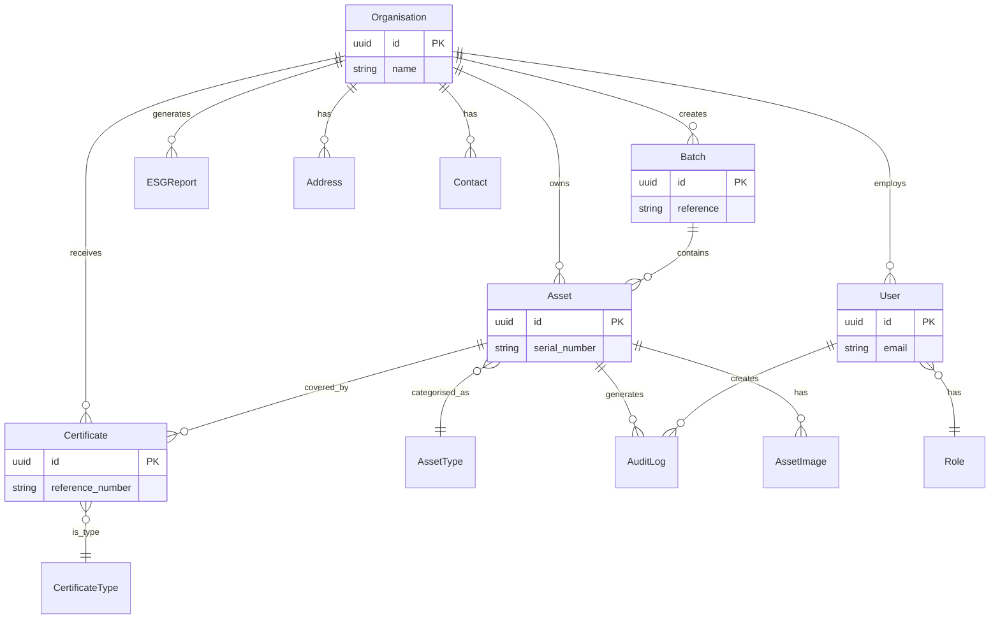
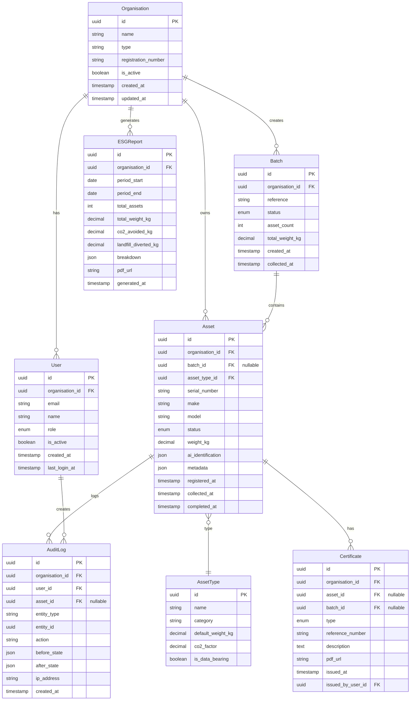
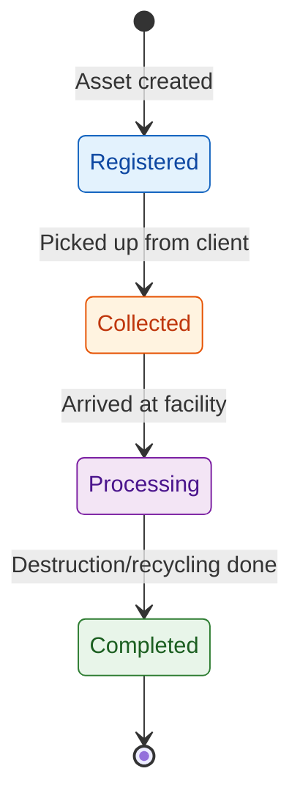

# Core Data Model

**Document Version:** 1.0
**Last Updated:** 23 January 2026
**Status:** Complete
**Author:** Oluwasegun Olumbe

---

> **MILESTONE 0 — DISCOVERY PHASE**
>
> This document is a deliverable of Milestone 0, a paid discovery phase intended to define the technical, architectural, and compliance foundations of AI-Reclaim™ **prior to any production build**.
>
> This document does not constitute a commitment to build. Detailed scope, timelines, and commercials for development phases will be defined following successful completion and acceptance of Milestone 0.
>
> All intellectual property vests exclusively in A to Z IT Recycling Ltd.

---

## Executive Summary

This document defines the core data model for AI-Reclaim™, establishing the primary entities, their attributes, and relationships required to support IT asset disposition tracking, compliance audit trails, and ESG reporting.

**Key design decisions:**
- Assets tracked individually with optional batch grouping for efficient collection handling
- Simple 4-stage lifecycle (Registered → Collected → Processing → Completed)
- Four certificate types supporting destruction, recycling, data sanitisation, and WEEE compliance
- Multi-tenant isolation via `organisation_id` foreign key on all tenant-scoped entities
- Immutable audit log capturing all state changes with before/after values

---

## 1. Entity Overview

### 1.1 Primary Entities

| Entity | Description | Tenant-Scoped |
|--------|-------------|---------------|
| **Organisation** | Client organisation (NHS trust, bank, local authority, etc.) | No (is tenant) |
| **User** | System users with role-based access | Yes |
| **Asset** | Individual IT equipment item tracked through disposal lifecycle | Yes |
| **Batch** | Collection of assets grouped for efficient handling | Yes |
| **AssetType** | Category/classification of IT equipment | No (shared) |
| **Certificate** | Legal compliance document (destruction, recycling, etc.) | Yes |
| **AuditLog** | Immutable record of all system actions | Yes |
| **ESGReport** | Environmental impact report for an organisation | Yes |

### 1.2 Supporting Entities

| Entity | Description | Purpose |
|--------|-------------|---------|
| **Address** | Physical location for collection/delivery | Supports multiple addresses per organisation |
| **Contact** | Contact person within an organisation | Communication and notifications |
| **AssetImage** | Photograph of asset for AI identification | Links to S3 storage |

---

## 2. Entity Relationship Diagram

### 2.1 Core Relationships

### 2.2 Detailed Schema Diagram

---

## 3. Entity Specifications

### 3.1 Organisation

The Organisation entity represents a client company using the platform. All tenant-scoped data is isolated by `organisation_id`.

| Field | Description |
|-------|-------------|
| id | Unique identifier |
| name | Organisation display name |
| type | Organisation type: NHS trust, bank, local authority, enterprise, recycler |
| registration_number | Companies House or charity number |
| is_active | Soft delete flag |
| created_at | Record creation time |

**Business Rules:**
- Organisation cannot be deleted if it has assets in processing
- Type determines available features and compliance requirements

---

### 3.2 User

Users belong to an organisation and have role-based permissions.

| Field | Description |
|-------|-------------|
| id | Unique identifier |
| organisation_id | Parent organisation |
| email | Login identifier (unique) |
| name | Display name |
| role | User role (see below) |
| is_active | Account active flag |
| created_at | Account creation time |
| last_login_at | Last successful login |

**User Roles:**

| Role | Description | Permissions |
|------|-------------|-------------|
| `admin` | Organisation administrator | Full access to organisation data, user management |
| `operator` | Recycling facility staff | Asset processing, certificate generation |
| `client` | Client organisation staff | Register assets, view status, download certificates |
| `auditor` | Compliance auditor | Read-only access to all data and audit logs |

---

### 3.3 Asset

The Asset entity represents an individual IT equipment item tracked through the disposal lifecycle.

| Field | Description |
|-------|-------------|
| id | Unique identifier |
| organisation_id | Owning organisation |
| batch_id | Optional batch grouping |
| asset_type_id | Equipment category |
| serial_number | Manufacturer serial number |
| make | Manufacturer name |
| model | Model name/number |
| status | Current lifecycle stage |
| weight_kg | Actual weight in kilograms |
| ai_identification | AI recognition results (structured data) |
| metadata | Additional custom fields |
| registered_at | When asset was registered |
| collected_at | When asset was collected |
| completed_at | When processing completed |

**Asset Status Lifecycle:**

| Status | Description | Allowed Transitions |
|--------|-------------|---------------------|
| `registered` | Asset logged in system, awaiting collection | → `collected` |
| `collected` | Asset picked up, in transit to facility | → `processing` |
| `processing` | At facility, undergoing audit/sanitisation/recycling | → `completed` |
| `completed` | Final disposition complete, certificate issued | (terminal) |

---

### 3.4 Batch

Batches allow grouping of assets for efficient collection and processing.

| Field | Description |
|-------|-------------|
| id | Unique identifier |
| organisation_id | Owning organisation |
| reference | Human-readable batch ID |
| status | Batch status |
| asset_count | Number of assets in batch |
| total_weight_kg | Sum of asset weights |
| created_at | Batch creation time |
| collected_at | When batch was collected |

**Batch Status:**
- `open` — Accepting new assets
- `closed` — No more assets, awaiting collection
- `collected` — In transit
- `processing` — At facility
- `completed` — All assets processed

---

### 3.5 AssetType

Shared reference data for IT equipment categories.

| Field | Description |
|-------|-------------|
| id | Unique identifier |
| name | Display name (e.g., "Laptop") |
| category | High-level category |
| default_weight_kg | Estimated weight if not measured |
| co2_factor | kg CO2 avoided per kg recycled |
| is_data_bearing | Requires data sanitisation |

**Standard Asset Types:**

| Name | Category | Data Bearing | CO2 Factor |
|------|----------|--------------|------------|
| Laptop | Computing | Yes | 2.1 |
| Desktop PC | Computing | Yes | 1.8 |
| Server | Computing | Yes | 3.2 |
| Monitor | Display | No | 1.5 |
| Printer | Peripheral | No | 1.2 |
| Mobile Phone | Mobile | Yes | 0.8 |
| Tablet | Mobile | Yes | 0.9 |
| Network Switch | Networking | No | 1.4 |
| Hard Drive | Storage | Yes | 0.5 |

---

### 3.6 Certificate

Legal compliance documents issued upon completion of asset processing.

| Field | Description |
|-------|-------------|
| id | Unique identifier |
| organisation_id | Receiving organisation |
| asset_id | Single asset (if individual certificate) |
| batch_id | Batch (if batch certificate) |
| type | Certificate type |
| reference_number | Official reference (unique) |
| description | Certificate details |
| pdf_url | URL to PDF document |
| issued_at | Issue date/time |
| issued_by_user_id | Issuing operator |

**Certificate Types:**

| Type | Code | Description | Required For |
|------|------|-------------|--------------|
| Certificate of Destruction | `destruction` | Confirms secure physical destruction | Data-bearing assets |
| Certificate of Recycling | `recycling` | Confirms environmentally responsible recycling | All assets |
| Data Sanitisation Certificate | `sanitisation` | Confirms data wiped to NIST 800-88 standard | Data-bearing assets |
| WEEE Compliance Certificate | `weee` | EU/UK e-waste regulation compliance | Batch/collection level |

**Business Rules:**
- Data-bearing assets MUST have either `destruction` or `sanitisation` certificate
- Certificates are immutable once issued
- PDF generated and stored in S3 at issuance

---

### 3.7 AuditLog

Immutable record of all significant system actions for compliance.

| Field | Description |
|-------|-------------|
| id | Unique identifier |
| organisation_id | Tenant scope |
| user_id | Acting user |
| asset_id | Related asset (if applicable) |
| entity_type | Entity being modified |
| entity_id | ID of modified entity |
| action | Action performed |
| before_state | State before change |
| after_state | State after change |
| ip_address | Client IP address |
| created_at | Action timestamp |

**Audit Actions:**

| Action | Entity Types | Description |
|--------|--------------|-------------|
| `created` | All | New record created |
| `updated` | All | Record modified |
| `status_changed` | Asset, Batch | Lifecycle status transition |
| `certificate_issued` | Certificate | Certificate generated |
| `login` | User | User authentication |
| `login_failed` | User | Failed authentication attempt |

**Immutability:**
- Audit logs are append-only (no updates or deletes)
- Tamper-proof storage enforced at database level

---

### 3.8 ESGReport

Environmental, Social, and Governance impact reports.

| Field | Description |
|-------|-------------|
| id | Unique identifier |
| organisation_id | Report owner |
| period_start | Reporting period start |
| period_end | Reporting period end |
| total_assets | Assets processed in period |
| total_weight_kg | Total weight processed |
| co2_avoided_kg | CO2 emissions avoided |
| landfill_diverted_kg | Waste diverted from landfill |
| breakdown | Detailed breakdown by type |
| pdf_url | URL to PDF report |
| generated_at | Report generation time |

**ESG Metrics:**
- CO2 avoided calculated from asset weights and equipment-specific factors
- Landfill diversion based on actual processing outcomes

---

## 4. Multi-Tenant Data Isolation

### 4.1 Isolation Strategy

All tenant-scoped entities include `organisation_id` as a foreign key. Row-Level Security (RLS) policies enforce isolation at the database level, ensuring organisations can only access their own data.

### 4.2 Tenant-Scoped vs Shared Entities

| Entity | Scope | Isolation |
|--------|-------|-----------|
| Organisation | Global | N/A (is the tenant) |
| User | Tenant | RLS by organisation_id |
| Asset | Tenant | RLS by organisation_id |
| Batch | Tenant | RLS by organisation_id |
| Certificate | Tenant | RLS by organisation_id |
| AuditLog | Tenant | RLS by organisation_id |
| ESGReport | Tenant | RLS by organisation_id |
| AssetType | Shared | No RLS (read-only reference data) |

---

## 5. Data Retention

| Data Type | Retention Period | Notes |
|-----------|------------------|-------|
| Assets | Indefinite | Soft delete after 7 years |
| Audit Logs | 7 years | Compliance requirement |
| Certificates | Indefinite | Legal requirement |
| ESG Reports | 7 years | Reporting requirement |
| Asset Images | 1 year after completion | Storage optimisation |

*Indexing strategy and archive implementation to be defined in Phase 1.*

---

## 6. Open Questions

| ID | Question | Impact | Resolution Approach |
|----|----------|--------|---------------------|
| DM1 | Should assets support custom fields per organisation? | Schema flexibility | JSONB metadata field (implemented) |
| DM2 | Is batch-level certificate sufficient or per-asset required? | Certificate workflow | Both supported (asset_id OR batch_id) |
| DM3 | What is the legal retention period for certificates? | Storage capacity | Research UK WEEE regulations |
| DM4 | Should audit logs be cryptographically signed? | Compliance | Assess NHS/financial requirements |

---

## 8. Decision Log

| ID | Decision | Rationale |
|----|----------|-----------|
| D1 | Simple 4-stage asset lifecycle | Reduces complexity; covers core workflow |
| D2 | Individual + batch tracking | Flexibility for different client workflows |
| D3 | Four certificate types | Covers destruction, recycling, sanitisation, WEEE |
| D4 | JSONB for AI identification | Flexible schema for ML model evolution |
| D5 | Weight-based ESG metrics | Standard industry approach; extensible later |
