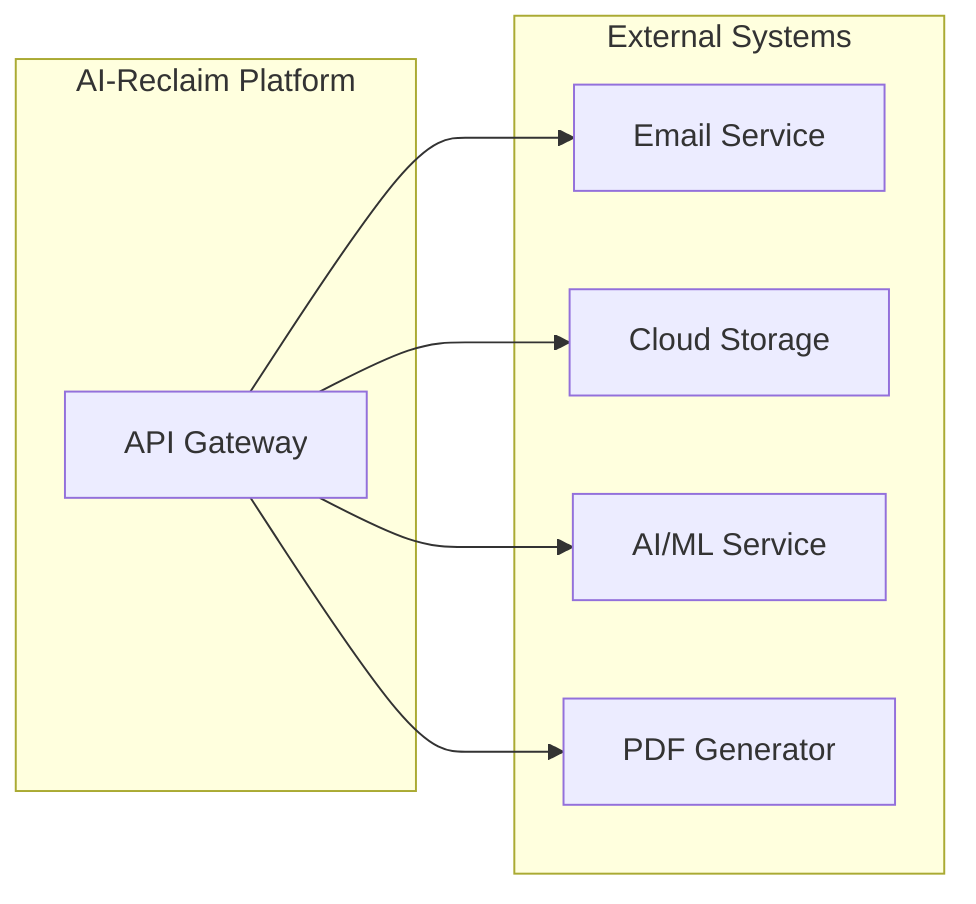

# API & Integration Outline

**Document Version:** 1.0
**Last Updated:** 13 January 2025
**Status:** Draft for Review

---

> **MILESTONE 0 — DISCOVERY PHASE**
>
> This document is a deliverable of Milestone 0, a paid discovery phase intended to define the technical, architectural, and compliance foundations of AI-Reclaim™ **prior to any production build**.
>
> This document does not constitute a commitment to build. Detailed scope, timelines, and commercials for development phases will be defined following successful completion and acceptance of Milestone 0.
>
> All intellectual property vests exclusively in A to Z IT Recycling Ltd.

---

## API Structure

### Base URL
```
https://api.ai-reclaim.com/v1
```

### Authentication
- (Define auth approach: JWT, OAuth2, API keys)

## Core Endpoints

### Assets
| Method | Endpoint | Description |
|--------|----------|-------------|
| GET | `/assets` | List assets |
| POST | `/assets` | Register new asset |
| GET | `/assets/{id}` | Get asset details |
| PATCH | `/assets/{id}` | Update asset |
| POST | `/assets/{id}/identify` | AI identification |

### Audit
| Method | Endpoint | Description |
|--------|----------|-------------|
| GET | `/audit` | Query audit logs |
| GET | `/audit/{asset_id}` | Asset audit trail |

### Certificates
| Method | Endpoint | Description |
|--------|----------|-------------|
| GET | `/certificates` | List certificates |
| POST | `/certificates` | Issue certificate |
| GET | `/certificates/{id}/pdf` | Download PDF |

### ESG Reporting
| Method | Endpoint | Description |
|--------|----------|-------------|
| GET | `/esg/reports` | List reports |
| POST | `/esg/reports/generate` | Generate report |

## Integration Points



## API Assumptions

- (List assumptions about API design)
