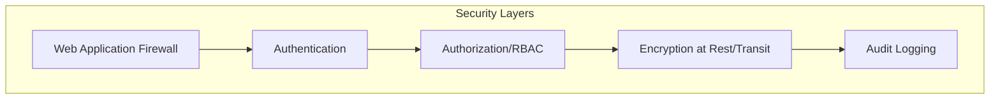

# Compliance, Security & Audit Logging

**Document Version:** 1.0
**Last Updated:** 13 January 2025
**Status:** Draft for Review

---

> **MILESTONE 0 — DISCOVERY PHASE**
>
> This document is a deliverable of Milestone 0, a paid discovery phase intended to define the technical, architectural, and compliance foundations of AI-Reclaim™ **prior to any production build**.
>
> This document does not constitute a commitment to build. Detailed scope, timelines, and commercials for development phases will be defined following successful completion and acceptance of Milestone 0.
>
> All intellectual property vests exclusively in A to Z IT Recycling Ltd.

---

## Compliance Requirements

### GDPR
- (Data protection requirements)

### Industry-Specific
- NHS Data Security and Protection Toolkit
- Financial services regulations
- Local authority requirements

## Security Architecture

## Audit Logging Approach

### What is Logged
| Event Type | Data Captured |
|------------|---------------|
| Asset creation | User, timestamp, asset details |
| Asset updates | User, timestamp, changed fields, before/after |
| Status changes | User, timestamp, from/to status |
| Certificate issuance | User, timestamp, certificate details |
| User authentication | User, timestamp, IP, success/failure |

### Immutability
- (How audit logs are protected from tampering)

### Retention
- (Log retention policy)

## Role-Based Access Control

| Role | Permissions |
|------|-------------|
| Admin | Full access |
| Operator | Asset management, certificates |
| Auditor | Read-only, full audit access |
| Client | View own organisation assets |

## Data Encryption

- At rest: (approach)
- In transit: (approach)
- Key management: (approach)
