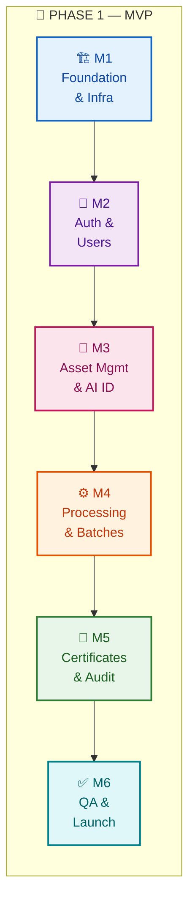

# Phase 1 Delivery Roadmap

**Document Version:** 1.0
**Last Updated:** 24 January 2025
**Status:** Draft for Review
**Author:** Oluwasegun Olumbe

---

> **MILESTONE 0 — DISCOVERY PHASE**
>
> This document is a deliverable of Milestone 0, a paid discovery phase intended to define the technical, architectural, and compliance foundations of AI-Reclaim™ **prior to any production build**.
>
> This document does not constitute a commitment to build. Detailed scope, timelines, and commercials for development phases will be defined following successful completion and acceptance of Milestone 0.
>
> All intellectual property vests exclusively in A to Z IT Recycling Ltd.

---

## Executive Summary

This document defines the scope and milestone breakdown for Phase 1 (MVP) of AI-Reclaim™. Phase 1 delivers the core asset disposition workflow from registration through to certificate generation, including AI-powered asset identification.

**Phase 1 Goal:** Deliver a working platform that enables a client organisation to register IT assets, track them through collection and processing, and receive compliance certificates.

**Key inclusions:**
- Complete asset lifecycle (Registered → Collected → Processing → Completed)
- AI-powered asset identification (image + barcode)
- Certificate generation (Destruction, Recycling, Sanitisation, WEEE)
- Immutable audit logging
- Multi-tenant architecture with RBAC

---

## 1. Phase 1 Scope

### 1.1 In Scope

| Feature | Description | Priority |
|---------|-------------|----------|
| **User authentication** | Cognito-based login, MFA for privileged roles | Must have |
| **Organisation management** | Create/manage client organisations | Must have |
| **User management** | Create users, assign roles (Admin, Operator, Client, Auditor) | Must have |
| **Asset registration** | Register individual assets with details | Must have |
| **AI identification** | Image upload + barcode/serial lookup | Must have |
| **Asset lifecycle** | Status transitions through 4 stages | Must have |
| **Batch management** | Group assets for collection | Must have |
| **Certificate generation** | Issue 4 certificate types with PDF | Must have |
| **Audit logging** | Immutable log of all actions | Must have |
| **Basic reporting** | Asset counts, status summaries | Should have |

### 1.2 Out of Scope (Future Phases)

| Feature | Rationale | Target Phase |
|---------|-----------|--------------|
| ESG reporting | Not critical for core workflow | Phase 2 |
| External API access | Focus on internal platform first | Phase 2 |
| Mobile native apps | Web responsive sufficient for MVP | Phase 2+ |
| Client ERP integrations | Requires client-specific work | Phase 2+ |
| Advanced analytics | Basic reporting sufficient for MVP | Phase 2 |
| Multi-language support | English-only for UK launch | Phase 2+ |

### 1.3 User Stories

**Client Organisation Staff:**
- Register IT assets for disposal (individually or batch)
- Upload photos for AI identification
- Track asset status through lifecycle
- Download certificates for completed assets

**Recycling Operator:**
- View assets assigned for processing
- Update asset status as work progresses
- Generate certificates upon completion
- View audit trail for assets

**Administrator:**
- Manage users and permissions
- View organisation-wide reports
- Access full audit logs

**Auditor:**
- Read-only access to all data
- Export audit logs for compliance review

---

## 2. Milestone Breakdown

### 2.1 Milestone Overview



### 2.2 Phase 1 Work Breakdown Structure (WBS)

```mermaid
flowchart TB
    PHASE1[🚀 Phase 1 — MVP<br/>AI-Reclaim Platform]

    PHASE1 --> M1[🏗️ M1: Foundation & Infrastructure]
    PHASE1 --> M2[🔐 M2: Auth & User Management]
    PHASE1 --> M3[🤖 M3: Asset Management & AI]
    PHASE1 --> M4[⚙️ M4: Processing & Batches]
    PHASE1 --> M5[📜 M5: Certificates & Audit]
    PHASE1 --> M6[✅ M6: QA & Launch]

    M1 --> M1_1[1.1 AWS Infrastructure]
    M1 --> M1_2[1.2 Database Setup]
    M1 --> M1_3[1.3 CI/CD Pipeline]
    M1 --> M1_4[1.4 Dev Environment]

    M2 --> M2_1[2.1 Cognito Integration]
    M2 --> M2_2[2.2 User Management]
    M2 --> M2_3[2.3 RBAC System]
    M2 --> M2_4[2.4 Admin UI]

    M3 --> M3_1[3.1 Asset CRUD]
    M3 --> M3_2[3.2 Image Upload]
    M3 --> M3_3[3.3 AI Identification]
    M3 --> M3_4[3.4 Asset UI]

    M4 --> M4_1[4.1 Status Workflow]
    M4 --> M4_2[4.2 Batch Management]
    M4 --> M4_3[4.3 Operator UI]

    M5 --> M5_1[5.1 Certificate Generation]
    M5 --> M5_2[5.2 PDF Service]
    M5 --> M5_3[5.3 Audit Trail UI]

    M6 --> M6_1[6.1 Testing]
    M6 --> M6_2[6.2 Security Review]
    M6 --> M6_3[6.3 UAT & Launch]

    %% Styling
    classDef rootStyle fill:#1a237e,stroke:#1a237e,stroke-width:3px,color:#ffffff
    classDef milestoneStyle fill:#3949ab,stroke:#1a237e,stroke-width:2px,color:#ffffff
    classDef taskStyle fill:#e8eaf6,stroke:#3949ab,stroke-width:1px,color:#1a237e

    class PHASE1 rootStyle
    class M1,M2,M3,M4,M5,M6 milestoneStyle
    class M1_1,M1_2,M1_3,M1_4,M2_1,M2_2,M2_3,M2_4,M3_1,M3_2,M3_3,M3_4,M4_1,M4_2,M4_3,M5_1,M5_2,M5_3,M6_1,M6_2,M6_3 taskStyle
```



### 2.3 Milestone Details

---

#### M1: Foundation & Infrastructure

**Objective:** Establish development environment, CI/CD pipeline, and core infrastructure.

| Deliverable | Description |
|-------------|-------------|
| AWS infrastructure | VPC, subnets, security groups (IaC) |
| Database setup | RDS PostgreSQL with RLS policies |
| CI/CD pipeline | GitHub Actions for build/test/deploy |
| Development environment | Local dev setup, staging environment |
| Monitoring foundation | CloudWatch, logging setup |

**Dependencies:** None (starting point)

**Acceptance Criteria:**
- Infrastructure deployed via IaC
- Database accessible with RLS enabled
- CI/CD pipeline runs successfully
- Staging environment accessible

**Work Breakdown Structure — M1:**

```
M1: Foundation & Infrastructure
│
├── 1.1 AWS Infrastructure
│   ├── 1.1.1 VPC configuration (public/private subnets)
│   ├── 1.1.2 Security groups setup
│   ├── 1.1.3 NAT Gateway configuration
│   ├── 1.1.4 Route tables and networking
│   └── 1.1.5 IAM roles and policies
│
├── 1.2 Database Setup
│   ├── 1.2.1 RDS PostgreSQL provisioning
│   ├── 1.2.2 Database schema creation
│   ├── 1.2.3 Row-Level Security (RLS) policies
│   ├── 1.2.4 Connection pooling setup
│   └── 1.2.5 Backup configuration
│
├── 1.3 CI/CD Pipeline
│   ├── 1.3.1 GitHub Actions workflow setup
│   ├── 1.3.2 Build pipeline (lint, test, build)
│   ├── 1.3.3 Deploy pipeline (staging, production)
│   ├── 1.3.4 Environment secrets management
│   └── 1.3.5 Docker image build & push to ECR
│
├── 1.4 Development Environment
│   ├── 1.4.1 Local Docker Compose setup
│   ├── 1.4.2 Environment variables template
│   ├── 1.4.3 Database seeding scripts
│   └── 1.4.4 Developer documentation
│
└── 1.5 Monitoring Foundation
    ├── 1.5.1 CloudWatch log groups
    ├── 1.5.2 CloudWatch alarms (basic)
    ├── 1.5.3 Application logging setup
    └── 1.5.4 Health check endpoints
```

---

#### M2: Authentication & User Management

**Objective:** Implement secure authentication and user/organisation management.

| Deliverable | Description |
|-------------|-------------|
| Cognito integration | User pools, MFA configuration |
| Authentication API | Login, logout, password reset, token refresh |
| Organisation CRUD | Create, read, update organisations |
| User CRUD | Create, read, update, deactivate users |
| RBAC implementation | Role-based permissions |
| Admin UI | User and organisation management screens |

**Dependencies:** M1 (infrastructure)

**Acceptance Criteria:**
- Users can register and login
- MFA works for Admin/Operator roles
- Admins can manage users
- Role permissions enforced on all endpoints

**Work Breakdown Structure — M2:**

```
M2: Authentication & User Management
│
├── 2.1 Cognito Integration
│   ├── 2.1.1 User pool creation
│   ├── 2.1.2 App client configuration
│   ├── 2.1.3 MFA setup (TOTP/SMS)
│   ├── 2.1.4 Custom attributes (organisation_id, role)
│   └── 2.1.5 Token configuration (access, ID, refresh)
│
├── 2.2 Authentication API
│   ├── 2.2.1 Login endpoint
│   ├── 2.2.2 Logout endpoint
│   ├── 2.2.3 Password reset flow
│   ├── 2.2.4 Token refresh endpoint
│   ├── 2.2.5 JWT validation middleware
│   └── 2.2.6 Session management
│
├── 2.3 Organisation Management
│   ├── 2.3.1 Organisation CRUD API
│   ├── 2.3.2 Organisation types (NHS, bank, etc.)
│   ├── 2.3.3 Organisation status (active/inactive)
│   └── 2.3.4 Organisation settings storage
│
├── 2.4 User Management
│   ├── 2.4.1 User CRUD API
│   ├── 2.4.2 User-organisation linking
│   ├── 2.4.3 User activation/deactivation
│   ├── 2.4.4 Password policies
│   └── 2.4.5 User invitation flow
│
├── 2.5 RBAC System
│   ├── 2.5.1 Role definitions (Admin, Operator, Client, Auditor)
│   ├── 2.5.2 Permission matrix implementation
│   ├── 2.5.3 Role assignment API
│   ├── 2.5.4 Permission checking middleware
│   └── 2.5.5 Role-based UI visibility
│
└── 2.6 Admin UI
    ├── 2.6.1 User list/search screen
    ├── 2.6.2 User create/edit forms
    ├── 2.6.3 Organisation management screen
    ├── 2.6.4 Role assignment interface
    └── 2.6.5 User activity dashboard
```

---

#### M3: Asset Management & AI Identification

**Objective:** Implement core asset registration with AI-powered identification.

| Deliverable | Description |
|-------------|-------------|
| Asset CRUD | Create, read, update assets |
| Asset type reference data | Seed standard IT equipment types |
| Image upload | S3 integration for asset photos |
| AI identification | Rekognition integration for device recognition |
| Barcode/serial lookup | Manual and scanned entry |
| Asset search | Filter and search assets |
| Asset UI | Registration form, list view, detail view |

**Dependencies:** M2 (authentication, organisations)

**Acceptance Criteria:**
- Users can register assets
- Image upload triggers AI identification
- AI results populate asset fields (with confidence score)
- Assets searchable and filterable

---

#### M4: Processing & Batch Management

**Objective:** Implement asset lifecycle workflow and batch grouping.

| Deliverable | Description |
|-------------|-------------|
| Status transitions | Implement 4-stage lifecycle with validation |
| Batch CRUD | Create, read, update batches |
| Batch-asset linking | Add/remove assets from batches |
| Batch status | Batch lifecycle (open → closed → collected → processing → completed) |
| Workflow UI | Status update screens, batch management |

**Dependencies:** M3 (assets)

**Acceptance Criteria:**
- Assets transition through lifecycle correctly
- Invalid transitions rejected
- Batches group assets correctly
- Batch status reflects contained assets

**Work Breakdown Structure — M4:**

```
M4: Processing & Batch Management
│
├── 4.1 Asset Status Workflow
│   ├── 4.1.1 Status enum definition (Registered → Collected → Processing → Completed)
│   ├── 4.1.2 Transition validation rules
│   ├── 4.1.3 Status update API
│   ├── 4.1.4 Status history tracking
│   └── 4.1.5 Timestamp recording (collected_at, completed_at)
│
├── 4.2 Batch Management
│   ├── 4.2.1 Batch CRUD API
│   ├── 4.2.2 Batch reference number generation
│   ├── 4.2.3 Batch status workflow (open → closed → collected → processing → completed)
│   ├── 4.2.4 Batch weight/count aggregation
│   └── 4.2.5 Batch-organisation linking
│
├── 4.3 Asset-Batch Operations
│   ├── 4.3.1 Add assets to batch
│   ├── 4.3.2 Remove assets from batch
│   ├── 4.3.3 Bulk status update (batch level)
│   ├── 4.3.4 Batch validation (no empty batches)
│   └── 4.3.5 Asset transfer between batches
│
└── 4.4 Operator UI
    ├── 4.4.1 Batch list/search screen
    ├── 4.4.2 Batch detail view with asset list
    ├── 4.4.3 Status update workflow UI
    ├── 4.4.4 Batch creation form
    └── 4.4.5 Collection scheduling interface
```

---

#### M5: Certificates & Audit

**Objective:** Implement certificate generation and audit trail visibility.

| Deliverable | Description |
|-------------|-------------|
| Certificate generation | Create certificate records |
| PDF generation | Generate certificate PDFs (Lambda) |
| Certificate types | Support all 4 types with validation |
| Audit log API | Query and export audit logs |
| Audit UI | Audit log viewer with filters |
| Asset history | View audit trail per asset |

**Dependencies:** M4 (asset lifecycle complete)

**Acceptance Criteria:**
- Certificates generated for completed assets
- PDF downloads work
- Certificate types validated (e.g., destruction requires data-bearing)
- Audit logs queryable and exportable

**Work Breakdown Structure — M5:**

```
M5: Certificates & Audit
│
├── 5.1 Certificate Generation
│   ├── 5.1.1 Certificate data model
│   ├── 5.1.2 Certificate CRUD API
│   ├── 5.1.3 Reference number generation (unique)
│   ├── 5.1.4 Certificate-asset/batch linking
│   └── 5.1.5 Certificate validation rules
│
├── 5.2 Certificate Types
│   ├── 5.2.1 Destruction certificate logic
│   ├── 5.2.2 Recycling certificate logic
│   ├── 5.2.3 Data sanitisation certificate logic
│   ├── 5.2.4 WEEE compliance certificate logic
│   └── 5.2.5 Type-specific validation (data-bearing check)
│
├── 5.3 PDF Service
│   ├── 5.3.1 PDF template design (4 types)
│   ├── 5.3.2 Lambda function setup
│   ├── 5.3.3 Dynamic content injection
│   ├── 5.3.4 S3 storage for PDFs
│   └── 5.3.5 Download URL generation (pre-signed)
│
├── 5.4 Audit Logging
│   ├── 5.4.1 Audit log data model (immutable)
│   ├── 5.4.2 Audit event capture (all CRUD operations)
│   ├── 5.4.3 Before/after state recording
│   ├── 5.4.4 User/IP tracking
│   └── 5.4.5 Audit log archival to S3
│
└── 5.5 Audit UI
    ├── 5.5.1 Audit log list/search screen
    ├── 5.5.2 Filter by date/user/action/entity
    ├── 5.5.3 Audit detail view (before/after diff)
    ├── 5.5.4 Asset history timeline
    └── 5.5.5 Export to CSV/PDF
```

---

#### M6: QA & Launch Preparation

**Objective:** Testing, bug fixes, and launch readiness.

| Deliverable | Description |
|-------------|-------------|
| Integration testing | End-to-end workflow testing |
| Security testing | Vulnerability scan, pen test (if required) |
| Performance testing | Load testing core workflows |
| Bug fixes | Address issues from testing |
| Documentation | User guides, API documentation |
| UAT | User acceptance testing with pilot client |
| Production deployment | Deploy to production environment |

**Dependencies:** M1-M5 complete

**Acceptance Criteria:**
- All critical bugs resolved
- Security scan passed
- Performance meets targets
- UAT sign-off received
- Production environment live

**Work Breakdown Structure — M6:**

```
M6: QA & Launch Preparation
│
├── 6.1 Integration Testing
│   ├── 6.1.1 End-to-end test scenarios
│   ├── 6.1.2 API integration tests
│   ├── 6.1.3 UI automated tests (Cypress/Playwright)
│   ├── 6.1.4 Cross-browser testing
│   └── 6.1.5 Mobile/tablet responsiveness testing
│
├── 6.2 Security Testing
│   ├── 6.2.1 OWASP vulnerability scan
│   ├── 6.2.2 Dependency vulnerability check
│   ├── 6.2.3 Penetration testing (if required)
│   ├── 6.2.4 Authentication/authorisation testing
│   └── 6.2.5 Data isolation verification (multi-tenant)
│
├── 6.3 Performance Testing
│   ├── 6.3.1 Load testing (concurrent users)
│   ├── 6.3.2 API response time benchmarks
│   ├── 6.3.3 Database query performance
│   ├── 6.3.4 AI identification latency testing
│   └── 6.3.5 File upload/download performance
│
├── 6.4 Bug Fixes & Polish
│   ├── 6.4.1 Critical bug triage and fix
│   ├── 6.4.2 UI/UX polish
│   ├── 6.4.3 Error message improvements
│   ├── 6.4.4 Edge case handling
│   └── 6.4.5 Performance optimisation
│
├── 6.5 Documentation
│   ├── 6.5.1 API documentation (OpenAPI/Swagger)
│   ├── 6.5.2 User guide (client users)
│   ├── 6.5.3 Operator manual
│   ├── 6.5.4 Admin guide
│   └── 6.5.5 Deployment runbook
│
└── 6.6 UAT & Launch
    ├── 6.6.1 UAT environment setup
    ├── 6.6.2 Pilot client onboarding
    ├── 6.6.3 UAT execution & feedback
    ├── 6.6.4 Production deployment
    └── 6.6.5 Go-live monitoring & support
```

---

## 3. Dependencies & Critical Path

### 3.1 Dependency Map

```mermaid
flowchart TB
    subgraph DEPS["📊 Phase 1 Dependencies"]
        M1[🏗️ M1: Foundation<br/>& Infrastructure]
        M2[🔐 M2: Auth &<br/>User Management]
        M3[🤖 M3: Asset Mgmt<br/>& AI Identification]
        M4[⚙️ M4: Processing<br/>& Batches]
        M5[📜 M5: Certificates<br/>& Audit]
        M6[✅ M6: QA &<br/>Launch]
    end

    M1 -->|Infrastructure<br/>ready| M2
    M2 -->|Auth &<br/>users ready| M3
    M3 -->|Assets<br/>ready| M4
    M4 -->|Lifecycle<br/>complete| M5
    M5 -->|Features<br/>complete| M6

    %% Styling
    classDef infraStyle fill:#e3f2fd,stroke:#1565c0,stroke-width:2px,color:#0d47a1
    classDef authStyle fill:#f3e5f5,stroke:#7b1fa2,stroke-width:2px,color:#4a148c
    classDef assetStyle fill:#fce4ec,stroke:#c2185b,stroke-width:2px,color:#880e4f
    classDef processStyle fill:#fff3e0,stroke:#e65100,stroke-width:2px,color:#bf360c
    classDef certStyle fill:#e8f5e9,stroke:#2e7d32,stroke-width:2px,color:#1b5e20
    classDef qaStyle fill:#e0f7fa,stroke:#00838f,stroke-width:2px,color:#006064

    class M1 infraStyle
    class M2 authStyle
    class M3 assetStyle
    class M4 processStyle
    class M5 certStyle
    class M6 qaStyle
```



### 3.2 Critical Path

All milestones are sequential, forming a single critical path:

**M1 → M2 → M3 → M4 → M5 → M6**

No milestone can start until the previous is complete due to technical dependencies.

### 3.3 Risk to Timeline

| Risk | Impact | Mitigation |
|------|--------|------------|
| AI accuracy issues | May delay M3 | Early PoC with sample images |
| Cognito complexity | May delay M2 | Spike on MFA integration |
| PDF generation issues | May delay M5 | Evaluate PDF libraries early |
| Scope creep | Delays all | Strict change control |

---

## 4. Technical Approach

### 4.1 Technology Stack (Proposed)

| Layer | Technology | Rationale |
|-------|------------|-----------|
| Frontend | React / Next.js | Modern, widely supported |
| Backend | Node.js / Express | Team familiarity, async performance |
| Database | PostgreSQL (RDS) | Per architecture document |
| Auth | AWS Cognito | Per architecture document |
| Storage | AWS S3 | Per architecture document |
| AI | AWS Rekognition | Per architecture document |
| PDF | AWS Lambda + library | Serverless, scalable |
| IaC | Terraform / CDK | Reproducible infrastructure |
| CI/CD | GitHub Actions | Integrated with repo |

### 4.2 Development Practices

| Practice | Approach |
|----------|----------|
| Version control | GitHub, feature branches, PR reviews |
| Testing | Unit tests, integration tests, E2E tests |
| Code quality | Linting, formatting, type checking |
| Documentation | API docs auto-generated, user guides |
| Environments | Development, Staging, Production |

---

## 5. Resource Requirements

### 5.1 Team Composition (Indicative)

| Role | Responsibility |
|------|----------------|
| Tech Lead | Architecture decisions, code review, technical guidance |
| Backend Developer | API development, database, integrations |
| Frontend Developer | UI development, UX implementation |
| DevOps | Infrastructure, CI/CD, monitoring |
| QA | Testing strategy, test execution |

---

## 6. Assumptions

| ID | Assumption | Impact if Invalid |
|----|------------|-------------------|
| A1 | Single pilot client for UAT | May need multiple test scenarios |
| A2 | English-only UI sufficient | Delays if i18n required |
| A3 | Standard certificate templates acceptable | Custom templates add effort |
| A4 | AWS Rekognition accuracy sufficient | May need custom model training |
| A5 | Team has React/Node experience | Learning curve if not |

---

## 7. Open Questions

| ID | Question | Decision Needed By |
|----|----------|-------------------|
| Q1 | Who is the pilot client for UAT? | Before M6 |
| Q2 | Are custom certificate templates required? | Before M5 |
| Q3 | Penetration testing required before launch? | Before M6 |
| Q4 | Production support model post-launch? | Before M6 |

---

## 8. Decision Log

| ID | Decision | Rationale |
|----|----------|-----------|
| D1 | Core flow for MVP (not full platform) | Faster to market, validate with users |
| D2 | AI identification in Phase 1 | Key differentiator, core value prop |
| D3 | ESG reporting deferred to Phase 2 | Not critical for core workflow |
| D4 | Sequential milestones | Technical dependencies require this |
