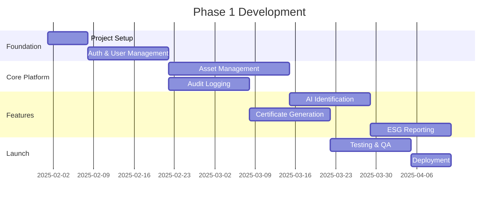

# Phase 1 Delivery Roadmap

**Document Version:** 1.0
**Last Updated:** 13 January 2025
**Status:** Draft for Review

---

> **MILESTONE 0 — DISCOVERY PHASE**
>
> This document is a deliverable of Milestone 0, a paid discovery phase intended to define the technical, architectural, and compliance foundations of AI-Reclaim™ **prior to any production build**.
>
> This document does not constitute a commitment to build. Detailed scope, timelines, and commercials for development phases will be defined following successful completion and acceptance of Milestone 0.
>
> All intellectual property vests exclusively in A to Z IT Recycling Ltd.

---

## Phase 1 Scope

(Define what's included in Phase 1 MVP)

## Milestones

## Milestone Details

### M1: Project Setup
- (Tasks and acceptance criteria)

### M2: Auth & User Management
- (Tasks and acceptance criteria)

### M3: Asset Management
- (Tasks and acceptance criteria)

### M4: Audit Logging
- (Tasks and acceptance criteria)

### M5: AI Identification
- (Tasks and acceptance criteria)

### M6: Certificate Generation
- (Tasks and acceptance criteria)

### M7: ESG Reporting
- (Tasks and acceptance criteria)

## Dependencies

(Identify critical path and dependencies)

## Resource Requirements

(Team composition and skills needed)
