# AI-Reclaim™ — Executive Summary

**Milestone 0: Discovery Phase Deliverables**

**Prepared for:** A to Z IT Recycling Ltd
**Prepared by:** Oluwasegun Olumbe

---

## Overview

This document summarises the technical discovery phase for AI-Reclaim™, a compliance-first SaaS platform for IT asset disposition (ITAD) management.

**Target Market:** NHS trusts, banks, local authorities, and enterprises requiring auditable IT asset disposal with environmental reporting.

---

## What We've Defined

| Deliverable | Summary |
|-------------|---------|
| **System Architecture** | AWS-hosted multi-tenant platform with hardened containers, UK data residency (eu-west-2), and defence-in-depth security |
| **Data Model** | 8 core entities supporting asset lifecycle from registration through certified disposal |
| **API Design** | RESTful API with Cognito authentication and role-based access control |
| **Compliance** | GDPR, NHS DSPT, ISO 27001, and Cyber Essentials alignment |
| **Delivery Roadmap** | 6 milestones from infrastructure to launch |
| **Risk Register** | 23 identified risks with mitigations; 11 unknowns requiring resolution |

---

## Key Architectural Decisions

| Decision | Choice | Rationale |
|----------|--------|-----------|
| Cloud Provider | AWS (eu-west-2 London) | UK data residency, NHS compliance programme |
| Database | PostgreSQL with RLS | Multi-tenant isolation, audit compliance |
| Containers | Hardened base images | Minimal CVE footprint, regular scanning |
| Authentication | AWS Cognito | Managed MFA, enterprise SSO capability |
| AI Identification | AWS Rekognition | Image-based asset recognition |

---

## Platform Capabilities (Phase 1)

```
┌─────────────────────────────────────────────────────────┐
│                    AI-RECLAIM™ MVP                      │
├─────────────────────────────────────────────────────────┤
│                                                         │
│  ✓ Asset Registration      ✓ AI Identification          │
│  ✓ Batch Management        ✓ Status Tracking            │
│  ✓ Certificate Generation  ✓ Immutable Audit Logs       │
│  ✓ Role-Based Access       ✓ Multi-Tenant Isolation     │
│                                                         │
└─────────────────────────────────────────────────────────┘
```

**Asset Lifecycle:**
```
Registered → Collected → Processing → Completed
                                         ↓
                                   Certificate
                                   (Destruction/Recycling/
                                    Sanitisation/WEEE)
```

---

## Compliance Coverage

| Framework | Status |
|-----------|--------|
| GDPR | Designed for compliance |
| NHS DSPT | 10 standards addressed |
| ISO 27001 | Control domains aligned |
| Cyber Essentials Plus | 5 controls implemented |

---

## Delivery Milestones

```
M1 Foundation → M2 Auth → M3 Assets → M4 Processing → M5 Certificates → M6 QA
     ↓            ↓          ↓            ↓               ↓              ↓
   AWS/DB      Cognito    AI ID      Batches          PDF Gen        Launch
   CI/CD        RBAC      CRUD       Workflow         Audit UI        UAT
```

---

## Critical Items Requiring Decision

| Priority | Item | Action Required |
|----------|------|-----------------|
| 🔴 | <abbr title="We need to test if AWS Rekognition can accurately identify IT equipment types (laptops, servers, monitors, etc.) from photos. A Proof of Concept with real sample images from your warehouse will validate this before we commit to the approach.">AI accuracy unknown</abbr> | Approve PoC with sample IT asset images |
| 🔴 | <abbr title="Should recycling facility staff have their own simplified interface focused on processing tasks, or can they use the same portal as clients with different permissions? A separate UI adds development cost but may improve efficiency.">Operator portal scope</abbr> | Confirm if separate UI needed |
| 🟠 | <abbr title="ISO 27001 is an information security certification. Some enterprise clients may require AI-Reclaim to be ISO 27001 certified before they can use it. This affects infrastructure design and adds compliance overhead.">ISO 27001 requirement</abbr> | Confirm with enterprise prospects |
| 🟠 | <abbr title="How long must certificates of destruction/recycling be stored? UK regulations typically require 3-7 years for compliance records. This affects database storage costs and data retention policies.">Certificate retention period</abbr> | Legal consultation required |
| 🟡 | <abbr title="Penetration testing is a security assessment where ethical hackers attempt to find vulnerabilities. Required by some regulated clients (NHS, banks) but adds cost and time before launch.">Penetration testing</abbr> | Confirm if required before launch |

---

## Open Questions for Client

1. **Operator workflow** — Do recycling operators need a separate portal or can role-based access suffice?

2. **Certificate templates** — Are standard templates acceptable or do you need custom branding?

3. **Pilot client** — Who will participate in UAT testing?

4. **NHS engagement** — Do you have an NHS trust contact for DSPT requirements clarification?

5. **Offline capability** — Do field staff need offline data entry?

---

## Next Steps

1. **Review** — Client reviews all 6 deliverables
2. **Clarify** — Address open questions above
3. **Validate** — Run AI identification PoC (critical assumption)
4. **Approve** — Sign-off on Milestone 0
5. **Proceed** — Define Phase 1 scope and commercials

---

## Document Index

| # | Document | Description |
|---|----------|-------------|
| 01 | [System Architecture](./01-system-architecture/README.md) | Technical architecture, AWS design |
| 02 | [Core Data Model](./02-data-model/README.md) | Entities, relationships, ER diagrams |
| 03 | [API & Integration](./03-api-integration/README.md) | REST API structure, authentication |
| 04 | [Compliance & Security](./04-compliance-security/README.md) | GDPR, NHS DSPT, audit logging |
| 05 | [Delivery Roadmap](./05-delivery-roadmap/README.md) | Phase 1 milestones |
| 06 | [Risks Register](./06-risks-register/README.md) | Risks, unknowns, mitigations |

---

> **Note:** This discovery phase defines foundations only. Detailed scope, timelines, and commercials for development phases will be defined following Milestone 0 acceptance.
>
> All intellectual property vests exclusively in A to Z IT Recycling Ltd.


---

# DETAILED DELIVERABLES

---

# System Architecture

**Document Version:** 1.0
**Last Updated:** 13 January 2025
**Status:** Complete
**Author:** AI-Reclaim Development Team

---

> **MILESTONE 0 — DISCOVERY PHASE**
>
> This document is a deliverable of Milestone 0, a paid discovery phase intended to define the technical, architectural, and compliance foundations of AI-Reclaim™ **prior to any production build**.
>
> This document does not constitute a commitment to build. Detailed scope, timelines, and commercials for development phases will be defined following successful completion and acceptance of Milestone 0.
>
> All intellectual property vests exclusively in A to Z IT Recycling Ltd.

---

## Executive Summary

This document defines the technical architecture for AI-Reclaim™, a compliance-first SaaS platform for IT asset disposition (ITAD) management. The architecture addresses three critical requirements for our target market of NHS trusts, banks, local authorities, and enterprises:

1. **Regulatory compliance** — Immutable audit trails, secure chain of custody, and certified destruction documentation
2. **Data sovereignty** — All data processing and storage within UK jurisdiction (AWS eu-west-2)
3. **Scalability** — Pilot deployment that scales to national adoption without re-architecture

The proposed solution is a multi-tenant web application hosted on AWS, using PostgreSQL with Row-Level Security for tenant isolation, AWS Rekognition for AI-powered asset identification, and S3 for secure document storage.

**Key architectural decisions:**
- AWS eu-west-2 (London) as sole deployment region
- Multi-tenant architecture with database-level isolation
- Managed services (Cognito, RDS, S3) to reduce operational complexity
- Web-only MVP with responsive design for tablet use

---

## 1. Introduction

### 1.1 Purpose

This document provides the high-level system architecture for AI-Reclaim™. It is intended to:
- Communicate the technical approach to stakeholders
- Guide Phase 1 development decisions
- Serve as a reference for security and compliance review
- Document assumptions requiring validation

### 1.2 Scope

This architecture covers:
- Application components and their interactions
- Data storage and isolation strategy
- Security and compliance controls
- Scalability approach from pilot to national scale

Out of scope for this document:
- Detailed API specifications (see `03-api-integration/`)
- Database schema design (see `02-data-model/`)
- Security policies and procedures (see `04-compliance-security/`)

### 1.3 Audience

| Audience | Relevant Sections |
|----------|-------------------|
| Business stakeholders | Executive Summary, Section 1 |
| Development team | Sections 2-6 |
| Security/compliance | Sections 4, 7, 8 |
| Operations | Sections 6, 7 |

### 1.4 Platform Overview

AI-Reclaim™ is a multi-tenant SaaS platform hosted on AWS (UK region) providing IT asset disposition tracking, AI-enabled identification, and compliance reporting for regulated organisations.

The platform enables organisations to maintain a complete digital chain of custody for IT assets from collection through to certified destruction or recycling, while generating the audit trails and ESG reports required by regulators.

### 1.1 Architecture Principles

The architecture is guided by the following principles:

1. **Compliance-first design** — Every component is designed with audit logging, data residency, and regulatory requirements as primary concerns, not afterthoughts.

2. **Multi-tenant isolation** — Client organisations share infrastructure while data is strictly isolated at the database and storage layers to prevent cross-tenant access.

3. **UK data sovereignty** — All data processing and storage occurs exclusively within AWS eu-west-2 (London) to meet UK data protection requirements for NHS, financial services, and public sector clients.

4. **Managed services preference** — Where possible, AWS managed services are used to reduce operational overhead, improve security posture, and accelerate time-to-market.

5. **Horizontal scalability** — The architecture supports growth from pilot (1-10 organisations) to national scale (50+ organisations) without fundamental redesign.

---

## 2. High-Level Architecture

### 2.1 Architecture Diagram

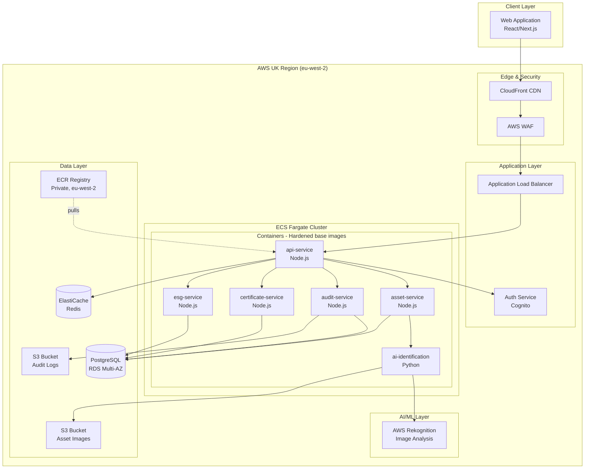

### 2.2 Architecture Narrative

The architecture follows a layered approach where each layer has distinct responsibilities:

**Client Layer**: A single-page web application built with React/Next.js provides the user interface for all user types (client organisation staff, recycling operators, auditors, and administrators). The application is served as static assets from S3 via CloudFront, enabling global edge caching while keeping origin data in the UK.

**Edge & Security Layer**: All inbound traffic passes through CloudFront and AWS WAF before reaching the application. WAF provides protection against common web exploits (SQL injection, XSS), bot traffic, and DDoS attacks. This layer acts as the first line of defence for the platform.

**Application Layer**: The Application Load Balancer (ALB) receives all inbound requests from WAF and routes them to the appropriate backend services. AWS Cognito provides managed authentication, handling user identities, JWT token issuance, and MFA for compliance requirements. The ALB performs health checks and distributes traffic across container instances.

**Container Platform (ECS Fargate)**: All application services run as containerised microservices on AWS ECS Fargate, using **hardened base images** (e.g., distroless, Chainguard, or AWS-vetted images per feasibility assessment). Regular vulnerability scanning via ECR ensures minimal CVE footprint. Container images are stored in a private ECR registry within eu-west-2.

**Business Services Layer**: Five domain-specific containerised services handle core platform functionality:
- **api-service** — Request routing, rate limiting, JWT validation
- **asset-service** — Asset lifecycle management from registration through disposition
- **audit-service** — Immutable audit log entries for all significant actions
- **certificate-service** — Destruction and recycling certificate generation
- **esg-service** — Environmental impact calculations and reporting

**AI/ML Layer**: The AI Identification Service enables users to identify IT assets by uploading photographs or scanning barcodes/serial numbers. Image analysis is performed by AWS Rekognition, with results matched against a device database. This accelerates asset registration and reduces data entry errors.

**Data Layer**: PostgreSQL (RDS) serves as the primary transactional database, chosen for its ACID compliance, Row-Level Security support, and mature audit capabilities. Redis (ElastiCache) provides caching for session data and frequently-accessed queries. S3 buckets store asset images and archived audit logs with appropriate retention policies.

---

## 3. Component Specifications

| Component | Purpose | AWS Service | Justification |
|-----------|---------|-------------|---------------|
| Web Application | User interface for all user types | S3 + CloudFront | Static hosting reduces attack surface; CDN improves performance |
| Container Registry | Private image storage | ECR (eu-west-2) | UK data residency; integrated scanning; immutable tags |
| api-service | API routing, rate limiting, request orchestration | ECS Fargate (Node.js) | Serverless containers; Docker Hardened base for compliance |
| Auth Service | Authentication, JWT tokens, MFA | Cognito | Managed auth with built-in MFA, federation support, compliance certifications |
| asset-service | Asset lifecycle management | ECS Fargate (Node.js) | Stateless containers; independent scaling |
| audit-service | Immutable audit log creation | ECS Fargate (Node.js) | Dedicated service ensures audit writes are never blocked |
| certificate-service | Certificate generation, PDF | ECS Fargate (Node.js) | PDF generation with Lambda burst capacity |
| esg-service | Environmental impact calculations | ECS Fargate (Node.js) | Complex calculations benefit from dedicated compute |
| ai-identification | Image classification + barcode decoding | ECS Fargate (Python) | Rekognition for images; separate barcode library |
| Primary Database | Transactional data, tenant isolation | RDS PostgreSQL | ACID compliance, RLS for tenant isolation, JSON support |
| Cache | Session data, frequent queries | ElastiCache Redis | Sub-millisecond latency; reduces database load |
| Object Storage | Asset images, PDFs, audit archives | S3 | Unlimited scale; lifecycle policies for retention management |

---

## 4. Multi-Tenant Architecture

### 4.1 Tenant Isolation Diagram

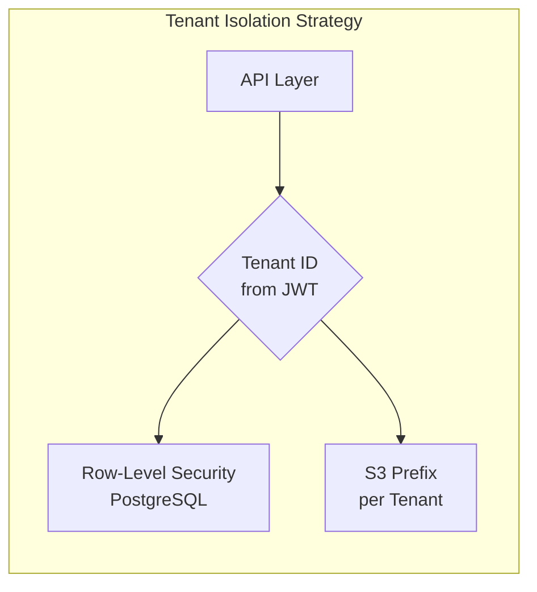

### 4.2 Isolation Strategy

Multi-tenancy is a core architectural decision that enables infrastructure sharing while maintaining strict data isolation between client organisations. The isolation strategy operates at multiple levels:

**Authentication Level**: When a user authenticates via Cognito, their JWT token includes an `organisation_id` claim. This claim is extracted and validated on every API request, ensuring users can only access data belonging to their organisation.

**Database Level**: PostgreSQL Row-Level Security (RLS) policies automatically filter all queries by `organisation_id`. Even if application code contains a bug that omits tenant filtering, the database layer enforces isolation. This defence-in-depth approach is critical for regulated environments.

**Storage Level**: S3 objects are stored with a tenant-specific prefix structure (`s3://bucket/{organisation_id}/...`). IAM policies and bucket policies restrict access to tenant-specific prefixes based on the authenticated user's organisation.

**Cache Level**: Redis keys are namespaced per tenant (`{organisation_id}:cache_key`), preventing cache pollution between organisations.

This multi-layered approach ensures that a failure at any single layer does not result in cross-tenant data exposure.

---

## 5. Design Assumptions

This section documents assumptions made during architecture definition. Assumptions are categorised by confidence level and validation status.

### 5.1 Confirmed Assumptions

These assumptions are based on explicit requirements or stakeholder decisions:

| ID | Assumption | Source | Notes |
|----|------------|--------|-------|
| A1 | Platform will be web-only for MVP | Stakeholder decision | Native mobile apps deferred to future phase |
| A2 | AWS is the cloud provider | Stakeholder decision | Selected over Azure/GCP |
| A3 | All data must reside in UK | Compliance requirement | NHS, financial services, public sector mandate |
| A4 | Multi-tenant architecture | Stakeholder decision | Isolation via RLS |

### 5.2 Technical Assumptions

These assumptions are based on technical analysis and require validation:

| ID | Assumption | Confidence | Validation Approach | Risk if Invalid |
|----|------------|------------|---------------------|-----------------|
| T1 | AWS Cognito meets authentication requirements including MFA and potential SSO | High | Review Cognito capabilities against NHS/enterprise SSO requirements | May need custom auth implementation |
| T2 | PostgreSQL RLS provides sufficient tenant isolation | High | Security review during Phase 1 | May need schema-per-tenant approach |
| T3 | PostgreSQL handles audit write volume | Medium | Load testing with projected volumes | May need separate audit database or time-series DB |
| T4 | AWS Rekognition recognises IT equipment (laptops, servers, monitors) | Low | **Requires PoC** with sample IT asset images | May need custom ML model training |
| T5 | Synchronous AI identification completes within 5 seconds | Medium | Performance testing during Phase 1 | May need async pattern with webhooks/polling |
| T6 | ECS Fargate provides adequate compute flexibility | High | Standard AWS pattern | Unlikely to be invalid |

### 5.3 Business Assumptions

These assumptions relate to user requirements and workflows:

| ID | Assumption | Confidence | Validation Approach | Risk if Invalid |
|----|------------|------------|---------------------|-----------------|
| B1 | Recycling operators can use same portal as clients (with different permissions) | **Unknown** | User research / stakeholder interview | May need separate operator portal |
| B2 | Responsive web design is acceptable for warehouse/field use | Medium | User testing with target devices | May need PWA with offline capability |
| B3 | 99.9% availability SLA meets customer expectations | High | Confirm in sales process | Higher SLA requires multi-region architecture |
| B4 | English-only interface is acceptable for MVP | High | Confirm with stakeholders | Internationalisation adds complexity |

### 5.4 Assumptions Requiring Immediate Validation

The following assumptions are high-risk and should be validated before Phase 1 development begins:

| Priority | ID | Assumption | Recommended Action |
|----------|----|-----------|--------------------|
| 🔴 Critical | T4 | Rekognition recognises IT equipment | Run PoC with 50+ sample images of typical IT assets |
| 🟠 High | B1 | Operators use same portal | Interview 2-3 recycling operators about their workflow |
| 🟡 Medium | T3 | PostgreSQL audit performance | Estimate audit event volume; compare to PostgreSQL benchmarks |

---

## 6. Scalability Considerations

### 6.1 Growth Path

The architecture is designed to scale through three phases without fundamental redesign:

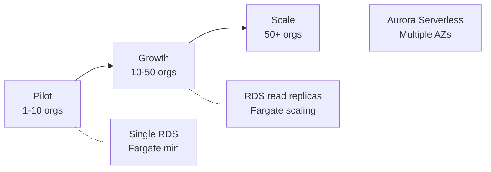

### 6.2 Phase Specifications

**Pilot Phase (1-10 Organisations)**

The pilot phase establishes the foundation for growth. Infrastructure is sized for minimal viable capacity with auto-scaling headroom.

| Resource | Sizing |
|----------|--------|
| API Compute | ECS Fargate 0.5 vCPU / 1GB, 1-4 tasks |
| Database | RDS db.t3.medium, Single-AZ |
| Cache | ElastiCache cache.t3.micro |
| Storage | S3 Standard |

**Growth Phase (10-50 Organisations)**

As user base grows, the focus shifts to resilience and read performance. Database read replicas offload reporting queries from the primary instance.

| Resource | Sizing | Changes from Pilot |
|----------|--------|-------------------|
| API Compute | Fargate 2-10 tasks | Increased min capacity |
| Database | RDS Multi-AZ + Read Replica | Add failover and read scaling |
| Cache | ElastiCache cluster mode | Add cache redundancy |

**Scale Phase (50+ Organisations)**

At national scale, Aurora Serverless provides automatic scaling based on demand, and services may be split into independently deployable microservices.

| Resource | Sizing | Changes from Growth |
|----------|--------|-------------------|
| Database | Aurora Serverless v2 | Auto-scaling, higher IOPS |
| Compute | Fargate with service mesh | Independent service scaling |
| Observability | Enhanced CloudWatch, X-Ray | Distributed tracing |

### 6.3 Performance Targets

| Metric | Target | Measurement Method |
|--------|--------|-------------------|
| API Response Time (p95) | <500ms | CloudWatch Metrics |
| AI Identification Time | <5s | CloudWatch Metrics |
| Platform Availability | 99.9% | CloudWatch Synthetics |
| Audit Log Write Latency | <100ms | CloudWatch Metrics |
| Database Query Time (p95) | <100ms | RDS Performance Insights |

---

## 7. Security Architecture

Security is addressed in detail in `04-compliance-security/README.md`. This section summarises the key architectural security controls:

### 7.1 Network Security

- **VPC isolation**: All backend services run in private subnets with no direct internet access
- **Security groups**: Least-privilege network access between components
- **NAT Gateway**: Controlled outbound internet access for services requiring external APIs

### 7.2 Data Security

- **Encryption in transit**: TLS 1.3 enforced on all connections
- **Encryption at rest**: AWS KMS-managed keys for RDS, S3, and ElastiCache
- **Key rotation**: Automatic annual key rotation via KMS

### 7.3 Application Security

- **WAF rules**: OWASP Top 10 protection, rate limiting, bot detection
- **Input validation**: All API inputs validated against schemas
- **Output encoding**: Prevent XSS via content security policies

### 7.4 Access Control

- **IAM roles**: Service-specific roles with least-privilege policies
- **Cognito MFA**: Multi-factor authentication required for privileged users
- **Audit logging**: All access and changes logged to CloudTrail and application audit log

---

## 8. UK Data Residency

Compliance with UK data protection requirements is a non-negotiable architectural constraint. The following measures ensure all data remains within UK jurisdiction:

| Requirement | Implementation | Verification |
|-------------|----------------|--------------|
| All data stored in UK | AWS eu-west-2 (London) region exclusively | AWS Config rules |
| No cross-region replication | Replication disabled by IAM policy | IAM policy audit |
| Backups in UK | RDS automated backups in eu-west-2 | Backup configuration audit |
| Processing in UK | All compute resources in eu-west-2 | Resource tagging audit |
| CDN edge locations | CloudFront geo-restriction (optional) | Distribution configuration |

### 8.1 Compliance Certifications

AWS eu-west-2 maintains certifications relevant to target customers:
- ISO 27001, 27017, 27018
- SOC 1, 2, 3
- Cyber Essentials Plus
- NHS Data Security and Protection Toolkit (via AWS compliance programme)

---

## 9. Decision Log

| ID | Decision | Rationale | Alternatives Considered |
|----|----------|-----------|------------------------|
| D1 | AWS as cloud provider | UK region availability, NHS compliance, managed services | Azure (strong NHS presence), GCP |
| D2 | PostgreSQL as primary database | RLS for multi-tenancy, ACID for audit, team familiarity | MongoDB (flexible schema), DynamoDB (serverless) |
| D3 | Multi-tenant shared infrastructure | Shared infrastructure with isolation via RLS | Single-tenant (simpler isolation) |
| D4 | Web-only MVP | Faster time-to-market; responsive design covers tablets | Native mobile apps (better offline support) |
| D5 | Mermaid for diagrams | Version-controllable, renders in GitHub/IDEs | Draw.io (richer visuals), Lucidchart (collaboration) |
| D6 | Hardened base images | Minimal CVE footprint; regular vulnerability scanning | Standard Docker images (higher CVE risk) |
| D7 | Microservices on ECS Fargate | Independent scaling; fault isolation; serverless ops | Monolith (simpler), EKS (more complex) |

---

## 10. Open Questions

The following questions require resolution before or during Phase 1:

1. **Operator portal scope**: Do recycling operators require a separate portal with different workflows, or can role-based access within the same portal suffice?

2. **AI model training**: Will AWS Rekognition recognise IT assets (laptops, servers, monitors) out-of-the-box, or will custom model training be required?

3. **Offline capability**: Do field staff require offline data entry capability, and if so, what sync strategy should be used?

4. **Integration requirements**: What existing systems (ERP, ticketing, logistics) do target customers need to integrate with?

5. **Certificate legal requirements**: What specific content and format is required for destruction certificates to be legally valid in UK jurisdictions?


---

# Core Data Model

**Document Version:** 1.0
**Last Updated:** 13 January 2025
**Status:** Complete

---

> **MILESTONE 0 — DISCOVERY PHASE**
>
> This document is a deliverable of Milestone 0, a paid discovery phase intended to define the technical, architectural, and compliance foundations of AI-Reclaim™ **prior to any production build**.
>
> This document does not constitute a commitment to build. Detailed scope, timelines, and commercials for development phases will be defined following successful completion and acceptance of Milestone 0.
>
> All intellectual property vests exclusively in A to Z IT Recycling Ltd.

---

## Executive Summary

This document defines the core data model for AI-Reclaim™, establishing the primary entities, their attributes, and relationships required to support IT asset disposition tracking, compliance audit trails, and ESG reporting.

**Key design decisions:**
- Assets tracked individually with optional batch grouping for efficient collection handling
- Simple 4-stage lifecycle (Registered → Collected → Processing → Completed)
- Four certificate types supporting destruction, recycling, data sanitisation, and WEEE compliance
- Multi-tenant isolation via `organisation_id` foreign key on all tenant-scoped entities
- Immutable audit log capturing all state changes with before/after values

---

## 1. Entity Overview

### 1.1 Primary Entities

| Entity | Description | Tenant-Scoped |
|--------|-------------|---------------|
| **Organisation** | Client organisation (NHS trust, bank, local authority, etc.) | No (is tenant) |
| **User** | System users with role-based access | Yes |
| **Asset** | Individual IT equipment item tracked through disposal lifecycle | Yes |
| **Batch** | Collection of assets grouped for efficient handling | Yes |
| **AssetType** | Category/classification of IT equipment | No (shared) |
| **Certificate** | Legal compliance document (destruction, recycling, etc.) | Yes |
| **AuditLog** | Immutable record of all system actions | Yes |
| **ESGReport** | Environmental impact report for an organisation | Yes |

### 1.2 Supporting Entities

| Entity | Description | Purpose |
|--------|-------------|---------|
| **Address** | Physical location for collection/delivery | Supports multiple addresses per organisation |
| **Contact** | Contact person within an organisation | Communication and notifications |
| **AssetImage** | Photograph of asset for AI identification | Links to S3 storage |

---

## 2. Entity Relationship Diagram

### 2.1 Core Relationships

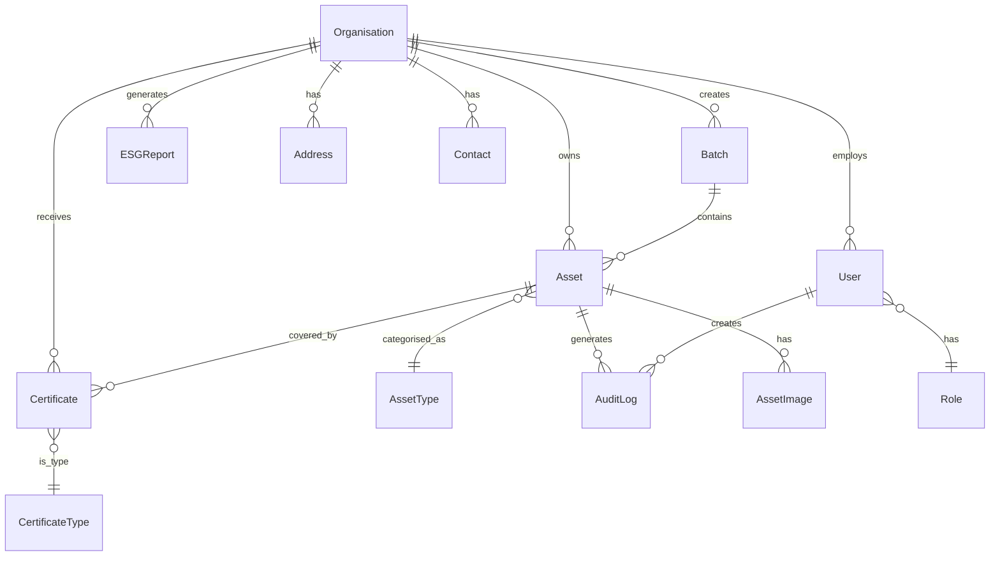

### 2.2 Detailed Schema Diagram

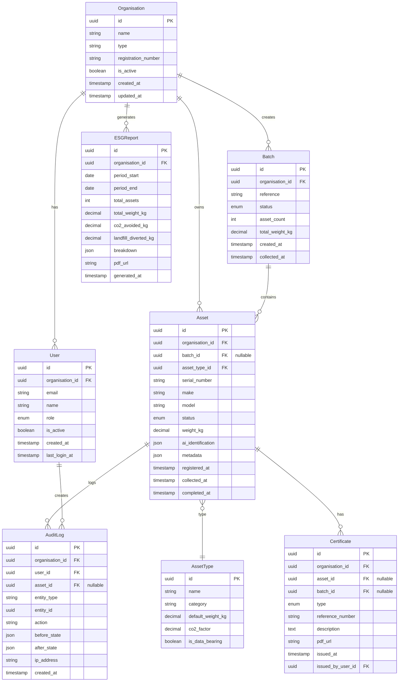

---

## 3. Entity Specifications

### 3.1 Organisation

The Organisation entity represents a client company using the platform. All tenant-scoped data is isolated by `organisation_id`.

| Field | Type | Constraints | Description |
|-------|------|-------------|-------------|
| `id` | UUID | PK | Unique identifier |
| `name` | VARCHAR(255) | NOT NULL | Organisation display name |
| `type` | ENUM | NOT NULL | `nhs_trust`, `bank`, `local_authority`, `enterprise`, `recycler` |
| `registration_number` | VARCHAR(50) | UNIQUE | Companies House or charity number |
| `is_active` | BOOLEAN | DEFAULT true | Soft delete flag |
| `created_at` | TIMESTAMP | NOT NULL | Record creation time |
| `updated_at` | TIMESTAMP | NOT NULL | Last modification time |

**Business Rules:**
- Organisation cannot be deleted if it has assets in processing
- Type determines available features and compliance requirements

---

### 3.2 User

Users belong to an organisation and have role-based permissions.

| Field | Type | Constraints | Description |
|-------|------|-------------|-------------|
| `id` | UUID | PK | Unique identifier |
| `organisation_id` | UUID | FK, NOT NULL | Parent organisation |
| `email` | VARCHAR(255) | UNIQUE, NOT NULL | Login identifier |
| `name` | VARCHAR(255) | NOT NULL | Display name |
| `role` | ENUM | NOT NULL | User role (see below) |
| `is_active` | BOOLEAN | DEFAULT true | Account active flag |
| `created_at` | TIMESTAMP | NOT NULL | Account creation time |
| `last_login_at` | TIMESTAMP | | Last successful login |

**User Roles:**

| Role | Description | Permissions |
|------|-------------|-------------|
| `admin` | Organisation administrator | Full access to organisation data, user management |
| `operator` | Recycling facility staff | Asset processing, certificate generation |
| `client` | Client organisation staff | Register assets, view status, download certificates |
| `auditor` | Compliance auditor | Read-only access to all data and audit logs |

---

### 3.3 Asset

The Asset entity represents an individual IT equipment item tracked through the disposal lifecycle.

| Field | Type | Constraints | Description |
|-------|------|-------------|-------------|
| `id` | UUID | PK | Unique identifier |
| `organisation_id` | UUID | FK, NOT NULL | Owning organisation |
| `batch_id` | UUID | FK, NULL | Optional batch grouping |
| `asset_type_id` | UUID | FK, NOT NULL | Equipment category |
| `serial_number` | VARCHAR(100) | | Manufacturer serial number |
| `make` | VARCHAR(100) | | Manufacturer name |
| `model` | VARCHAR(100) | | Model name/number |
| `status` | ENUM | NOT NULL | Current lifecycle stage |
| `weight_kg` | DECIMAL(10,3) | | Actual weight in kilograms |
| `ai_identification` | JSONB | | AI recognition results |
| `metadata` | JSONB | | Additional custom fields |
| `registered_at` | TIMESTAMP | NOT NULL | When asset was registered |
| `collected_at` | TIMESTAMP | | When asset was collected |
| `completed_at` | TIMESTAMP | | When processing completed |

**Asset Status Lifecycle:**

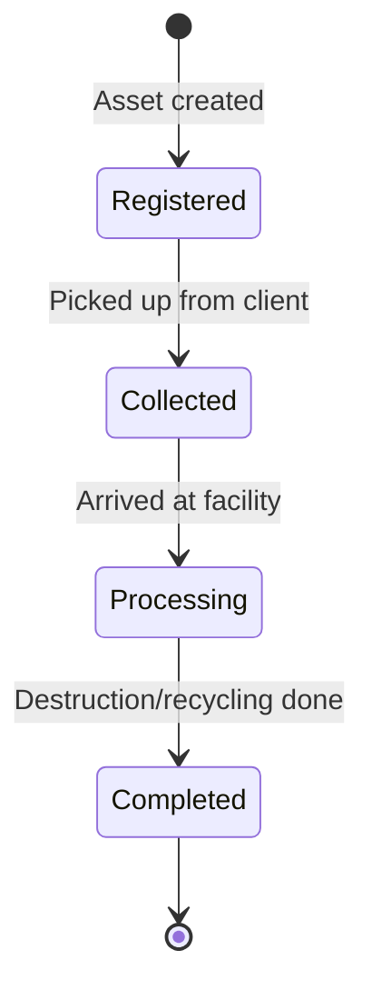

| Status | Description | Allowed Transitions |
|--------|-------------|---------------------|
| `registered` | Asset logged in system, awaiting collection | → `collected` |
| `collected` | Asset picked up, in transit to facility | → `processing` |
| `processing` | At facility, undergoing audit/sanitisation/recycling | → `completed` |
| `completed` | Final disposition complete, certificate issued | (terminal) |

**AI Identification JSON Structure:**
```json
{
  "confidence": 0.94,
  "detected_make": "Dell",
  "detected_model": "Latitude 5520",
  "detected_type": "laptop",
  "image_url": "s3://bucket/org-id/assets/asset-id/photo.jpg",
  "identified_at": "2025-01-13T10:30:00Z"
}
```

---

### 3.4 Batch

Batches allow grouping of assets for efficient collection and processing.

| Field | Type | Constraints | Description |
|-------|------|-------------|-------------|
| `id` | UUID | PK | Unique identifier |
| `organisation_id` | UUID | FK, NOT NULL | Owning organisation |
| `reference` | VARCHAR(50) | NOT NULL | Human-readable batch ID |
| `status` | ENUM | NOT NULL | Batch status |
| `asset_count` | INT | DEFAULT 0 | Number of assets in batch |
| `total_weight_kg` | DECIMAL(10,3) | DEFAULT 0 | Sum of asset weights |
| `created_at` | TIMESTAMP | NOT NULL | Batch creation time |
| `collected_at` | TIMESTAMP | | When batch was collected |

**Batch Status:**
- `open` — Accepting new assets
- `closed` — No more assets, awaiting collection
- `collected` — In transit
- `processing` — At facility
- `completed` — All assets processed

---

### 3.5 AssetType

Shared reference data for IT equipment categories.

| Field | Type | Constraints | Description |
|-------|------|-------------|-------------|
| `id` | UUID | PK | Unique identifier |
| `name` | VARCHAR(100) | NOT NULL | Display name (e.g., "Laptop") |
| `category` | VARCHAR(50) | NOT NULL | High-level category |
| `default_weight_kg` | DECIMAL(10,3) | | Estimated weight if not measured |
| `co2_factor` | DECIMAL(10,4) | | kg CO2 avoided per kg recycled |
| `is_data_bearing` | BOOLEAN | DEFAULT false | Requires data sanitisation |

**Standard Asset Types:**

| Name | Category | Data Bearing | CO2 Factor |
|------|----------|--------------|------------|
| Laptop | Computing | Yes | 2.1 |
| Desktop PC | Computing | Yes | 1.8 |
| Server | Computing | Yes | 3.2 |
| Monitor | Display | No | 1.5 |
| Printer | Peripheral | No | 1.2 |
| Mobile Phone | Mobile | Yes | 0.8 |
| Tablet | Mobile | Yes | 0.9 |
| Network Switch | Networking | No | 1.4 |
| Hard Drive | Storage | Yes | 0.5 |

---

### 3.6 Certificate

Legal compliance documents issued upon completion of asset processing.

| Field | Type | Constraints | Description |
|-------|------|-------------|-------------|
| `id` | UUID | PK | Unique identifier |
| `organisation_id` | UUID | FK, NOT NULL | Receiving organisation |
| `asset_id` | UUID | FK, NULL | Single asset (if individual) |
| `batch_id` | UUID | FK, NULL | Batch (if batch certificate) |
| `type` | ENUM | NOT NULL | Certificate type |
| `reference_number` | VARCHAR(50) | UNIQUE, NOT NULL | Official reference |
| `description` | TEXT | | Certificate details |
| `pdf_url` | VARCHAR(500) | | S3 URL to PDF document |
| `issued_at` | TIMESTAMP | NOT NULL | Issue date/time |
| `issued_by_user_id` | UUID | FK, NOT NULL | Issuing operator |

**Certificate Types:**

| Type | Code | Description | Required For |
|------|------|-------------|--------------|
| Certificate of Destruction | `destruction` | Confirms secure physical destruction | Data-bearing assets |
| Certificate of Recycling | `recycling` | Confirms environmentally responsible recycling | All assets |
| Data Sanitisation Certificate | `sanitisation` | Confirms data wiped to NIST 800-88 standard | Data-bearing assets |
| WEEE Compliance Certificate | `weee` | EU/UK e-waste regulation compliance | Batch/collection level |

**Business Rules:**
- Data-bearing assets MUST have either `destruction` or `sanitisation` certificate
- Certificates are immutable once issued
- PDF generated and stored in S3 at issuance

---

### 3.7 AuditLog

Immutable record of all significant system actions for compliance.

| Field | Type | Constraints | Description |
|-------|------|-------------|-------------|
| `id` | UUID | PK | Unique identifier |
| `organisation_id` | UUID | FK, NOT NULL | Tenant scope |
| `user_id` | UUID | FK, NOT NULL | Acting user |
| `asset_id` | UUID | FK, NULL | Related asset (if applicable) |
| `entity_type` | VARCHAR(50) | NOT NULL | Entity being modified |
| `entity_id` | UUID | NOT NULL | ID of modified entity |
| `action` | VARCHAR(50) | NOT NULL | Action performed |
| `before_state` | JSONB | | State before change |
| `after_state` | JSONB | | State after change |
| `ip_address` | INET | | Client IP address |
| `created_at` | TIMESTAMP | NOT NULL | Action timestamp |

**Audit Actions:**

| Action | Entity Types | Description |
|--------|--------------|-------------|
| `created` | All | New record created |
| `updated` | All | Record modified |
| `status_changed` | Asset, Batch | Lifecycle status transition |
| `certificate_issued` | Certificate | Certificate generated |
| `login` | User | User authentication |
| `login_failed` | User | Failed authentication attempt |

**Immutability:**
- Audit logs are append-only (no UPDATE or DELETE)
- Enforced via PostgreSQL trigger and RLS policy
- Archived to S3 after 90 days for long-term retention

---

### 3.8 ESGReport

Environmental, Social, and Governance impact reports.

| Field | Type | Constraints | Description |
|-------|------|-------------|-------------|
| `id` | UUID | PK | Unique identifier |
| `organisation_id` | UUID | FK, NOT NULL | Report owner |
| `period_start` | DATE | NOT NULL | Reporting period start |
| `period_end` | DATE | NOT NULL | Reporting period end |
| `total_assets` | INT | NOT NULL | Assets processed in period |
| `total_weight_kg` | DECIMAL(12,3) | NOT NULL | Total weight processed |
| `co2_avoided_kg` | DECIMAL(12,3) | NOT NULL | CO2 emissions avoided |
| `landfill_diverted_kg` | DECIMAL(12,3) | NOT NULL | Waste diverted from landfill |
| `breakdown` | JSONB | | Detailed breakdown by type |
| `pdf_url` | VARCHAR(500) | | S3 URL to PDF report |
| `generated_at` | TIMESTAMP | NOT NULL | Report generation time |

**ESG Breakdown JSON Structure:**
```json
{
  "by_asset_type": [
    {
      "type": "Laptop",
      "count": 150,
      "weight_kg": 375.5,
      "co2_avoided_kg": 788.55
    }
  ],
  "by_disposition": {
    "recycled": { "count": 180, "weight_kg": 420.0 },
    "destroyed": { "count": 20, "weight_kg": 35.5 }
  }
}
```

**ESG Calculations:**
- `co2_avoided_kg` = Σ (asset weight × asset_type.co2_factor)
- `landfill_diverted_kg` = `total_weight_kg` (assumes 100% diversion)

---

## 4. Multi-Tenant Data Isolation

### 4.1 Isolation Strategy

All tenant-scoped entities include `organisation_id` as a foreign key. PostgreSQL Row-Level Security (RLS) policies enforce isolation at the database level.

```sql
-- Example RLS policy for assets table
CREATE POLICY tenant_isolation ON assets
    USING (organisation_id = current_setting('app.current_organisation_id')::uuid);
```

### 4.2 Tenant-Scoped vs Shared Entities

| Entity | Scope | Isolation |
|--------|-------|-----------|
| Organisation | Global | N/A (is the tenant) |
| User | Tenant | RLS by organisation_id |
| Asset | Tenant | RLS by organisation_id |
| Batch | Tenant | RLS by organisation_id |
| Certificate | Tenant | RLS by organisation_id |
| AuditLog | Tenant | RLS by organisation_id |
| ESGReport | Tenant | RLS by organisation_id |
| AssetType | Shared | No RLS (read-only reference data) |

---

## 5. Indexing Strategy

### 5.1 Primary Indexes

| Table | Index | Columns | Purpose |
|-------|-------|---------|---------|
| assets | `idx_assets_org_status` | (organisation_id, status) | Filter by org and status |
| assets | `idx_assets_batch` | (batch_id) | Batch lookups |
| assets | `idx_assets_serial` | (serial_number) | Serial number search |
| audit_logs | `idx_audit_org_created` | (organisation_id, created_at DESC) | Audit log queries |
| audit_logs | `idx_audit_asset` | (asset_id, created_at DESC) | Asset history |
| certificates | `idx_certs_org_type` | (organisation_id, type) | Certificate listing |

### 5.2 Full-Text Search

```sql
-- Asset search index
CREATE INDEX idx_assets_search ON assets
    USING gin(to_tsvector('english', make || ' ' || model || ' ' || serial_number));
```

---

## 6. Data Retention

| Data Type | Retention Period | Archive Strategy |
|-----------|------------------|------------------|
| Assets | Indefinite | Soft delete after 7 years |
| Audit Logs | 7 years | Archive to S3 after 90 days |
| Certificates | Indefinite | Legal requirement |
| ESG Reports | 7 years | Archive to S3 after 2 years |
| Asset Images | 1 year after completion | Delete from S3 |

---

## 7. Open Questions

| ID | Question | Impact | Resolution Approach |
|----|----------|--------|---------------------|
| DM1 | Should assets support custom fields per organisation? | Schema flexibility | JSONB metadata field (implemented) |
| DM2 | Is batch-level certificate sufficient or per-asset required? | Certificate workflow | Both supported (asset_id OR batch_id) |
| DM3 | What is the legal retention period for certificates? | Storage capacity | Research UK WEEE regulations |
| DM4 | Should audit logs be cryptographically signed? | Compliance | Assess NHS/financial requirements |

---

## 8. Decision Log

| ID | Decision | Rationale |
|----|----------|-----------|
| D1 | Simple 4-stage asset lifecycle | Reduces complexity; covers core workflow |
| D2 | Individual + batch tracking | Flexibility for different client workflows |
| D3 | Four certificate types | Covers destruction, recycling, sanitisation, WEEE |
| D4 | JSONB for AI identification | Flexible schema for ML model evolution |
| D5 | Weight-based ESG metrics | Standard industry approach; extensible later |


---

# API & Integration Outline

**Document Version:** 1.0
**Last Updated:** January 2025
**Status:** Complete

---

> **MILESTONE 0 — DISCOVERY PHASE**
>
> This document is a deliverable of Milestone 0, a paid discovery phase intended to define the technical, architectural, and compliance foundations of AI-Reclaim™ **prior to any production build**.
>
> This document does not constitute a commitment to build. Detailed scope, timelines, and commercials for development phases will be defined following successful completion and acceptance of Milestone 0.
>
> All intellectual property vests exclusively in A to Z IT Recycling Ltd.

---

## Executive Summary

This document outlines the proposed API structure for AI-Reclaim™. The API serves as the interface between the web application and backend services, enabling asset management, audit logging, certificate generation, and ESG reporting.

**Key decisions:**
- RESTful API design for broad compatibility and ease of integration
- JWT-based authentication via AWS Cognito
- Versioned API (v1) to support future evolution
- External integrations documented as future consideration

---

## 1. API Design Principles

| Principle | Description |
|-----------|-------------|
| **RESTful** | Resource-oriented endpoints following REST conventions |
| **Versioned** | API version in URL path (e.g., `/v1/assets`) |
| **JSON** | Request and response bodies in JSON format |
| **Authenticated** | All endpoints require valid JWT token (except health check) |
| **Tenant-scoped** | Organisation ID derived from token; users access only their data |
| **Audited** | All write operations generate audit log entries |

---

## 2. API Structure Overview

### 2.1 Resource Domains

The API is organised around the following resource domains:

```
/v1
├── /auth              → Authentication & session management
├── /assets            → Asset lifecycle management
├── /batches           → Batch/collection management
├── /certificates      → Certificate generation & retrieval
├── /audit             → Audit log queries
├── /esg               → ESG reporting
├── /users             → User management (admin)
└── /organisations     → Organisation settings (admin)
```

### 2.2 Endpoint Summary

| Domain | Key Operations | Access |
|--------|----------------|--------|
| **Auth** | Login, logout, refresh token, password reset | Public/Authenticated |
| **Assets** | Register, list, view, update status, AI identify | Client, Operator |
| **Batches** | Create, add assets, close, view | Client, Operator |
| **Certificates** | Generate, list, download PDF | Operator, Client (read) |
| **Audit** | Query logs, export | Auditor, Admin |
| **ESG** | Generate report, list reports, download | Client, Admin |
| **Users** | Create, list, update, deactivate | Admin |
| **Organisations** | View settings, update | Admin |

---

## 3. Core API Resources

### 3.1 Assets

Primary resource for IT equipment tracking.

| Operation | Method | Endpoint | Description |
|-----------|--------|----------|-------------|
| List assets | GET | `/assets` | Paginated list with filters |
| Register asset | POST | `/assets` | Create new asset record |
| Get asset | GET | `/assets/{id}` | Retrieve asset details |
| Update asset | PATCH | `/assets/{id}` | Update asset fields |
| Change status | POST | `/assets/{id}/status` | Transition lifecycle status |
| AI identify | POST | `/assets/{id}/identify` | Submit image for AI recognition |
| Asset history | GET | `/assets/{id}/history` | Audit trail for asset |

**Common Filters:**
- `status` — Filter by lifecycle status
- `batch_id` — Filter by batch
- `asset_type_id` — Filter by equipment type
- `created_after` / `created_before` — Date range

### 3.2 Batches

Grouping of assets for collection and processing.

| Operation | Method | Endpoint | Description |
|-----------|--------|----------|-------------|
| List batches | GET | `/batches` | Paginated list |
| Create batch | POST | `/batches` | Create new batch |
| Get batch | GET | `/batches/{id}` | Batch details with asset summary |
| Add assets | POST | `/batches/{id}/assets` | Add assets to batch |
| Close batch | POST | `/batches/{id}/close` | Mark batch ready for collection |
| Batch assets | GET | `/batches/{id}/assets` | List assets in batch |

### 3.3 Certificates

Compliance documentation.

| Operation | Method | Endpoint | Description |
|-----------|--------|----------|-------------|
| List certificates | GET | `/certificates` | Paginated list with filters |
| Generate certificate | POST | `/certificates` | Issue new certificate |
| Get certificate | GET | `/certificates/{id}` | Certificate details |
| Download PDF | GET | `/certificates/{id}/pdf` | Download PDF document |

**Certificate Generation Requirements:**
- Asset or batch must be in `completed` status
- Operator role required
- Certificate type must be appropriate for asset type (e.g., destruction for data-bearing)

### 3.4 Audit

Compliance audit trail.

| Operation | Method | Endpoint | Description |
|-----------|--------|----------|-------------|
| Query logs | GET | `/audit` | Paginated audit log query |
| Asset audit | GET | `/audit/assets/{id}` | Audit trail for specific asset |
| Export logs | GET | `/audit/export` | Export audit logs (CSV/JSON) |

**Query Parameters:**
- `entity_type` — Filter by entity (asset, user, certificate)
- `action` — Filter by action type
- `user_id` — Filter by acting user
- `date_from` / `date_to` — Date range

### 3.5 ESG Reporting

Environmental impact reports.

| Operation | Method | Endpoint | Description |
|-----------|--------|----------|-------------|
| List reports | GET | `/esg/reports` | Previous reports |
| Generate report | POST | `/esg/reports` | Generate new report for period |
| Get report | GET | `/esg/reports/{id}` | Report details |
| Download PDF | GET | `/esg/reports/{id}/pdf` | Download PDF report |

---

## 4. Authentication & Authorisation

### 4.1 Authentication Flow

```
┌──────────┐     ┌─────────┐     ┌──────────┐
│  Client  │────▶│   API   │────▶│ Cognito  │
│   App    │◀────│ Service │◀────│   Pool   │
└──────────┘     └─────────┘     └──────────┘
     │                                │
     │◀───────── JWT Token ──────────▶│
```

1. User submits credentials to `/auth/login`
2. API validates with Cognito
3. Cognito returns JWT tokens (access + refresh)
4. Client includes access token in `Authorization` header
5. API validates token and extracts organisation_id

### 4.2 Authorisation Matrix

| Role | Assets | Batches | Certificates | Audit | ESG | Users |
|------|--------|---------|--------------|-------|-----|-------|
| **Admin** | Full | Full | Full | Full | Full | Full |
| **Operator** | Read/Update | Full | Generate | Read | Read | — |
| **Client** | Create/Read | Create/Read | Read | — | Read | — |
| **Auditor** | Read | Read | Read | Full | Read | — |

---

## 5. Integration Points

### 5.1 Internal Integrations

Services the API integrates with internally:

| Service | Purpose | Integration Method |
|---------|---------|-------------------|
| AWS Cognito | Authentication | SDK / REST |
| AWS S3 | File storage (images, PDFs) | SDK |
| AWS Rekognition | AI image analysis | SDK |
| PostgreSQL | Data persistence | Connection pool |
| Redis | Caching, sessions | Connection pool |

### 5.2 External Integrations (Future Consideration)

Potential external integrations identified for future phases:

| Integration | Purpose | Priority |
|-------------|---------|----------|
| Client ERP systems | Asset data sync | Medium |
| Email service | Notifications, certificate delivery | High |
| SMS gateway | Collection notifications | Low |
| Logistics providers | Collection scheduling | Medium |
| Accounting systems | Invoice generation | Low |

**Note:** External API access for client systems is documented as a future requirement. Phase 1 will focus on internal platform functionality.

---

## 6. API Assumptions

### 6.1 Confirmed Assumptions

| ID | Assumption | Source |
|----|------------|--------|
| A1 | RESTful API design | Stakeholder decision |
| A2 | JWT-based authentication via Cognito | Architecture decision |
| A3 | JSON request/response format | Industry standard |
| A4 | API versioning in URL path | Best practice |

### 6.2 Assumptions Requiring Validation

| ID | Assumption | Confidence | Validation Approach |
|----|------------|------------|---------------------|
| A5 | Synchronous AI identification acceptable | Medium | Performance testing |
| A6 | Standard pagination (limit/offset) sufficient | High | Review with frontend |
| A7 | Webhook/callback not needed for MVP | Medium | Confirm with stakeholders |
| A8 | File uploads via signed S3 URLs | High | Security review |

---

## 7. Non-Functional Requirements

| Requirement | Target | Notes |
|-------------|--------|-------|
| Response time (p95) | < 500ms | Excluding AI identification |
| AI identification | < 5 seconds | May need async pattern |
| Rate limiting | 100 req/min per user | Prevent abuse |
| Max payload size | 10 MB | For image uploads |
| Pagination default | 20 items | Configurable per endpoint |

---

## 8. Open Questions

| ID | Question | Impact | Resolution Approach |
|----|----------|--------|---------------------|
| Q1 | Should AI identification be async with webhooks? | UX design | Prototype and test response times |
| Q2 | What file formats for bulk asset import? | Feature scope | Client consultation |
| Q3 | Real-time updates needed (WebSockets)? | Architecture | Review UX requirements |
| Q4 | Public API for client integrations in Phase 1? | Scope | Stakeholder decision (deferred) |

---

## 9. Decision Log

| ID | Decision | Rationale |
|----|----------|-----------|
| D1 | REST over GraphQL | Simpler implementation, broader familiarity, sufficient for use cases |
| D2 | External integrations deferred | Focus Phase 1 on core platform; integrations as future enhancement |
| D3 | Cognito for auth | Managed service, MFA support, reduces implementation risk |
| D4 | Versioned API from start | Enables future evolution without breaking clients |


---

# Compliance, Security & Audit Logging

**Document Version:** 1.0
**Last Updated:** January 2025
**Status:** Complete

---

> **MILESTONE 0 — DISCOVERY PHASE**
>
> This document is a deliverable of Milestone 0, a paid discovery phase intended to define the technical, architectural, and compliance foundations of AI-Reclaim™ **prior to any production build**.
>
> This document does not constitute a commitment to build. Detailed scope, timelines, and commercials for development phases will be defined following successful completion and acceptance of Milestone 0.
>
> All intellectual property vests exclusively in A to Z IT Recycling Ltd.

---

## Executive Summary

This document defines the compliance, security, and audit logging approach for AI-Reclaim™. As a platform serving NHS trusts, banks, local authorities, and enterprises, compliance is a foundational requirement rather than an afterthought.

**Key decisions:**
- Target compliance: GDPR, NHS DSPT, ISO 27001, Cyber Essentials Plus
- Immutable audit logging with before/after state capture
- UK data residency (AWS eu-west-2 only)
- Defence-in-depth security architecture
- Role-based access control with MFA for privileged users

---

## 1. Compliance Framework

### 1.1 Target Compliance Standards

| Standard | Relevance | Priority |
|----------|-----------|----------|
| **GDPR** | All UK/EU personal data processing | Critical |
| **NHS DSPT** | NHS trust customers | Critical |
| **ISO 27001** | Enterprise customers, demonstrates security maturity | High |
| **Cyber Essentials Plus** | UK government contracts, baseline security | High |
| **WEEE Regulations** | IT asset disposal compliance | Medium |

### 1.2 GDPR Compliance

| Requirement | Implementation Approach |
|-------------|------------------------|
| Lawful basis | Processing based on contract (service delivery) and legitimate interest (security) |
| Data minimisation | Collect only data required for asset tracking and compliance |
| Storage limitation | Defined retention periods per data type (see Data Retention) |
| Right to access | Export functionality for organisation data |
| Right to erasure | Soft delete with anonymisation after retention period |
| Right to portability | Standard export formats (JSON, CSV) |
| Security of processing | Encryption, access controls, audit logging |
| Breach notification | Incident response procedure with 72-hour notification |

**Personal Data Processed:**

| Data Category | Examples | Retention |
|---------------|----------|-----------|
| User account data | Name, email, role | Account lifetime + 1 year |
| Audit logs | User actions, IP addresses | 7 years |
| Asset data | Serial numbers (may link to individuals) | 7 years |

### 1.3 NHS Data Security and Protection Toolkit (DSPT)

The NHS DSPT requires organisations to meet 10 data security standards. Key requirements addressed:

| DSPT Standard | How AI-Reclaim Addresses |
|---------------|-------------------------|
| 1. Personal confidential data | Role-based access, need-to-know principle |
| 2. Staff responsibilities | User training documentation, access policies |
| 3. Training | Platform includes user role documentation |
| 4. Managing access | RBAC, MFA, access reviews |
| 5. Process reviews | Audit logging, compliance reporting |
| 6. Responding to incidents | Incident response procedure |
| 7. Continuity planning | Multi-AZ deployment, backup strategy |
| 8. Unsupported systems | AWS managed services, regular updates |
| 9. IT protection | Encryption, WAF, security monitoring |
| 10. Accountable suppliers | Supplier security assessment process |

### 1.4 ISO 27001 Alignment

Key ISO 27001 control domains addressed:

| Control Domain | Implementation |
|----------------|----------------|
| A.5 Information security policies | Documented security policies |
| A.6 Organisation of information security | Defined roles and responsibilities |
| A.8 Asset management | Asset inventory, classification |
| A.9 Access control | RBAC, authentication, authorisation |
| A.10 Cryptography | Encryption at rest and in transit |
| A.12 Operations security | Logging, monitoring, change management |
| A.13 Communications security | Network segmentation, TLS |
| A.14 System acquisition | Secure development practices |
| A.16 Incident management | Incident response procedure |
| A.18 Compliance | Legal and regulatory compliance |

### 1.5 Cyber Essentials Plus

| Control | Implementation |
|---------|----------------|
| Firewalls | AWS WAF, Security Groups, VPC |
| Secure configuration | Infrastructure as Code, hardened AMIs |
| User access control | Cognito MFA, RBAC, least privilege |
| Malware protection | AWS GuardDuty, regular scanning |
| Patch management | Managed services, automated updates |

---

## 2. Security Architecture

### 2.1 Defence in Depth

```
┌─────────────────────────────────────────────────────────────┐
│                     PERIMETER SECURITY                       │
│  ┌─────────────┐  ┌─────────────┐  ┌─────────────────────┐  │
│  │ CloudFront  │  │   AWS WAF   │  │   DDoS Protection   │  │
│  └─────────────┘  └─────────────┘  └─────────────────────┘  │
├─────────────────────────────────────────────────────────────┤
│                    NETWORK SECURITY                          │
│  ┌─────────────┐  ┌─────────────┐  ┌─────────────────────┐  │
│  │     VPC     │  │   Subnets   │  │  Security Groups    │  │
│  │  Isolation  │  │ Public/Priv │  │   (Least Privilege) │  │
│  └─────────────┘  └─────────────┘  └─────────────────────┘  │
├─────────────────────────────────────────────────────────────┤
│                   APPLICATION SECURITY                       │
│  ┌─────────────┐  ┌─────────────┐  ┌─────────────────────┐  │
│  │   Cognito   │  │    RBAC     │  │  Input Validation   │  │
│  │  Auth/MFA   │  │             │  │                     │  │
│  └─────────────┘  └─────────────┘  └─────────────────────┘  │
├─────────────────────────────────────────────────────────────┤
│                      DATA SECURITY                           │
│  ┌─────────────┐  ┌─────────────┐  ┌─────────────────────┐  │
│  │ Encryption  │  │     RLS     │  │   Audit Logging     │  │
│  │ Rest/Transit│  │  (Postgres) │  │                     │  │
│  └─────────────┘  └─────────────┘  └─────────────────────┘  │
└─────────────────────────────────────────────────────────────┘
```

### 2.2 Security Controls by Layer

| Layer | Control | Purpose |
|-------|---------|---------|
| **Perimeter** | CloudFront | CDN, edge caching, TLS termination |
| | AWS WAF | OWASP Top 10 protection, rate limiting |
| | Shield | DDoS protection |
| **Network** | VPC | Network isolation |
| | Private subnets | Backend services not internet-accessible |
| | Security groups | Micro-segmentation, least privilege |
| | NACLs | Subnet-level access control |
| **Application** | Cognito | Authentication, MFA |
| | JWT validation | Request authentication |
| | RBAC | Authorisation |
| | Input validation | Prevent injection attacks |
| | CORS | Cross-origin protection |
| **Data** | KMS encryption | Data at rest |
| | TLS 1.3 | Data in transit |
| | RLS | Tenant isolation |
| | Audit logging | Accountability |

### 2.3 Network Architecture

```
┌──────────────────── VPC (10.0.0.0/16) ────────────────────┐
│                                                            │
│  ┌─────────── Public Subnets (10.0.1.0/24) ───────────┐   │
│  │  ALB    NAT Gateway                                 │   │
│  └─────────────────────────────────────────────────────┘   │
│                           │                                │
│  ┌─────────── Private Subnets (10.0.2.0/24) ──────────┐   │
│  │  ECS Tasks (API, Services)                          │   │
│  └─────────────────────────────────────────────────────┘   │
│                           │                                │
│  ┌─────────── Data Subnets (10.0.3.0/24) ─────────────┐   │
│  │  RDS    ElastiCache                                 │   │
│  └─────────────────────────────────────────────────────┘   │
│                                                            │
└────────────────────────────────────────────────────────────┘
```

---

## 3. Authentication & Access Control

### 3.1 Authentication

| Requirement | Implementation |
|-------------|----------------|
| Identity provider | AWS Cognito User Pools |
| Password policy | Min 12 chars, complexity requirements |
| MFA | Required for Admin and Operator roles |
| Session management | JWT tokens, 1-hour access token, 30-day refresh |
| Account lockout | 5 failed attempts triggers temporary lockout |
| Password reset | Secure email-based flow |

### 3.2 Role-Based Access Control (RBAC)

| Role | Description | MFA Required |
|------|-------------|--------------|
| **Admin** | Organisation administrator, full access | Yes |
| **Operator** | Recycling facility staff, asset processing | Yes |
| **Client** | Client organisation staff, asset registration | No (recommended) |
| **Auditor** | Compliance auditor, read-only access | Yes |

### 3.3 Permission Matrix

| Permission | Admin | Operator | Client | Auditor |
|------------|-------|----------|--------|---------|
| Manage users | ✓ | — | — | — |
| View all audit logs | ✓ | — | — | ✓ |
| Generate certificates | ✓ | ✓ | — | — |
| Process assets | ✓ | ✓ | — | — |
| Register assets | ✓ | ✓ | ✓ | — |
| View own assets | ✓ | ✓ | ✓ | ✓ |
| Download certificates | ✓ | ✓ | ✓ | ✓ |
| Generate ESG reports | ✓ | — | ✓ | — |

---

## 4. Audit Logging

### 4.1 Audit Logging Approach

All significant actions are logged to an immutable audit trail. The audit log captures:

| Field | Description | Example |
|-------|-------------|---------|
| Timestamp | When action occurred | 2025-01-13T10:30:00Z |
| User ID | Who performed action | uuid |
| Organisation ID | Tenant context | uuid |
| Action | What was done | `asset.status_changed` |
| Entity type | What was affected | `asset` |
| Entity ID | Which record | uuid |
| Before state | Previous values | JSON |
| After state | New values | JSON |
| IP address | Client IP | 192.168.1.1 |

### 4.2 Audited Events

| Category | Events |
|----------|--------|
| **Authentication** | Login success, login failure, logout, password change, MFA setup |
| **Assets** | Create, update, status change, delete |
| **Batches** | Create, add assets, close, status change |
| **Certificates** | Generate, download |
| **Users** | Create, update, deactivate, role change |
| **System** | Configuration change, export data |

### 4.3 Audit Log Immutability

Audit log immutability is critical for compliance. A multi-layered approach ensures logs cannot be tampered with at any level.

#### 4.3.1 Immutability Architecture

```
┌─────────────────────────────────────────────────────────────────┐
│                    AUDIT LOG FLOW                               │
├─────────────────────────────────────────────────────────────────┤
│                                                                 │
│  Application                                                    │
│      │                                                          │
│      ▼                                                          │
│  ┌─────────────────────────────────────────────────────────┐   │
│  │              PostgreSQL (Hot Storage)                    │   │
│  │  ┌─────────────────────────────────────────────────┐    │   │
│  │  │  audit_logs table                               │    │   │
│  │  │  • INSERT only (triggers block UPDATE/DELETE)   │    │   │
│  │  │  • RLS enforced                                 │    │   │
│  │  │  • Hash chain: each row references previous     │    │   │
│  │  └─────────────────────────────────────────────────┘    │   │
│  └─────────────────────────────────────────────────────────┘   │
│      │                                                          │
│      │ Archive Job (90 days)                                    │
│      ▼                                                          │
│  ┌─────────────────────────────────────────────────────────┐   │
│  │              S3 (Cold Storage)                           │   │
│  │  ┌─────────────────────────────────────────────────┐    │   │
│  │  │  s3://ai-reclaim-audit-logs/                    │    │   │
│  │  │  • Object Lock: Compliance Mode                 │    │   │
│  │  │  • Retention: 7 years                           │    │   │
│  │  │  • Versioning enabled                           │    │   │
│  │  │  • Server-side encryption (KMS)                 │    │   │
│  │  └─────────────────────────────────────────────────┘    │   │
│  └─────────────────────────────────────────────────────────┘   │
│                                                                 │
└─────────────────────────────────────────────────────────────────┘
```

#### 4.3.2 Database-Level Controls

| Control | Implementation | Purpose |
|---------|----------------|---------|
| INSERT-only trigger | PostgreSQL trigger on audit_logs | Blocks UPDATE and DELETE statements |
| RLS policy | `USING (false)` for UPDATE/DELETE | Users cannot modify via SQL |
| Separate schema | `audit` schema with restricted grants | Limits access to audit data |
| Connection isolation | Dedicated audit writer role | Application uses least-privilege role |

**Trigger Logic:**
- Any UPDATE attempt → raises exception
- Any DELETE attempt → raises exception
- Only INSERT permitted from application service

#### 4.3.3 S3 Object Lock Configuration

S3 Object Lock provides WORM (Write Once Read Many) storage for archived audit logs.

| Setting | Value | Rationale |
|---------|-------|-----------|
| **Mode** | Compliance | Cannot be overridden, even by root account |
| **Retention period** | 7 years (2,555 days) | Meets financial/legal retention requirements |
| **Versioning** | Enabled | Required for Object Lock |
| **Encryption** | SSE-KMS | AWS managed keys with audit trail |
| **Legal hold** | Available | Can extend retention for litigation |

**Compliance Mode vs Governance Mode:**

| Aspect | Compliance Mode ✓ | Governance Mode |
|--------|-------------------|-----------------|
| Override by root | No | Yes (with permission) |
| Retention change | Cannot shorten | Can shorten with permission |
| Audit requirement | Meets strict compliance | May not satisfy auditors |
| Recommendation | **Selected** | Not recommended |

**Bucket Policy:**
- Deny `s3:DeleteObject` for all principals
- Deny `s3:PutObjectRetention` (shorten) for all principals
- Allow `s3:PutObjectLegalHold` for compliance officers only

#### 4.3.4 Hash Chain Integrity

Each audit log entry includes a cryptographic hash linking it to the previous entry, creating a tamper-evident chain.

**Hash Calculation:**

| Field | Included in Hash |
|-------|------------------|
| Previous hash | ✓ |
| Timestamp | ✓ |
| User ID | ✓ |
| Organisation ID | ✓ |
| Action | ✓ |
| Entity type | ✓ |
| Entity ID | ✓ |
| Before state | ✓ |
| After state | ✓ |

**Hash Algorithm:** SHA-256

**Chain Structure:**
```
Entry 1: hash_1 = SHA256(genesis + data_1)
Entry 2: hash_2 = SHA256(hash_1 + data_2)
Entry 3: hash_3 = SHA256(hash_2 + data_3)
...
Entry N: hash_N = SHA256(hash_N-1 + data_N)
```

**Verification Process:**
1. Read entries in sequence
2. Recalculate hash for each entry
3. Compare calculated hash with stored hash
4. Any mismatch indicates tampering

#### 4.3.5 Cryptographic Signing (Future Enhancement)

> **Note:** This capability is designed for future implementation. Can be deferred to Phase 2.

For enhanced non-repudiation, audit log batches can be digitally signed using AWS KMS.

| Component | Approach |
|-----------|----------|
| Signing key | AWS KMS asymmetric key (RSA_2048) |
| Signed content | Daily batch hash + metadata |
| Signature storage | Alongside archived logs in S3 |
| Key rotation | Annual, with key versioning |
| Verification | Public key available for auditors |

**Benefits:**
- Proves logs existed at signing time
- Detects any post-signing modification
- Non-repudiation for legal proceedings

**Implementation Approach:**
1. Daily job calculates Merkle root of day's entries
2. Signs Merkle root with KMS key
3. Stores signature in S3 alongside log archive
4. Auditors can verify using public key

#### 4.3.6 Verification & Compliance Reporting

| Verification Type | Method | Frequency |
|-------------------|--------|-----------|
| Hash chain integrity | Automated job recalculates chain | Daily |
| S3 Object Lock status | AWS Config rule | Continuous |
| Archive completeness | Compare DB count vs S3 objects | Weekly |
| Retention compliance | S3 Inventory report | Monthly |

**Compliance Reports:**
- Audit log volume by organisation
- Hash verification results
- Object Lock retention status
- Access attempts to audit data

**Audit Support:**
- Export capability for external auditors
- Chain verification tool for spot checks
- Object Lock retention proof via S3 console

### 4.4 Audit Log Access

| Role | Access Level |
|------|--------------|
| Admin | View own organisation logs |
| Auditor | View and export all logs |
| Operator | View logs for own actions |
| Client | No direct access (via asset history) |

---

## 5. Data Protection

### 5.1 Encryption

| Data State | Method | Key Management |
|------------|--------|----------------|
| At rest (database) | AES-256 via RDS encryption | AWS KMS |
| At rest (files) | AES-256 via S3 encryption | AWS KMS |
| At rest (cache) | AES-256 via ElastiCache encryption | AWS KMS |
| In transit | TLS 1.3 | AWS Certificate Manager |

### 5.2 Key Management

| Aspect | Approach |
|--------|----------|
| Key storage | AWS KMS (FIPS 140-2 Level 2) |
| Key rotation | Automatic annual rotation |
| Access control | IAM policies, least privilege |
| Audit | CloudTrail logging of key usage |

### 5.3 Data Classification

| Classification | Examples | Handling |
|----------------|----------|----------|
| **Confidential** | User credentials, API keys | Encrypted, no logging of values |
| **Sensitive** | Personal data, audit logs | Encrypted, access controlled |
| **Internal** | Asset details, certificates | Encrypted, tenant-isolated |
| **Public** | Asset type reference data | No special handling |

---

## 6. Data Residency

### 6.1 UK Data Sovereignty

| Requirement | Implementation |
|-------------|----------------|
| Data location | AWS eu-west-2 (London) only |
| Processing location | All compute in eu-west-2 |
| Backup location | Same region |
| Replication | No cross-region replication |

### 6.2 Technical Controls

| Control | Purpose |
|---------|---------|
| AWS Config rules | Alert on non-UK resource creation |
| IAM policies | Deny actions in other regions |
| CloudFront | Origin in eu-west-2 |
| Service Control Policies | Organisation-level region restriction |

---

## 7. Data Retention

| Data Type | Active Retention | Archive | Deletion |
|-----------|------------------|---------|----------|
| User accounts | Account lifetime | +1 year | Anonymise |
| Assets | 7 years | S3 Glacier | Anonymise |
| Audit logs | 90 days hot | 7 years S3 | Delete |
| Certificates | Indefinite | — | Never |
| ESG reports | 2 years | 7 years S3 | Delete |
| Asset images | 1 year | — | Delete |
| Session data | 30 days | — | Delete |

---

## 8. Incident Response

### 8.1 Incident Classification

| Severity | Description | Response Time |
|----------|-------------|---------------|
| **Critical** | Data breach, system compromise | Immediate |
| **High** | Service outage, security vulnerability | 4 hours |
| **Medium** | Partial outage, suspicious activity | 24 hours |
| **Low** | Minor issue, policy violation | 72 hours |

### 8.2 Incident Response Process

```
┌─────────┐   ┌─────────┐   ┌─────────┐   ┌─────────┐   ┌─────────┐
│ Detect  │──▶│ Assess  │──▶│ Contain │──▶│Eradicate│──▶│ Recover │
└─────────┘   └─────────┘   └─────────┘   └─────────┘   └─────────┘
                                                              │
                                                              ▼
                                                        ┌─────────┐
                                                        │ Review  │
                                                        └─────────┘
```

### 8.3 Breach Notification

| Requirement | Timeline |
|-------------|----------|
| Internal escalation | Immediate |
| ICO notification (if required) | Within 72 hours |
| Affected organisation notification | Without undue delay |
| Documentation | Complete incident report |

---

## 9. Security Monitoring

### 9.1 Monitoring Components

| Component | Purpose |
|-----------|---------|
| AWS CloudTrail | API activity logging |
| AWS GuardDuty | Threat detection |
| CloudWatch Logs | Application logging |
| CloudWatch Alarms | Threshold alerting |
| AWS Config | Configuration compliance |

### 9.2 Security Alerts

| Alert Type | Trigger | Response |
|------------|---------|----------|
| Failed logins | 5+ failures in 5 minutes | Review, potential lockout |
| Unusual access | Off-hours admin access | Verify legitimacy |
| Data export | Large data export | Review authorisation |
| Configuration change | Security group modified | Verify change request |

---

## 10. Assumptions

### 10.1 Confirmed Assumptions

| ID | Assumption | Source |
|----|------------|--------|
| A1 | UK data residency required | Compliance requirement |
| A2 | MFA required for privileged roles | Security best practice |
| A3 | 7-year audit log retention | Legal/compliance guidance |
| A4 | AWS managed services acceptable | Architecture decision |

### 10.2 Assumptions Requiring Validation

| ID | Assumption | Confidence | Validation |
|----|------------|------------|------------|
| A5 | NHS DSPT self-assessment sufficient (vs. audit) | Medium | Confirm with NHS clients |
| A6 | ISO 27001 certification not required for MVP | Medium | Confirm with enterprise clients |
| A7 | Standard audit logging sufficient (vs. forensic) | High | Confirm with auditors |
| A8 | 72-hour breach notification meets all requirements | High | Legal review |

---

## 11. Open Questions

| ID | Question | Impact | Resolution |
|----|----------|--------|------------|
| Q1 | Is ISO 27001 certification required for Phase 1? | Scope | Client consultation |
| Q2 | Specific NHS trust security questionnaire requirements? | Compliance scope | Engage with NHS clients |
| Q3 | Should audit logs be cryptographically signed? | Implementation effort | Security review |
| Q4 | Third-party penetration testing required before launch? | Scope | Stakeholder decision |

---

## 12. Decision Log

| ID | Decision | Rationale |
|----|----------|-----------|
| D1 | Target all major compliance frameworks | Broadest market coverage |
| D2 | Standard audit depth (not forensic) | Balance between compliance and storage/performance |
| D3 | 7-year audit retention | Aligns with financial record requirements |
| D4 | MFA required for Admin/Operator only | Balance security and usability |
| D5 | AWS KMS for key management | Managed service, compliance certifications |


---

# Phase 1 Delivery Roadmap

**Document Version:** 1.0
**Last Updated:** January 2025
**Status:** Complete

---

> **MILESTONE 0 — DISCOVERY PHASE**
>
> This document is a deliverable of Milestone 0, a paid discovery phase intended to define the technical, architectural, and compliance foundations of AI-Reclaim™ **prior to any production build**.
>
> This document does not constitute a commitment to build. Detailed scope, timelines, and commercials for development phases will be defined following successful completion and acceptance of Milestone 0.
>
> All intellectual property vests exclusively in A to Z IT Recycling Ltd.

---

## Executive Summary

This document defines the scope and milestone breakdown for Phase 1 (MVP) of AI-Reclaim™. Phase 1 delivers the core asset disposition workflow from registration through to certificate generation, including AI-powered asset identification.

**Phase 1 Goal:** Deliver a working platform that enables a client organisation to register IT assets, track them through collection and processing, and receive compliance certificates.

**Key inclusions:**
- Complete asset lifecycle (Registered → Collected → Processing → Completed)
- AI-powered asset identification (image + barcode)
- Certificate generation (Destruction, Recycling, Sanitisation, WEEE)
- Immutable audit logging
- Multi-tenant architecture with RBAC

---

## 1. Phase 1 Scope

### 1.1 In Scope

| Feature | Description | Priority |
|---------|-------------|----------|
| **User authentication** | Cognito-based login, MFA for privileged roles | Must have |
| **Organisation management** | Create/manage client organisations | Must have |
| **User management** | Create users, assign roles (Admin, Operator, Client, Auditor) | Must have |
| **Asset registration** | Register individual assets with details | Must have |
| **AI identification** | Image upload + barcode/serial lookup | Must have |
| **Asset lifecycle** | Status transitions through 4 stages | Must have |
| **Batch management** | Group assets for collection | Must have |
| **Certificate generation** | Issue 4 certificate types with PDF | Must have |
| **Audit logging** | Immutable log of all actions | Must have |
| **Basic reporting** | Asset counts, status summaries | Should have |

### 1.2 Out of Scope (Future Phases)

| Feature | Rationale | Target Phase |
|---------|-----------|--------------|
| ESG reporting | Not critical for core workflow | Phase 2 |
| External API access | Focus on internal platform first | Phase 2 |
| Mobile native apps | Web responsive sufficient for MVP | Phase 2+ |
| Client ERP integrations | Requires client-specific work | Phase 2+ |
| Advanced analytics | Basic reporting sufficient for MVP | Phase 2 |
| Multi-language support | English-only for UK launch | Phase 2+ |

### 1.3 User Stories

**Client Organisation Staff:**
- Register IT assets for disposal (individually or batch)
- Upload photos for AI identification
- Track asset status through lifecycle
- Download certificates for completed assets

**Recycling Operator:**
- View assets assigned for processing
- Update asset status as work progresses
- Generate certificates upon completion
- View audit trail for assets

**Administrator:**
- Manage users and permissions
- View organisation-wide reports
- Access full audit logs

**Auditor:**
- Read-only access to all data
- Export audit logs for compliance review

---

## 2. Milestone Breakdown

### 2.1 Milestone Overview

```
┌─────────────────────────────────────────────────────────────────┐
│                     PHASE 1 MILESTONES                          │
├─────────────────────────────────────────────────────────────────┤
│                                                                 │
│  M1          M2          M3          M4          M5          M6 │
│  ────        ────        ────        ────        ────        ───│
│  Foundation  Auth &      Asset       Processing  Certificates  │
│  & Infra     Users       Mgmt        & Batches   & Audit     QA │
│                                                                 │
│  ▼           ▼           ▼           ▼           ▼           ▼  │
│  AWS setup   Cognito     CRUD        Status      PDF gen     Test│
│  CI/CD       RBAC        AI ID       Batches     Audit UI    Fix │
│  DB setup    User UI     Search      Workflow    Reports     UAT │
│                                                                 │
└─────────────────────────────────────────────────────────────────┘
```

### 2.2 Milestone Details

---

#### M1: Foundation & Infrastructure

**Objective:** Establish development environment, CI/CD pipeline, and core infrastructure.

| Deliverable | Description |
|-------------|-------------|
| AWS infrastructure | VPC, subnets, security groups (IaC) |
| Database setup | RDS PostgreSQL with RLS policies |
| CI/CD pipeline | GitHub Actions for build/test/deploy |
| Development environment | Local dev setup, staging environment |
| Monitoring foundation | CloudWatch, logging setup |

**Dependencies:** None (starting point)

**Acceptance Criteria:**
- Infrastructure deployed via IaC
- Database accessible with RLS enabled
- CI/CD pipeline runs successfully
- Staging environment accessible

---

#### M2: Authentication & User Management

**Objective:** Implement secure authentication and user/organisation management.

| Deliverable | Description |
|-------------|-------------|
| Cognito integration | User pools, MFA configuration |
| Authentication API | Login, logout, password reset, token refresh |
| Organisation CRUD | Create, read, update organisations |
| User CRUD | Create, read, update, deactivate users |
| RBAC implementation | Role-based permissions |
| Admin UI | User and organisation management screens |

**Dependencies:** M1 (infrastructure)

**Acceptance Criteria:**
- Users can register and login
- MFA works for Admin/Operator roles
- Admins can manage users
- Role permissions enforced on all endpoints

---

#### M3: Asset Management & AI Identification

**Objective:** Implement core asset registration with AI-powered identification.

| Deliverable | Description |
|-------------|-------------|
| Asset CRUD | Create, read, update assets |
| Asset type reference data | Seed standard IT equipment types |
| Image upload | S3 integration for asset photos |
| AI identification | Rekognition integration for device recognition |
| Barcode/serial lookup | Manual and scanned entry |
| Asset search | Filter and search assets |
| Asset UI | Registration form, list view, detail view |

**Dependencies:** M2 (authentication, organisations)

**Acceptance Criteria:**
- Users can register assets
- Image upload triggers AI identification
- AI results populate asset fields (with confidence score)
- Assets searchable and filterable

---

#### M4: Processing & Batch Management

**Objective:** Implement asset lifecycle workflow and batch grouping.

| Deliverable | Description |
|-------------|-------------|
| Status transitions | Implement 4-stage lifecycle with validation |
| Batch CRUD | Create, read, update batches |
| Batch-asset linking | Add/remove assets from batches |
| Batch status | Batch lifecycle (open → closed → collected → processing → completed) |
| Workflow UI | Status update screens, batch management |

**Dependencies:** M3 (assets)

**Acceptance Criteria:**
- Assets transition through lifecycle correctly
- Invalid transitions rejected
- Batches group assets correctly
- Batch status reflects contained assets

---

#### M5: Certificates & Audit

**Objective:** Implement certificate generation and audit trail visibility.

| Deliverable | Description |
|-------------|-------------|
| Certificate generation | Create certificate records |
| PDF generation | Generate certificate PDFs (Lambda) |
| Certificate types | Support all 4 types with validation |
| Audit log API | Query and export audit logs |
| Audit UI | Audit log viewer with filters |
| Asset history | View audit trail per asset |

**Dependencies:** M4 (asset lifecycle complete)

**Acceptance Criteria:**
- Certificates generated for completed assets
- PDF downloads work
- Certificate types validated (e.g., destruction requires data-bearing)
- Audit logs queryable and exportable

---

#### M6: QA & Launch Preparation

**Objective:** Testing, bug fixes, and launch readiness.

| Deliverable | Description |
|-------------|-------------|
| Integration testing | End-to-end workflow testing |
| Security testing | Vulnerability scan, pen test (if required) |
| Performance testing | Load testing core workflows |
| Bug fixes | Address issues from testing |
| Documentation | User guides, API documentation |
| UAT | User acceptance testing with pilot client |
| Production deployment | Deploy to production environment |

**Dependencies:** M1-M5 complete

**Acceptance Criteria:**
- All critical bugs resolved
- Security scan passed
- Performance meets targets
- UAT sign-off received
- Production environment live

---

## 3. Dependencies & Critical Path

### 3.1 Dependency Map

```
M1 Foundation
 │
 └──▶ M2 Auth & Users
       │
       └──▶ M3 Asset Management
             │
             └──▶ M4 Processing & Batches
                   │
                   └──▶ M5 Certificates & Audit
                         │
                         └──▶ M6 QA & Launch
```

### 3.2 Critical Path

All milestones are sequential, forming a single critical path:

**M1 → M2 → M3 → M4 → M5 → M6**

No milestone can start until the previous is complete due to technical dependencies.

### 3.3 Risk to Timeline

| Risk | Impact | Mitigation |
|------|--------|------------|
| AI accuracy issues | May delay M3 | Early PoC with sample images |
| Cognito complexity | May delay M2 | Spike on MFA integration |
| PDF generation issues | May delay M5 | Evaluate PDF libraries early |
| Scope creep | Delays all | Strict change control |

---

## 4. Technical Approach

### 4.1 Technology Stack (Proposed)

| Layer | Technology | Rationale |
|-------|------------|-----------|
| Frontend | React / Next.js | Modern, widely supported |
| Backend | Node.js / Express | Team familiarity, async performance |
| Database | PostgreSQL (RDS) | Per architecture document |
| Auth | AWS Cognito | Per architecture document |
| Storage | AWS S3 | Per architecture document |
| AI | AWS Rekognition | Per architecture document |
| PDF | AWS Lambda + library | Serverless, scalable |
| IaC | Terraform / CDK | Reproducible infrastructure |
| CI/CD | GitHub Actions | Integrated with repo |

### 4.2 Development Practices

| Practice | Approach |
|----------|----------|
| Version control | GitHub, feature branches, PR reviews |
| Testing | Unit tests, integration tests, E2E tests |
| Code quality | Linting, formatting, type checking |
| Documentation | API docs auto-generated, user guides |
| Environments | Development, Staging, Production |

---

## 5. Resource Requirements

### 5.1 Team Composition (Indicative)

| Role | Responsibility |
|------|----------------|
| Tech Lead | Architecture decisions, code review, technical guidance |
| Backend Developer | API development, database, integrations |
| Frontend Developer | UI development, UX implementation |
| DevOps | Infrastructure, CI/CD, monitoring |
| QA | Testing strategy, test execution |

---

## 6. Assumptions

| ID | Assumption | Impact if Invalid |
|----|------------|-------------------|
| A1 | Single pilot client for UAT | May need multiple test scenarios |
| A2 | English-only UI sufficient | Delays if i18n required |
| A3 | Standard certificate templates acceptable | Custom templates add effort |
| A4 | AWS Rekognition accuracy sufficient | May need custom model training |
| A5 | Team has React/Node experience | Learning curve if not |

---

## 7. Open Questions

| ID | Question | Decision Needed By |
|----|----------|-------------------|
| Q1 | Who is the pilot client for UAT? | Before M6 |
| Q2 | Are custom certificate templates required? | Before M5 |
| Q3 | Penetration testing required before launch? | Before M6 |
| Q4 | Production support model post-launch? | Before M6 |

---

## 8. Decision Log

| ID | Decision | Rationale |
|----|----------|-----------|
| D1 | Core flow for MVP (not full platform) | Faster to market, validate with users |
| D2 | AI identification in Phase 1 | Key differentiator, core value prop |
| D3 | ESG reporting deferred to Phase 2 | Not critical for core workflow |
| D4 | Sequential milestones | Technical dependencies require this |


---

# Risks & Unknowns Register

**Document Version:** 1.0
**Last Updated:** January 2025
**Status:** Complete

---

> **MILESTONE 0 — DISCOVERY PHASE**
>
> This document is a deliverable of Milestone 0, a paid discovery phase intended to define the technical, architectural, and compliance foundations of AI-Reclaim™ **prior to any production build**.
>
> This document does not constitute a commitment to build. Detailed scope, timelines, and commercials for development phases will be defined following successful completion and acceptance of Milestone 0.
>
> All intellectual property vests exclusively in A to Z IT Recycling Ltd.

---

## Executive Summary

This register consolidates all risks and unknowns identified across Milestone 0 deliverables. It provides a single view of items requiring attention before or during Phase 1 development.

**Summary:**
- 12 Technical risks
- 6 Compliance risks
- 5 Operational risks
- 11 Unknowns requiring resolution

---

## 1. Risk Assessment Matrix

| Probability ↓ / Impact → | Low | Medium | High |
|--------------------------|-----|--------|------|
| **High** | Monitor | Mitigate | 🔴 Critical |
| **Medium** | Accept | Monitor | 🟠 Mitigate |
| **Low** | Accept | Accept | 🟡 Monitor |

---

## 2. Technical Risks

| ID | Risk | Prob | Impact | Rating | Mitigation | Source |
|----|------|------|--------|--------|------------|--------|
| T1 | AWS Rekognition doesn't recognise IT equipment accurately | Medium | High | 🟠 Mitigate | PoC with 50+ sample images before Phase 1 | Architecture |
| T2 | AI identification response time exceeds 5s | Medium | Medium | Monitor | Implement async pattern with polling/webhook if needed | API |
| T3 | PostgreSQL audit log performance degrades at scale | Medium | High | 🟠 Mitigate | Load test with projected volumes; consider time-series DB | Architecture |
| T4 | Multi-tenant RLS insufficient for client requirements | Low | High | 🟡 Monitor | Security review; consider schema-per-tenant if needed | Architecture |
| T5 | Cognito MFA/SSO doesn't meet enterprise requirements | Low | Medium | Accept | Spike on Cognito capabilities early in M2 | Architecture |
| T6 | PDF generation fails at scale | Medium | Medium | Monitor | Evaluate PDF libraries; use Lambda for burst capacity | Roadmap |
| T7 | S3 signed URL security concerns | Low | Medium | Accept | Security review during M3 | API |
| T8 | Database connection pool exhaustion | Low | High | 🟡 Monitor | Configure appropriate pool size; implement connection management | Architecture |
| T9 | Image storage capacity planning | Low | Low | Accept | Implement lifecycle policies; review after pilot | Architecture |
| T10 | Third-party API dependencies unavailable | Medium | Medium | Monitor | Abstract integrations; implement circuit breakers | Architecture |
| T11 | Barcode scanning accuracy issues | Low | Medium | Accept | Support manual entry fallback | Data Model |
| T12 | Real-time updates needed (WebSocket) | Medium | Medium | Monitor | Review UX requirements; add if needed in Phase 2 | API |

---

## 3. Compliance Risks

| ID | Risk | Prob | Impact | Rating | Mitigation | Source |
|----|------|------|--------|--------|------------|--------|
| C1 | GDPR non-compliance discovered post-launch | Low | High | 🟡 Monitor | Legal review before launch; DPO consultation | Compliance |
| C2 | NHS DSPT requirements unclear or change | Medium | Medium | Monitor | Early engagement with NHS clients; track DSPT updates | Compliance |
| C3 | ISO 27001 certification required for Phase 1 | Medium | High | 🟠 Mitigate | Confirm with enterprise clients early; budget if needed | Compliance |
| C4 | Audit log tampering vulnerability | Low | High | 🟡 Monitor | Immutable storage; S3 Object Lock; consider cryptographic signing | Compliance |
| C5 | Data residency violation (accidental cross-region) | Low | High | 🟡 Monitor | AWS Config rules; IAM deny policies; regular audit | Architecture |
| C6 | Breach notification process inadequate | Low | High | 🟡 Monitor | Document procedure; legal review; test with tabletop exercise | Compliance |

---

## 4. Operational Risks

| ID | Risk | Prob | Impact | Rating | Mitigation | Source |
|----|------|------|--------|--------|------------|--------|
| O1 | Scope creep delays delivery | High | Medium | 🟠 Mitigate | Strict change control; defer non-critical features to Phase 2 | Roadmap |
| O2 | Key person dependency | Medium | Medium | Monitor | Documentation; knowledge sharing; cross-training | Roadmap |
| O3 | Pilot client unavailable for UAT | Medium | Medium | Monitor | Identify backup client; internal UAT as fallback | Roadmap |
| O4 | Team lacks React/Node experience | Low | Medium | Accept | Training time; hire if needed | Roadmap |
| O5 | Infrastructure capacity planning | Low | Low | Accept | Monitor usage; implement alerts | Roadmap |

---

## 5. Unknowns

Items requiring resolution before or during Phase 1:

| ID | Unknown | Impact if Unresolved | Resolution Approach | Owner | Due |
|----|---------|---------------------|---------------------|-------|-----|
| U1 | Operator portal requirements | May need separate UI design | Interview 2-3 recycling operators | Product | Before M3 |
| U2 | AI training data availability | May need custom model | Assess data sources; test Rekognition | Tech | Before M3 |
| U3 | NHS specific security questionnaire | May delay NHS sales | Engage NHS trust prospect | Sales | Before M6 |
| U4 | Legal retention period for certificates | Storage capacity impact | Legal consultation | Legal | Before M5 |
| U5 | Custom certificate templates needed | Additional design/dev | Confirm with pilot client | Product | Before M5 |
| U6 | Penetration testing required | Scope impact | Stakeholder decision | PM | Before M6 |
| U7 | Offline capability requirement | Architecture impact | Confirm with field staff users | Product | Before M3 |
| U8 | Integration requirements (ERP, etc.) | Phase 2 scope | Discovery with target clients | Sales | Before Phase 2 |
| U9 | Bulk import file formats | Feature scope | Client consultation | Product | Before M3 |
| U10 | Production support model | Operational planning | Stakeholder decision | PM | Before M6 |
| U11 | Cryptographic signing for audit logs | Implementation effort | Security review | Tech | Before M5 |

---

## 6. Risk Heatmap

```
                    IMPACT
           Low      Medium     High
        ┌────────┬──────────┬──────────┐
  High  │   —    │   O1     │    —     │
        ├────────┼──────────┼──────────┤
Prob    │  T9    │ T2,T6    │ T1,T3    │
Medium  │  O5    │ T10,T12  │   C3     │
        │        │ C2,O2,O3 │          │
        ├────────┼──────────┼──────────┤
  Low   │   —    │ T5,T7    │ T4,T8    │
        │        │ T11,O4   │ C1,C4    │
        │        │          │ C5,C6    │
        └────────┴──────────┴──────────┘
```

---

## 7. Critical Items for Immediate Action

These items should be addressed before Phase 1 development begins:

| Priority | ID | Item | Action Required |
|----------|----|----- |-----------------|
| 🔴 1 | T1 | AI accuracy unknown | Run PoC with 50+ IT asset images |
| 🔴 2 | U1 | Operator portal scope | Interview recycling operators |
| 🟠 3 | C3 | ISO 27001 requirement | Confirm with enterprise prospects |
| 🟠 4 | T3 | Audit log performance | Estimate volumes; benchmark PostgreSQL |
| 🟡 5 | U4 | Certificate retention | Legal consultation |

---

## 8. Risk Review Schedule

| Activity | Frequency | Participants |
|----------|-----------|--------------|
| Risk register review | Weekly during development | Tech Lead, PM |
| Risk status update | Each milestone completion | Full team |
| New risk identification | Ongoing | All team members |
| Critical risk escalation | Immediate | PM → Stakeholders |

---

## 9. Risk Response Definitions

| Response | Description |
|----------|-------------|
| **Accept** | Risk is acknowledged; no specific action taken |
| **Monitor** | Risk is tracked; action taken if probability/impact increases |
| **Mitigate** | Active steps taken to reduce probability or impact |
| **Avoid** | Change approach to eliminate risk entirely |
| **Transfer** | Shift risk to third party (insurance, contracts) |

---

## 10. Document Cross-References

Risks consolidated from:

| Document | Risks | Open Questions |
|----------|-------|----------------|
| [01 - System Architecture](01-system-architecture/README.md) | T1-T5, T8-T10, C5 | 5 |
| [02 - Core Data Model](02-data-model/README.md) | T11 | 4 |
| [03 - API & Integration](03-api-integration/README.md) | T2, T7, T12 | 4 |
| [04 - Compliance & Security](04-compliance-security/README.md) | C1-C4, C6 | 4 |
| [05 - Delivery Roadmap](05-delivery-roadmap/README.md) | T6, O1-O5 | 4 |


---

# User Flows — End-to-End

**AI-Reclaim™ Discovery Phase**

**Author:** Oluwasegun Olumbe
**Client:** A to Z IT Recycling Ltd

---

> **MILESTONE 0 — DISCOVERY PHASE**
>
> This document illustrates assumed user journeys through the AI-Reclaim™ platform. These flows require validation with stakeholders before Phase 1 development.

---

## 1. Complete Platform Flow

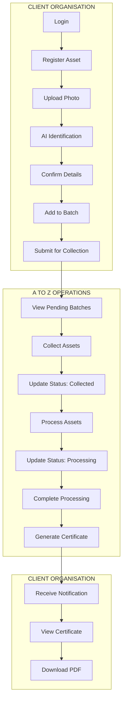

---

## 2. Client Organisation User Flow

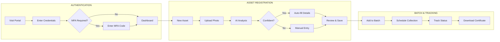

---

## 3. Asset Lifecycle Flow

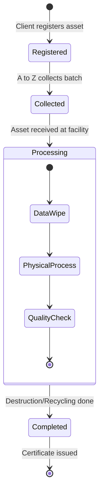

---

## 4. Operator (A to Z Staff) Flow

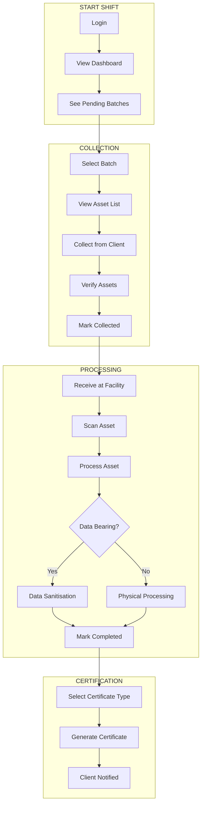

---

## 5. Auditor Flow

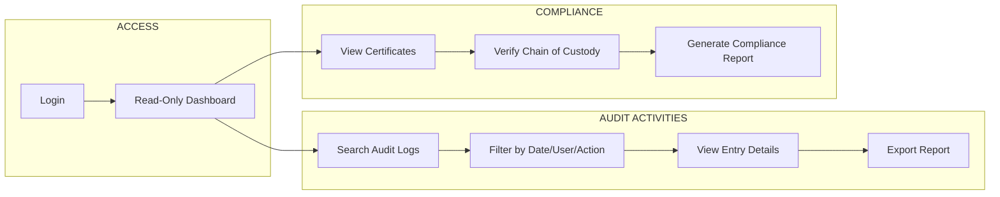

---

## 6. AI Identification Flow

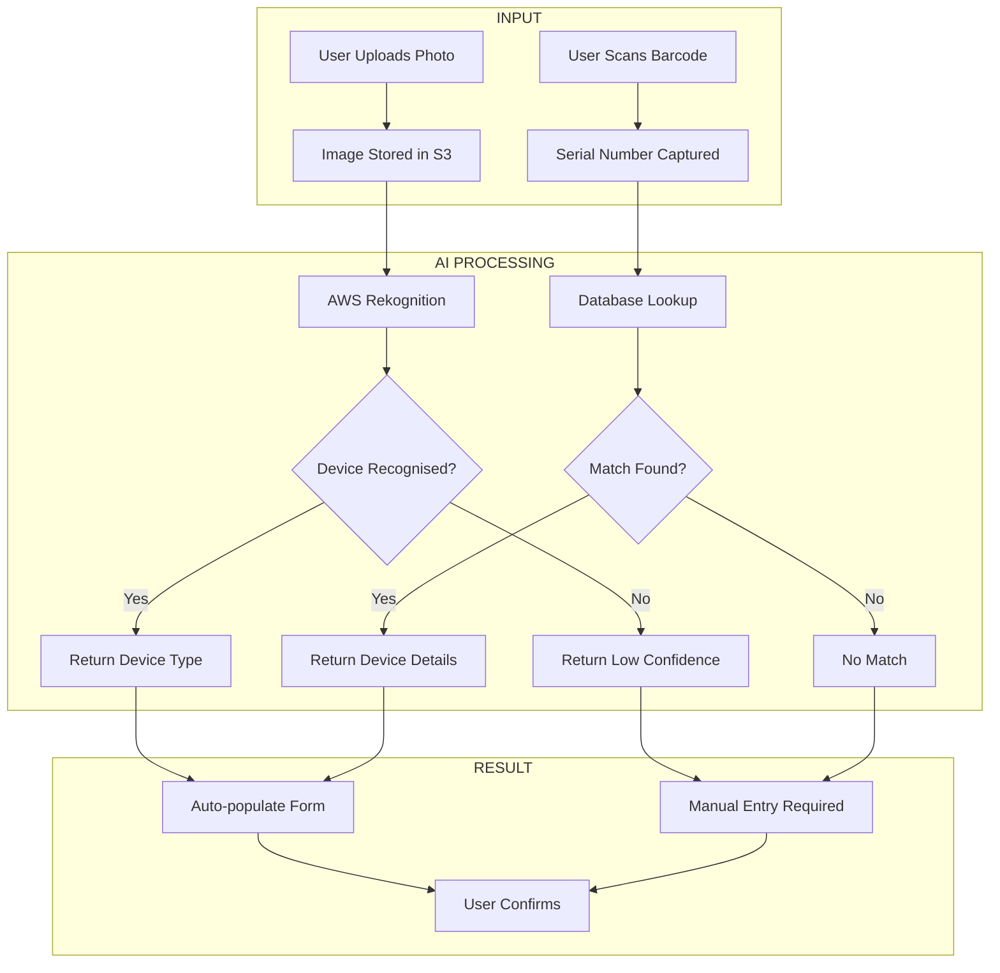

---

## 7. Certificate Generation Flow

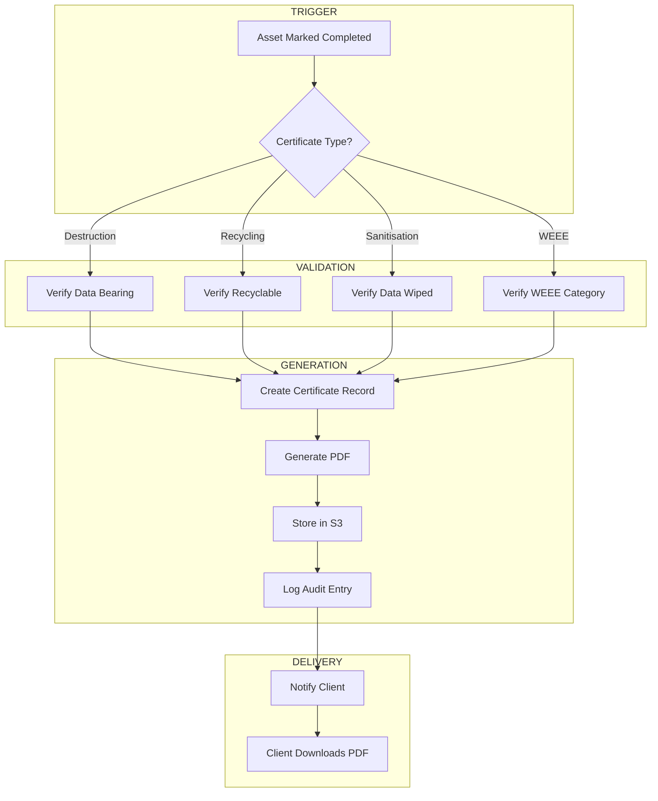

---

## 8. Role-Based Access Summary

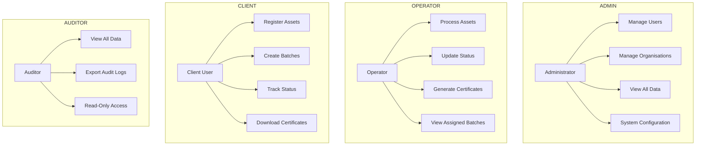

---

## Assumptions to Validate

| # | Assumption | Validate With |
|---|------------|---------------|
| 1 | Client registers assets before collection | Client stakeholders |
| 2 | Single portal serves all user types | Operators, Clients |
| 3 | AI identification happens at registration | Client stakeholders |
| 4 | Operators update status at each stage | A to Z operations team |
| 5 | Certificates generated per-asset (not batch only) | Compliance team |
| 6 | Auditors need export functionality | Auditor stakeholders |

---

## Document Cross-References

- [System Architecture](./01-system-architecture/README.md) — Technical implementation
- [Data Model](./02-data-model/README.md) — Entity relationships
- [API & Integration](./03-api-integration/README.md) — Endpoint design
- [Compliance & Security](./04-compliance-security/README.md) — Audit requirements
