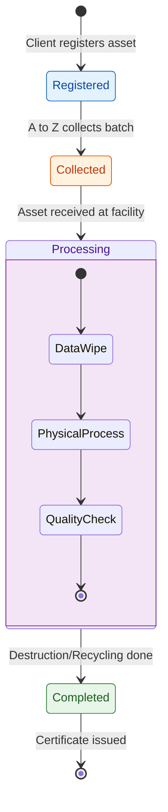

# User Flows — Proposed Scenarios

**AI-Reclaim™ Discovery Phase**

**Author:** Oluwasegun Olumbe
**Client:** A to Z IT Recycling Ltd
**Status:** Complete

---

!!! info "Supplementary Material — Added Value"
    This document is provided as **added value** and is not part of the Milestone 0 scope of work. It is intended to support Phase 1 planning and requirements gathering.

!!! warning "Scenarios Requiring Client Validation"
    The workflows below are **proposed scenarios** based on initial requirements gathering. These are **not confirmed specifications**.

    **We need your input to validate:**

    - Do these flows match your actual business processes?
    - What steps are missing or incorrect?
    - Which user roles need adjustment?
    - Are there alternative workflows we should consider?

---

## Scenario 1: Complete Platform Flow

> **Assumption:** Client registers assets → A to Z collects & processes → Client receives certificate

```mermaid
flowchart TB
    subgraph CLIENT1["🏢 CLIENT ORGANISATION"]
        A1[🔐 Login] --> A2[📝 Register Asset]
        A2 --> A3[📷 Upload Photo]
        A3 --> A4[🤖 AI Identification]
        A4 --> A5[✅ Confirm Details]
        A5 --> A6[📦 Add to Batch]
        A6 --> A7[🚀 Submit for Collection]
    end

    subgraph ATOZ["♻️ A TO Z OPERATIONS"]
        B1[📋 View Pending Batches] --> B2[🚚 Collect Assets]
        B2 --> B3[📍 Update Status: Collected]
        B3 --> B4[⚙️ Process Assets]
        B4 --> B5[🔄 Update Status: Processing]
        B5 --> B6[✔️ Complete Processing]
        B6 --> B7[📜 Generate Certificate]
    end

    subgraph CLIENT2["🏢 CLIENT ORGANISATION"]
        C1[🔔 Receive Notification] --> C2[👁️ View Certificate]
        C2 --> C3[⬇️ Download PDF]
    end

    A7 --> B1
    B7 --> C1

    %% Styling
    classDef clientStyle fill:#e3f2fd,stroke:#1565c0,stroke-width:2px,color:#0d47a1
    classDef opStyle fill:#e8f5e9,stroke:#2e7d32,stroke-width:2px,color:#1b5e20
    classDef resultStyle fill:#fff3e0,stroke:#e65100,stroke-width:2px,color:#bf360c

    class A1,A2,A3,A4,A5,A6,A7 clientStyle
    class B1,B2,B3,B4,B5,B6,B7 opStyle
    class C1,C2,C3 resultStyle
```

??? question "Validation Questions"
    1. Does the client always register assets before collection, or does A to Z sometimes register on their behalf?
    2. Is the photo upload and AI identification step mandatory or optional?
    3. Are there any approval steps before a batch is submitted for collection?

---

## Scenario 2: Client Organisation User Flow

> **Assumption:** Clients self-register assets via portal with optional AI-assisted identification

```mermaid
flowchart LR
    subgraph AUTH["🔐 AUTHENTICATION"]
        L1[🌐 Visit Portal] --> L2[📧 Enter Credentials]
        L2 --> L3{🔒 MFA Required?}
        L3 -->|Yes| L4[📱 Enter MFA Code]
        L3 -->|No| L5[🏠 Dashboard]
        L4 --> L5
    end

    subgraph REG["📝 ASSET REGISTRATION"]
        L5 --> R1[➕ New Asset]
        R1 --> R2[📷 Upload Photo]
        R2 --> R3[🤖 AI Analysis]
        R3 --> R4{🎯 Confident?}
        R4 -->|Yes| R5[✨ Auto-fill Details]
        R4 -->|No| R6[✏️ Manual Entry]
        R5 --> R7[💾 Review & Save]
        R6 --> R7
    end

    subgraph TRACK["📦 BATCH & TRACKING"]
        R7 --> T1[📦 Add to Batch]
        T1 --> T2[📅 Schedule Collection]
        T2 --> T3[🔍 Track Status]
        T3 --> T4[📜 Download Certificate]
    end

    %% Styling
    classDef authStyle fill:#f3e5f5,stroke:#7b1fa2,stroke-width:2px,color:#4a148c
    classDef regStyle fill:#e3f2fd,stroke:#1565c0,stroke-width:2px,color:#0d47a1
    classDef trackStyle fill:#e8f5e9,stroke:#2e7d32,stroke-width:2px,color:#1b5e20
    classDef decisionStyle fill:#fff3e0,stroke:#e65100,stroke-width:2px,color:#bf360c

    class L1,L2,L4,L5 authStyle
    class R1,R2,R3,R5,R6,R7 regStyle
    class T1,T2,T3,T4 trackStyle
    class L3,R4 decisionStyle
```

??? question "Validation Questions"
    1. Is MFA required for all users or only admin/privileged users?
    2. Can clients edit asset details after registration, or is it locked once submitted?
    3. Who schedules collection — the client or A to Z operations?

---

## Scenario 3: Asset Lifecycle Flow

> **Assumption:** Assets move through: Registered → Collected → Processing → Completed

??? question "Validation Questions"
    1. Are these the correct status stages, or are there additional states?
    2. Does every asset go through Data Wipe, or only data-bearing devices?
    3. Is there a "rejected" or "quarantine" state for problematic assets?

---

## Scenario 4: Operator (A to Z Staff) Flow

> **Assumption:** Operators use the same portal as clients, with different permissions

```mermaid
flowchart TB
    subgraph SHIFT["🕐 START SHIFT"]
        O1[🔐 Login] --> O2[📊 View Dashboard]
        O2 --> O3[📋 See Pending Batches]
    end

    subgraph COLLECT["🚚 COLLECTION"]
        O3 --> C1[📦 Select Batch]
        C1 --> C2[📝 View Asset List]
        C2 --> C3[🏢 Collect from Client]
        C3 --> C4[✅ Verify Assets]
        C4 --> C5[📍 Mark Collected]
    end

    subgraph PROCESS["⚙️ PROCESSING"]
        C5 --> P1[📥 Receive at Facility]
        P1 --> P2[📱 Scan Asset]
        P2 --> P3[🔧 Process Asset]
        P3 --> P4{💾 Data Bearing?}
        P4 -->|Yes| P5[🗑️ Data Sanitisation]
        P4 -->|No| P6[♻️ Physical Processing]
        P5 --> P7[✔️ Mark Completed]
        P6 --> P7
    end

    subgraph CERT["📜 CERTIFICATION"]
        P7 --> X1[📋 Select Certificate Type]
        X1 --> X2[📄 Generate Certificate]
        X2 --> X3[🔔 Client Notified]
    end

    %% Styling
    classDef shiftStyle fill:#e8f5e9,stroke:#2e7d32,stroke-width:2px,color:#1b5e20
    classDef collectStyle fill:#e3f2fd,stroke:#1565c0,stroke-width:2px,color:#0d47a1
    classDef processStyle fill:#f3e5f5,stroke:#7b1fa2,stroke-width:2px,color:#4a148c
    classDef certStyle fill:#fff3e0,stroke:#e65100,stroke-width:2px,color:#bf360c
    classDef decisionStyle fill:#fce4ec,stroke:#c2185b,stroke-width:2px,color:#880e4f

    class O1,O2,O3 shiftStyle
    class C1,C2,C3,C4,C5 collectStyle
    class P1,P2,P3,P5,P6,P7 processStyle
    class X1,X2,X3 certStyle
    class P4 decisionStyle
```

??? question "Validation Questions"
    1. Do operators need a separate portal/app, or is the web portal sufficient?
    2. Do operators scan assets at collection site, at facility, or both?
    3. What devices will operators use? (tablets, phones, desktop)
    4. Is there a handover/signature step when collecting from clients?

---

## Scenario 5: Auditor Flow

> **Assumption:** Auditors have read-only access to verify compliance and export reports

```mermaid
flowchart LR
    subgraph ACCESS["🔐 ACCESS"]
        A1[🔐 Login] --> A2[👁️ Read-Only Dashboard]
    end

    subgraph AUDIT["📋 AUDIT ACTIVITIES"]
        A2 --> B1[🔍 Search Audit Logs]
        B1 --> B2[🎯 Filter by Date/User/Action]
        B2 --> B3[📄 View Entry Details]
        B3 --> B4[📊 Export Report]
    end

    subgraph COMPLY["✅ COMPLIANCE"]
        A2 --> C1[📜 View Certificates]
        C1 --> C2[🔗 Verify Chain of Custody]
        C2 --> C3[📈 Generate Compliance Report]
    end

    %% Styling
    classDef accessStyle fill:#f3e5f5,stroke:#7b1fa2,stroke-width:2px,color:#4a148c
    classDef auditStyle fill:#e3f2fd,stroke:#1565c0,stroke-width:2px,color:#0d47a1
    classDef complyStyle fill:#e8f5e9,stroke:#2e7d32,stroke-width:2px,color:#1b5e20

    class A1,A2 accessStyle
    class B1,B2,B3,B4 auditStyle
    class C1,C2,C3 complyStyle
```

??? question "Validation Questions"
    1. Who are the auditors? (Internal A to Z staff, external auditors, client compliance teams?)
    2. What specific reports do auditors need to generate?
    3. Do auditors need real-time access or periodic report delivery?

---

## Scenario 6: AI Identification Flow

> **Assumption:** AI automatically identifies IT assets from photos to reduce manual data entry

```mermaid
flowchart TB
    subgraph INPUT["📥 INPUT"]
        I1[📷 User Uploads Photo] --> I2[☁️ Image Stored in S3]
        I3[📱 User Scans Barcode] --> I4[🔢 Serial Number Captured]
    end

    subgraph AIPROC["🤖 AI PROCESSING"]
        I2 --> P1[🧠 AWS Rekognition]
        P1 --> P2{🎯 Device Recognised?}
        P2 -->|Yes| P3[✅ Return Device Type]
        P2 -->|No| P4[❓ Return Low Confidence]

        I4 --> P5[🔍 Database Lookup]
        P5 --> P6{📋 Match Found?}
        P6 -->|Yes| P7[✅ Return Device Details]
        P6 -->|No| P8[❌ No Match]
    end

    subgraph RESULT["📤 RESULT"]
        P3 --> R1[✨ Auto-populate Form]
        P4 --> R2[✏️ Manual Entry Required]
        P7 --> R1
        P8 --> R2
        R1 --> R3[👤 User Confirms]
        R2 --> R3
    end

    %% Styling
    classDef inputStyle fill:#e3f2fd,stroke:#1565c0,stroke-width:2px,color:#0d47a1
    classDef aiStyle fill:#fce4ec,stroke:#c2185b,stroke-width:2px,color:#880e4f
    classDef resultStyle fill:#e8f5e9,stroke:#2e7d32,stroke-width:2px,color:#1b5e20
    classDef successStyle fill:#c8e6c9,stroke:#388e3c,stroke-width:2px,color:#1b5e20
    classDef failStyle fill:#ffcdd2,stroke:#d32f2f,stroke-width:2px,color:#b71c1c
    classDef decisionStyle fill:#fff3e0,stroke:#e65100,stroke-width:2px,color:#bf360c

    class I1,I2,I3,I4 inputStyle
    class P1,P5 aiStyle
    class R1,R3 resultStyle
    class P3,P7 successStyle
    class P4,P8,R2 failStyle
    class P2,P6 decisionStyle
```

??? question "Validation Questions"
    1. Is AI identification a must-have for MVP, or a nice-to-have?
    2. What accuracy level is acceptable? (e.g., 80%? 95%?)
    3. Should users be able to skip AI and enter details manually from the start?

---

## Scenario 7: Certificate Generation Flow

> **Assumption:** Certificates are generated per-asset upon completion, with multiple certificate types

```mermaid
flowchart TB
    subgraph TRIGGER["🎯 TRIGGER"]
        T1[✔️ Asset Marked Completed] --> T2{📋 Certificate Type?}
    end

    subgraph VALID["✅ VALIDATION"]
        T2 -->|Destruction| V1[💾 Verify Data Bearing]
        T2 -->|Recycling| V2[♻️ Verify Recyclable]
        T2 -->|Sanitisation| V3[🗑️ Verify Data Wiped]
        T2 -->|WEEE| V4[🇪🇺 Verify WEEE Category]
    end

    subgraph GEN["📄 GENERATION"]
        V1 --> G1[📝 Create Certificate Record]
        V2 --> G1
        V3 --> G1
        V4 --> G1
        G1 --> G2[📜 Generate PDF]
        G2 --> G3[☁️ Store in S3]
        G3 --> G4[📋 Log Audit Entry]
    end

    subgraph DELIVER["📬 DELIVERY"]
        G4 --> D1[🔔 Notify Client]
        D1 --> D2[⬇️ Client Downloads PDF]
    end

    %% Styling
    classDef triggerStyle fill:#fff3e0,stroke:#e65100,stroke-width:2px,color:#bf360c
    classDef validStyle fill:#e8f5e9,stroke:#2e7d32,stroke-width:2px,color:#1b5e20
    classDef genStyle fill:#e3f2fd,stroke:#1565c0,stroke-width:2px,color:#0d47a1
    classDef deliverStyle fill:#f3e5f5,stroke:#7b1fa2,stroke-width:2px,color:#4a148c
    classDef decisionStyle fill:#fce4ec,stroke:#c2185b,stroke-width:2px,color:#880e4f

    class T1 triggerStyle
    class T2 decisionStyle
    class V1,V2,V3,V4 validStyle
    class G1,G2,G3,G4 genStyle
    class D1,D2 deliverStyle
```

??? question "Validation Questions"
    1. Are certificates issued per-asset, per-batch, or both?
    2. What certificate types are required? (Destruction, Recycling, Sanitisation, WEEE, other?)
    3. Do certificates require digital signatures or just PDF generation?
    4. What retention period is required for certificates?

---

## Scenario 8: Role-Based Access Summary

> **Assumption:** Four user roles with distinct permissions: Admin, Operator, Client, Auditor

```mermaid
flowchart TB
    subgraph ADMIN["👑 ADMIN"]
        AD[🔑 Administrator]
        AD --> AD1[👥 Manage Users]
        AD --> AD2[🏢 Manage Organisations]
        AD --> AD3[👁️ View All Data]
        AD --> AD4[⚙️ System Configuration]
    end

    subgraph OPERATOR["🔧 OPERATOR"]
        OP[👷 Operator]
        OP --> OP1[⚙️ Process Assets]
        OP --> OP2[📍 Update Status]
        OP --> OP3[📜 Generate Certificates]
        OP --> OP4[📦 View Assigned Batches]
    end

    subgraph CLIENT["🏢 CLIENT"]
        CL[👤 Client User]
        CL --> CL1[📝 Register Assets]
        CL --> CL2[📦 Create Batches]
        CL --> CL3[🔍 Track Status]
        CL --> CL4[⬇️ Download Certificates]
    end

    subgraph AUDITOR["🔍 AUDITOR"]
        AU[🕵️ Auditor]
        AU --> AU1[👁️ View All Data]
        AU --> AU2[📊 Export Audit Logs]
        AU --> AU3[🔒 Read-Only Access]
    end

    %% Styling
    classDef adminStyle fill:#ffcdd2,stroke:#c62828,stroke-width:2px,color:#b71c1c
    classDef operatorStyle fill:#e8f5e9,stroke:#2e7d32,stroke-width:2px,color:#1b5e20
    classDef clientStyle fill:#e3f2fd,stroke:#1565c0,stroke-width:2px,color:#0d47a1
    classDef auditorStyle fill:#f3e5f5,stroke:#7b1fa2,stroke-width:2px,color:#4a148c

    class AD,AD1,AD2,AD3,AD4 adminStyle
    class OP,OP1,OP2,OP3,OP4 operatorStyle
    class CL,CL1,CL2,CL3,CL4 clientStyle
    class AU,AU1,AU2,AU3 auditorStyle
```

??? question "Validation Questions"
    1. Are these four roles sufficient, or are additional roles needed?
    2. Can one person have multiple roles?
    3. Are there different permission levels within each role (e.g., senior operator)?

---

## Summary: Key Assumptions to Validate

| # | Assumption | Validate With |
|---|------------|---------------|
| 1 | Client registers assets before collection | Client stakeholders |
| 2 | Single portal serves all user types | Operators, Clients |
| 3 | AI identification happens at registration | Client stakeholders |
| 4 | Operators update status at each stage | A to Z operations team |
| 5 | Certificates generated per-asset (not batch only) | Compliance team |
| 6 | Auditors need export functionality | Auditor stakeholders |

---

## Document Cross-References

- [System Architecture](./01-system-architecture/README.md) — Technical implementation
- [Data Model](./02-data-model/README.md) — Entity relationships
- [API & Integration](./03-api-integration/README.md) — Endpoint design
- [Compliance & Security](./04-compliance-security/README.md) — Audit requirements
